# Conceptos para corpus M

Un **Corpus Mammut** (corpus M) es un tipo de corpus que permite usar un lenguaje formal (Mammut Markdown) para conectar el **corpus** a una ontology. Un corpus de tipo Mammut usa una combinación de **ontology** y **knowledge** para guardar la información del cliente que el bot podría necesitar saber en el momento de enviar mensajes a los usuarios.

## Estructura y datos del corpus M

(Por orden alfabético)

### Channel y subchannel (canal y subcanal)

**Canal** (plataforma) de comunicación entre los agentes. Por ejemplo: _Facebook messenger_, _Slack_, SMS, _Whatsapp_ y _Freshchat_.

**Subcanal** usado por los agentes para la comunicación dentro de la plataforma (si está permitido o tiene sentido). Por ejemplo: chat de _Freshchat_ en la página web de un cliente.

Tanto el channel como el subchannel proveen información sobre el contexto de la comunicación entre los agentes.

### Instance (instancia)

Cada una de las opciones o unidades de información que forman parte de un mismo [vertex](vertices.md). En el spreadsheet, una [instance](instances.md) es una fila (si bien todas las filas no son instances). Las instances contienen los datos, que el bot puede identificar en los mensajes que recibe o envía a un agente.

A manera de ejemplo, en la **figura 1** se representa un vertex **product** que aloja los datos de los diferentes platos que ofrece un restaurant. Cada una de las instances o filas que lo componen contiene información sobre cada plato específico (como su nombre, el id, su precio, tamaño, etc).

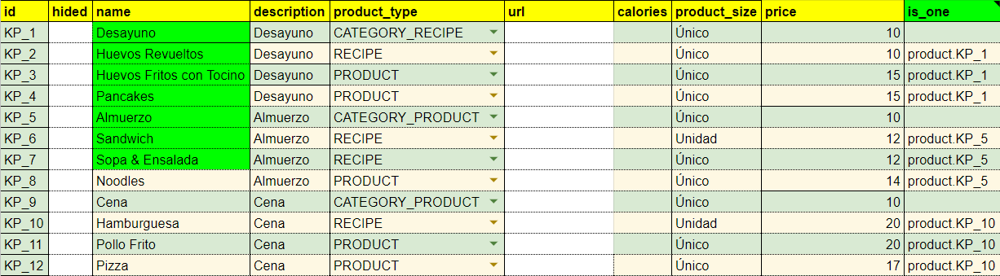

Figura 1: **Ejemplos de instances**

### Knowledge (conocimiento)

El [knowledge](ontology.md) (forma corta de referirnos al Knowledge base)  es el resultado de llenar una **ontology**. Por lo tanto, es una base de datos compuesta por el conjunto de todas las instances de información contenidas en los **vertices** definidos en la ontology de un bot. El knowledge puede ser tan extenso o corto como el programador lo requiera, dependiendo de lo que desee que el bot sepa. El knowledge provee la base de datos que un agente necesita para responder preguntas e interactuar con otro agente en un ambiente dado, usando información no incluida en los **corpus**.

### Ontology (ontología)

Representación formal del **knowledge** de un agente bot y de las relaciones que existen entre los elementos de este knowledge. La **ontology** presenta una estructura de grafo, por lo tanto consta de **vertices** (clases), **properties** (atributos) y **edges** (relaciones) que permiten una representación eficiente de la base de datos. La eficiencia viene dada porque su estructura de grafo plantea un equilibrio entre la cantidad de espacio en la memoria para almacenar el knowledge, y la menor cantidad de tiempo de procesamiento necesario para computar el knowledge. La función de la ontology es darle estructura al knowledge a través de relaciones semánticas que faciliten la búsqueda de información del bot cuando la necesite.

### Path/transverse (ruta)

[Ruta](path.md) indicada en una variable mammut que el bot debe recorrer para buscar una información determinada en el **knowledge**. El path debe contener todos los **vertices** y [edges](edges.md) (se deben excluir las properties) por los que el bot debe pasar para encontrar una [property](properties.md), siguiendo el orden dado por la estructura de la **ontology**.

Como se puede observar en la **figura 2**, para que el bot pueda encontrar la información que se aloja en una property específica de un vertex (en este caso, el precio de un producto, como “huevos fritos con tocino” en un restaurant), la variable marca un path que pasa por todos los vertices anteriores (**store, product**) antes de llegar a la property **price** en el vertex **product**.


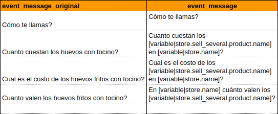

Figura 2: Ejemplo de el uso de un path.

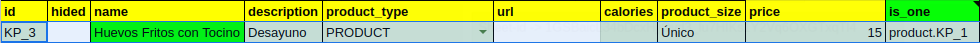

Figura 2: Lugar del knowledge representado por el path descrito en la variable (vertex **product**, property **price**).

### Variable Mammut

[Variable](variables.md) escrita en el **corpus** con lenguaje informático (mammut markdown) que permite sustituir un **path** para transformarlo en una de las formas que tiene la instance referida en la variable. Esta variable tiene un **identificador** y un **significado**: el identificador es un path que describe lugares específicos de la **ontology**, mientras que el significado se puede asociar a tantos valores como se desee, ya que puede asumir cualquiera de las diversas instances vinculadas a su path. La variable sustituye elementos intercambiables en el corpus para que el bot pueda ubicarlos en el **knowledge** y a su vez reconocerlos en los mensajes que recibe.

En el event que se observa en la 'figura 16': "_Cuál es el precio de los huevos fritos con tocino?_", la variable [```variable|store.sells.product.name```] permite convertir/sustituir el nombre de la variable (path) "_huevos fritos con tocino_" por cualquier otro elemento que se encuentre en la columna de la property **name** del vertex **product**, de modo que el bot podría generalizar esta pregunta y comprenderla si un usuario le preguntara por cualquiera de los platos que estén declarados en el vertex product. Ejemplo: “_Cuál es el precio de los (pancakes, almuerzos, sandwiches, etc.)?_”.

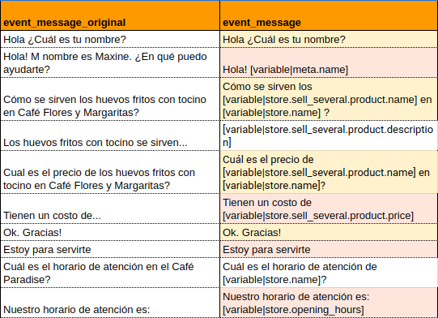

**Figura 16**: ejemplo de variable mammut en el corpus.


**Figura 17**: ejemplo de variable mammut en el corpus extension.


**Figura 18**: vertex **product** con sus respectivas instances. La property **name** es el destino marcado por la ruta de la variable Mammut descrita en el ejemplo.

Este tipo de variables codifican un path que el bot puede seguir a través de la ontology para encontrar la información que necesita. Esto permite generalizar información que se encuentra en los events del corpus, ya que a través de las variables mammut el bot puede buscar información que está en su knowledge y sustituir  la variable por la información en los events correspondientes.

### Scope
Información que se le da a un bot para que tenga knowledge o conciencia sobre lo sucedido en las interacciones anteriores. Comprende la información que el bot va adquiriendo de dichas interacciones que le pueden servir para futuras interacciones. El **scope** requiere seguir un orden específico, que es el indicado por la **ontology**, siempre partiendo desde el **entry point** e indicando el recorrido completo hasta terminar el **path**.

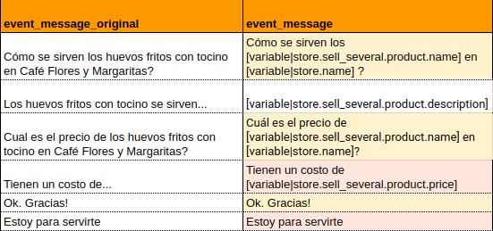

Figura 3: progresión del scope en un scenario.

## Presentation<a name="id2"></a>

### Presentation file (archivo de presentación)

Parte del **package** que aloja (a) parámetros de configuración del bot, (b) partes del **knowledge** y (c) el vertex **meta**. Además, la **presentation** vincula a esta parte del package con el **Spreadsheet**. Al ser parte del package, la presentation se usa para la preparación de un bot. Su función es (a) guardar información de algunos parámetros configurables para cada bot, tales como el 'min conversation duration' y el 'think status', (b) guardar información de partes del knowledge que son mucho más manejables desde un lugar diferente al sheet, tales como **events** que contienen mucha información, (c) mantener un recuento de la meta información del bot y (d) contener el **id** del sheet.

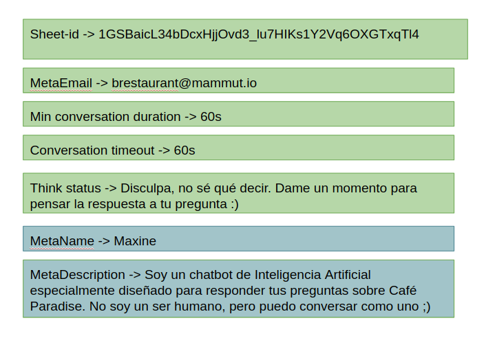

Figura 4: Ejemplo de datos en la presentation con la información correspondiente.

### Sheet id (identificación de la hoja)

Número de identificación del sheet vinculada al package. Este es un dato esencial para la preparación de un bot porque vincula la **presentation** con el **sheet**. Tal como se observa en la **figura 4**, este campo contiene el número de identificación obtenido de la URL del spreasheet (que se desea vincular con la presentation).

### Min conversation duration (duración mínima de conversación)

Período de tiempo mínimo que dura una conversación. El bot asume que la conversación durará como mínimo este período. Por lo tanto, hasta que no se cumpla el "Min conversation duration", el bot no verifica si una conversación ha terminado. Se expresa a través de una unidad de tiempo, actualmente se soportan milisegundos (millis), segundos (s), minutos (min), horas (h) y días (d/day).

### Conversation time out (tiempo de culminación de conversación)

Lapso de tiempo máximo que debe haber entre cada mensaje de la conversación. Si se cumple este período y no ha recibido un nuevo mensaje, el bot asume que la conversación terminó. Por lo tanto, pasado este período de tiempo, se pierde la información que estaba guardada en el **Scope**. Se expresa a través de una unidad de tiempo, actualmente se soportan milisegundos (millis), segundos (s), minutos (min), horas (h) y días (d/day).

### Think status (estado de espera)

Mensaje programado para responder a los usuarios en aquellos momentos en los que el bot no cuente con la información necesaria para responder a un **event**. En la **figura 4** se puede ver un ejemplo de Think status.

### Knowledge in the presentation (partes del conocimiento en la presentation)

Una manera de anotar el valor de una **property** en un sitio cómodo para editar párrafos largos es hacerlo en la **presentation** (el sheet puede resultar poco práctica para estos casos). Para incluir partes del **knowledge** en la presentation solo se debe agregar estas partes en un cuadro de texto que no tenga identificación alguna. Es necesario, además, sustituir el contenido de la celda correspondiente en el sheet del **vertex** por una referencia a su ubicación en la presentation. La referencia incluye el número de lámina, el tipo de elemento en la presentation (text o image), y las primeras palabras (mínimo las tres primeras palabras) que forman parte del texto escrito en el cuadro de texto, usando el formato slide|[#pagina]-[tipo]-[Contenido inicial]. Ejemplo: slide|3-text-Cuadro de texto].

Tal como se puede observar en las figuras 5 y 6, dado que el texto correspondiente a la property **description** de la instance 'KS_1' del vertex **store** es demasiado extenso para manejarlo en el sheet, este se agregó en un cuadro de texto de la presentation, y se vinculó al spreadsheet utilizando la referencia 'slide|3-text-En Café Paradise'.

Las partes del knowledge que se alojan en la presentation facilitan el manejo de contenido que podría resultar complejo desde el spreasheet, tal como textos muy largos.

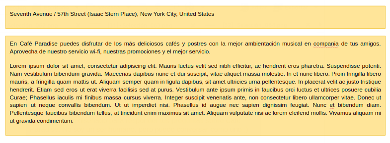

Figura 5: Partes del knowledge en la presentation

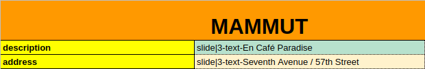

Figura 6: referencias al lugar de la presentation que aloja el contenido de las properties del vertex **store**.

### Meta

El **meta** es el único vertex de la **ontology** que se ubica en la **presentation** y tiene una sola instance. En este vertex se puede incluir cualquier información que se quiera agregar al knowledge. Sus **properties** no están sujetas al resto de la ontology, ya que siguen un **path** particular. Para incluir las properties del meta debemos diferenciarlas de los demás datos incluídos en la presentation, agregando el prefijo 'Meta' seguido por el nombre de la property, tal y como se muestra en la figura 7.


Figura 7: vertex Meta en la presentation.

La función del Meta es agregar información del knowledge a la que el bot pueda acceder de forma más rápida, por ejemplo, las respuestas a preguntas que el bot recibe con mucha frecuencia y que no dependen del **scope**. Además, en el meta se incluye la información que el bot sabe sobre sí mismo, por ejemplo, su nombre y sus usos.

Dado que la información almacenada en el meta se encuentra en un **vertex** de la **ontology** independiente del scope, la información que se encuentre en él es de más fácil acceso para el bot.  

## Spreasheet

### Sheet corpus

#### event_message

Cntiene los [events](events.md) de cada [scenario](scenario.md) en lenguaje natural; si es un corpusN, o en mammut_markdown; si es un corpusM. 

#### Action (acción)

**Acción** programática predefinida en código que se ejecuta automáticamente en un **event** asociado. Esta columna permite programar acciones determinadas que el bot puede llevar a cabo (dependiendo de los intereses del programador) cuando tiene lugar un event determinado. Un ejemplo de un action es programar el envío de un correo automáticamente a un usuario que solicite información sobre un tema en particular.

#### UI_event (event UI)

Función escrita en código informático que permite al bot percibir ciertas acciones llevadas a cabo por un agente en la interfaz de usuario.

#### Lambda conditions (condiciones lambda)

Configuraciones escritas en lenguaje informático que describen las condiciones necesarias para que el bot envíe una respuesta determinada al usuario, dependiendo de la información que se encuentre en el **scope**. Estas configuraciones se escriben en forma de estructuras condicionales (si X, entonces Y), teniendo en cuenta que la condición (si X) depende de la información que se encuentre en el scope, mientras que la consecuencia (entonces Y) representa una de dos opciones.

En la 'figura 15' se puede observar un ejemplo del uso de los **lambda conditions** para el event "_Cuál es el precio en Café Paradise?_". En este ejemplo, el uso de un lambda condition permite establecer las condiciones para que el bot dé diferentes respuestas al mismo **event** dependiendo de la información que tenga en el scope: la primera condición el event 4/2 (_store.sell_several.product.in_scope_) expresa que si este event forma parte de un scenario en el que el usuario ha especificado el nombre del producto cuyo precio desea saber, el bot puede responder con el precio correspondiente a esa instance en la property **price** del knowledge. Por otro lado, la segunda condición (_store.sell_several.product.not_in_scope_) en el mismo event -nótese que ambas respuestas posibles tienen el mismo sub_id- expresa que, si el valor del producto no se encuentra en el scope de la conversación, el bot debe solicitarle al usuario los datos faltantes.


Figura 15: Ejemplo de scenario en el corpus con un Lambda condition.


En cuanto a su función, los **lambda conditions** permiten determinar la ocurrencia de un **scenario** en relación al **scope**. Estas configuraciones permiten que el bot pueda dar una de dos respuestas diferentes de acuerdo a la información que este haya obtenido del contexto de la conversación. En caso de que falte información en el scope, los lambda conditions permiten hacer preguntas al usuario de manera de obtener más información sobre el contexto y así enviarle mensajes más precisos.

#### Field (campo)

Una palabra que indica el tema del **event**. La información del **field** debe estar vinculada con un elemento de la **ontology** asociada al **corpus**, o de la **upper ontology**. Cuando se use el modelo probabilístico (machine learning), esta columna va a ayudar a la interpretación de los mensajes que recibe el bot, dado que agrega información semántica.

### Sheet  vertices

#### Vertex (vértice)

Se refieren a las **clases** fundamentales que componen una **ontology**. Estos son nodos que representan conceptos y que forman categorías mayores a las que se pueden vincular diversos datos, por lo tanto, son considerados núcleos alrededor de los cuales se desarrolla el **knowledge**. Debido a que los vertices representan conceptos o ideas, se identifican con sustantivos; es decir, los vertices deben llevar como nombre un sustantivo que se elige como representativo de la idea o concepto al que refiere.

#### Edge (arista)

Representa las relaciones entre los elementos de una **ontology**. Debido a que constituye las relaciones entre vertices o entre un vertex y sus properties, se identifican con verbos o preposiciones. Los **edges** cumplen las mismas funciones que los verbos y preposiciones cumplen en cualquier lenguaje natural, es decir, unir elementos.  

#### Property (propiedad)

Las **properties** son atributos que pueden adjudicarse a los **vertices**. Estas sirven para describir aspectos, características o parámetros pertenecientes a los vertices que componen la **ontology**.

Las properties representan los atributos de los vertices ya que cumplen la función que tienen en las lenguas los adjetivos, es decir, describir, especificar o complementar a los núcleos (vertices).

#### Property predicate (predicado de propiedad)

**Edge** que describe la relación semántica entre una **property** y un **vertex**. Por ejemplo: “store._has_.parking”, considerando que 'parking' es una property del vertex **store**.

#### Element head (dirección del elemento)

Nombre del **vertex** de llegada en caso de que el elemento declarado sea un **edge**.

#### Default (valor por defecto)

Forma corta de referirnos a los **default assumptions**, son expresiones manifestadas en forma de código que permiten llenar el **scope** con información previamente definida en un sheet, de manera que cuando en el scope no se encuentre la información necesaria para dar respuesta a un mensaje recibido, el bot pueda asumir un valor por defecto. Por tanto, los defaults hacen posible que el bot tenga programados valores por defecto en el scope.

En la 'figura 8' se puede observar un ejemplo de la configuración de un valor por defecto en el sheet **defaults** de un package. La sintaxis de los defaults debe ser la siguiente: [Nombre del vertex] + [id de la instance] + [lambda lexical form]. Esta expresión en el ejemplo nos indica que, dado un canal con el valor "T0LBYNNE5", y en caso de que un usuario no haya especificado en el scope a cuál de las instances del **entry point** se refiere, el bot debe asumir que el entry point será la instance 'KS_1' del vertex **store**.

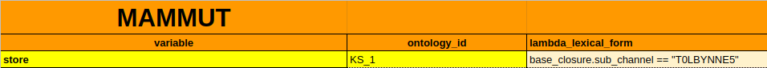

Figura 8: Sheet **defaults** en el package.

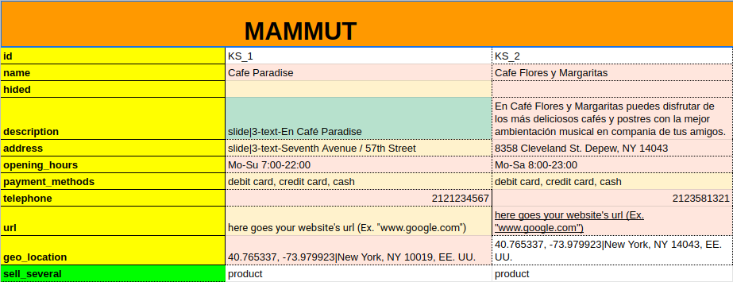

Figura 9: Sheet del entry point.

#### Optional (opcional)

Implica que una **property** de la **ontology** puede ser opcional u obligatoria, a conveniencia para el programador. Para una property obligatoria, se debe tener un valor de esa property asociado en cada una de las instances.

#### Reverse_predicate

**Edge** que describe la relación semántica entre dos vertices o entre un vertex y una property, y se expresa en el sentido contrario de un **path** que ya existe. Por ejemplo: dado un path “store.has.parking” un posible reverse path es “parking._belongs_to_.store”.

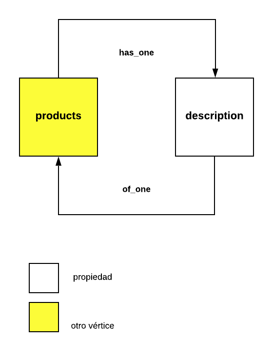

Figura 10: Representación gáfica de un reverse edge

### Sheet properties

#### Property_type (tipo de propiedad)

Dependiendo de la naturaleza de la información en alguna property, podremos elegir uno de los siguientes tipos:

* **String (cadena)**: en properties de este tipo podremos agregar una cadena de caracteres alfanuméricos.
* **Boolean (booleano)**: este tipo de property es un dato lógico o booleano que puede representar valores binarios, normalmente del tipo FALSE y TRUE.
* **GAttachment (GAdjunto)**: property que permite adjuntar un archivo como dato.
* **Integer**: tipo de property con números pertenecientes al conjunto de los enteros (sin decimales). Por ejemplo: (**Falta ejemplo**)
* **Long**: en properties de este tipo podremos agregar números enteros solo que más grandes que los anteriores (el valor que se puede guardar es mayor). Por ejemplo:
* **Double**: este tipo de property comprende números con decimales, punto flotantes, o pertenecientes al conjunto de los racionales. Por ejemplo: 1.2, 1.234, 1.23455.
* **LocalDate**: property que permite agregar la fecha en un formato simple, sin tiempo ni zona horaria, siguiendo el formato YYYY-MM-DD, como en: 2007-12-03.
* **LocalTime**: en properties de este tipo podemos agregar la hora en un formato simple, sin fecha ni zona horaria, siguiendo el formato HH:MM:SS, como en: 10:15:33.
* **ZonedDateTime**: es un tipo de property que comprende un texto que especifica una fecha, tiempo y zona horaria. En primer lugar tenemos la fecha con formato: YYYY-MM-DD, luego tenemos el tiempo en formato militar (00-24hrs), sigue la forma THH:MM:SS, y por último, la zona horaria [UTC](https://en.wikipedia.org/wiki/UTC_offset). Por ejemplo: 2007-12-03T10:15:30+01:00. En este ejemplo tenemos la fecha: 2007-12-03, luego el tiempo: T10:15:30 y por último la zona horaria +01:00.
* **StringToLower**: es una cadena de caracteres (texto) que se llevará a minúsculas.

#### Cardinality (cardinalidad)

Hace referencia a cuántos **edges** puede haber partiendo de un **vertex** dado.  La **cardinalidad** puede ser SINGLE o SET.

* **Single (única)**: es una property que se puede describir en su totalidad con un solo valor. Por ejemplo, una property que represente la cuenta de Instagram de una tienda. En principio se asume que con un valor dado, la property está completa: “@tiendita”.
* **Set (conjunto)**: es una property debe ser descrita con distintos valores al mismo tiempo. Por ejemplo, los métodos de pago que acepta una institución. Esta property puede ser descrita por un conjunto de palabras: {efectivo, punto de venta, transferencia}.
* **List (lista)**: es una property que se describe con una lista de valores que no deben ser distintos entre sí.

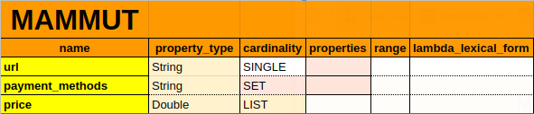

Figura 10

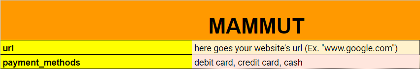

Figura 11

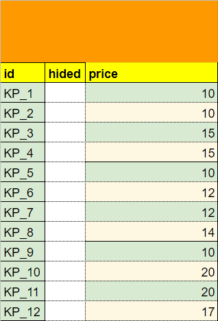

Figura 12

**Figura 10, 11 y 12**: Ejemplos de properties de cardinalidad Single, Set y List en el sheet **properties** y en los vertices de la ontology.

### Sheet edges

#### Multiplicity (multiplicidad)

Esta característica de los **edges** determina si el enlace podrá unirse a varias entidades (ONE2MANY) o si solo se puede unir a una sola entidad (ONE2ONE), sea una property o un vertex.

## Otros sheets<a name="id4"></a>

### Corpus extension (extensión del corpus)

Sheet que complementa el corpus con paráfrasis o diversas formas de decir los mensajes que son emitidos por los usuarios.

Su función es proveer datos para la preparación de los bots. La información escrita en el **corpus** y el [corpus extension](extension.md) provee casos representativos en lenguaje natural, así como información necesaria para la preparación del bot.

#### Ejemplo


### Corpus map

#### Corpus map (mapa del Corpus)

Contiene un mapa del conjunto de los **corpus** que forman parte de un mismo bot. En este mapa se identifica el vínculo que existe entre los distintos sheets que forman parte de un mismo corpus, es decir, los sheets de main_sheet, extension_sheet, y corpus_type. También se deben listar en el **corpus map** los sheets que pertenecen a la **ontology** como el **entry point** (ontology_instances), los ontology_vertex, ontology_properties, y los ontology_edges. Además, el corpus map contiene algunos datos generales sobre el corpus tales como el **id** e información referente a si es un corpus anotable o no (annotable), está oculto o no (hidden).

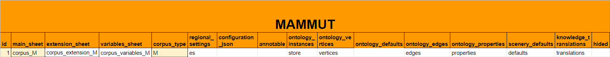
Figura 14: Sheet **corpus_map**.

Como se puede observar en la **figura 14**, en el corpus map se listan los nombres de las pestañas que componen el spreadsheet. En este caso, el nombre del **main_sheet** es **corpus_M**, mientras que el nombre del sheet **corpus_extension** es **corpus_extension_M**, y de esta manera se listan todas los sheets en la columna correspondiente. El campo **regional_settings** se llena siguiendo sigue la convención [ISO 639-1](https://en.wikipedia.org/wiki/ISO_639-1), y, como el corpus de este bot es de tipo Mammut, la columna **corpus_type** se llena con una M. Si el corpus es anotable (annotable) o está oculto (hidded), estas columnas se llenan con una X.

La función del corpus map es contener los nombres de los sheets que forman parte de un mismo corpus y precisar su función. Los nombres de las hojas deben aparecer escritos de manera idéntica en el corpus_map para que los sheets puedan ser reconocidos por el sistema.

### Entry point (punto de entrada)

Es un **vertex** que constituye el núcleo del **knowledge** alrededor del cual se construye la **ontology**. Es el punto de inicio de la ontology y se identifica con un sustantivo. La función del punto de entrada es dar un punto de partida a la ontology para acceder al resto del knowledge.

### Sheet variables

#### Variables sheet (hoja de cálculo Variables)

Sheet en donde se definen las **variables** que contienen otras variables. Dentro de esta hoja se pueden definir verbos en tiempo real de la elaboración del **corpus**. Los verbos definidos en este sheet se cargan automáticamente en Mammut-API durante el procesos de compilación. Este sheet permite que las variables puedan ser reutilizadas de una manera práctica, dado que en su reutilización se escriben en forma más corta que el **path** de la variable original.

#### Variable

Es un identificador (nombre) asociado a un valor (espacio de almacenamiento de datos). Por ejemplo, si en el knowledge tenemos un **path** como: [variable|store.sell_several.product.name] resulta más cómodo escribir el path de esta **variable** completa de forma más breve, como: [ProNameES]. Una vez que el path corto ha sido declarado como variable en este sheet, se puede utilizar cuando sea necesario. Estas estructuras permiten que un identificador pueda ser usado para representar un valor (independientemente de los datos específicos contenidos en este) que puede variar.

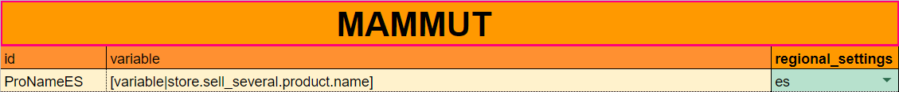

Figura 13: Ejemplo de una variable escrita en el sheet **Variables**.

### Translations

#### Translations (traducciones)

Sheet que contiene las traducciones de las instances del **knowledge**. Este sheet permite preparar al bot para que pueda comunicarse en diferentes idiomas utilizando la misma **ontology**.

### Defaults

#### Defaults (escenario por defecto)

Forma corta de referirnos a **default assumptions**. Estas son expresiones manifestadas en forma de código que permiten llenar el **scope** con información previamente definida en el sheet, de manera que si la información necesaria para dar respuesta a un mensaje recibido no se encuentra en el scope, el bot puedrá asumir un valor por defecto.

Estas configuraciones se expresan de forma de transverse: [Nombre del vertex] [id de la instance] [lambda lexical form]. Los **defaults** permiten configurar aquello que se desea que el bot asuma en un **escenario** de un ambiente dado.
