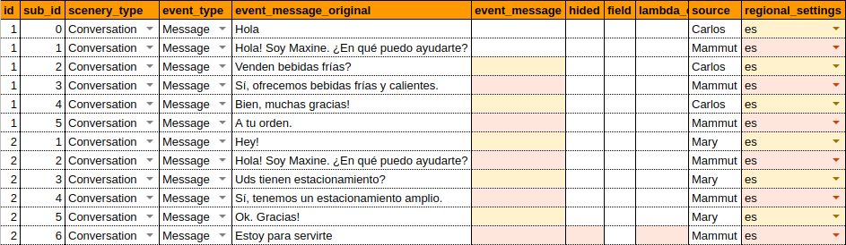
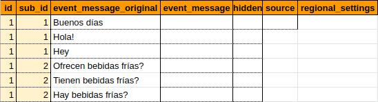
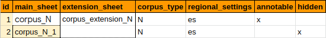

# Conceptos para corpus N

Un **corpus natural** (corpus N) es un tipo de corpus que se compone únicamente de **scenarios** en lenguaje natural.

## Estructura y datos del corpus N

(En orden alfabético)

### Annotable (anotable)

Un corpus 'annotable' es aquel que puede incluir metadata, es decir, anotaciones (lexicalización, anotación y desambiguación) cuya información proporciona patrones al bot para el aprendizaje del lenguaje natural.

### Channel (canal)

El **canal** (plataforma) base de la comunicación. Casos concretos: _Facebook messenger_, _Slack_, SMS, _WhatsApp_ y _Freshchat_, por ejemplo.

### Corpus

Conjunto de scenarios diferentes entre sí y dispuestos sin orden particular en un sheet (hoja de cálculo).

Su función es proveer datos para la preparación de los bots. La información escrita en el **corpus** y el [corpus extension](extension.md) provee casos representativos en lenguaje natural, así como información necesaria para la preparación del bot.

#### Ejemplo 

### Corpus extension (extensión del corpus)

Sheet que complementa el corpus con paráfrasis o diversas formas de decir los mensajes que son emitidos por los usuarios.

Su función es proveer datos para la preparación de los bots. La información escrita en el **corpus** y el [corpus extension](extension.md) provee casos representativos en lenguaje natural, así como información necesaria para la preparación del bot.

#### Ejemplo

### Corpus map (mapa del corpus)

Contiene un [mapa](corpus_map.md) del conjunto de los **corpus** que forman parte de un mismo bot. En este mapa se identifica el vínculo que existe entre los distintos sheets que forman parte de un mismo corpus, es decir, los sheets de **main_sheet**, **extension_sheet**, y **corpus_type**. Además, el corpus map contiene algunos datos generales sobre el corpus tales como el **id** y la información referente a si es un corpus anotable o no (annotable), y si el corpus está oculto o no (hidden).

Su función es contener los nombres de los sheets que forman parte de un mismo **corpus** y precisar su función. Los nombres de los sheets pueden estar compuestos por cualquier serie de caracteres (letras, números, códigos) y deben aparecer escritos de manera idéntica en el **corpus_map** para que los sheets puedan ser reconocidos por el sistema.

### Event (evento)

Uno o varios **mensajes** emitidos consecutivamente por un agente en un canal de comunicación. Estos mensajes pueden ser texto, imagen o cualquier recurso que provea información.

Los **events** y **scenarios** proveen la data necesaria para la preparación del bot.

### Field (campo)

Indica una palabra vinculada al tema del **event**.

Cuando se use el **modelo probabilístico** (machine learning), esta casilla va a ayudar a la interpretación de los mensajes que recibe el bot, dado que agrega información semántica.

### Hidden (oculto)

Implica que un event puede estar oculto (hidden) o descubierto, a conveniencia del programador. Un event o un corpus declarado como **hidden** no se toma en cuenta en el proceso de preparación del bot.

En caso de que se desee ocultar un event que forme parte de un **scenario** con otros events que no estén ocultos, se debe tener en cuenta que el scenario no estará oculto. Por lo tanto, la secuencia de events que se mantienen sin ocultar debe formar un scenario semánticamente coherente. Es decir, es necesario asegurarse de que, una vez ocultado cualquier event que forme parte de un scenario con otros events que no estén ocultos, los que no están ocultos deben transmitir un mensaje completo (tal como sucedería en una conversación real).

### Regional setting (configuración regional)

Idioma en el que está escrito el **corpus**. En este campo se sigue la convención [ISO 639-1](https://en.wikipedia.org/wiki/ISO_639-1).

### Scenario (escenario)

Conjunto de [events](events.md) programados en una sucesión cronológica de intervenciones que tienen lugar en un mismo ambiente. Los scenarios están compuestos por ejemplos de conversaciones que incluyen casos representativos de las posibles preguntas que hacen los usuarios y las respuestas que se desea programar al bot.

Los **events** y **scenarios** proveen la data necesaria para la preparación del bot.

### Scenario type (tipos de escenarios)

* **Conversation (conversación)**: es un tipo de scenario que tiene como fuente (source) a dos agentes.
* **Dialogue (diálogo)**: es un tipo de scenario que tiene como fuente (source) a tres o más agentes.
* **Monologue (monólogo)**: es un tipo de scenario que tiene como fuente (source) a un solo agente.

### Source (fuente)

En la construcción de un **corpus**, es una manera de diferenciar los mensajes que recibe el bot de aquellos que envía. El nombre de la fuente de un mensaje recibido por el bot puede tener cualquier serie de caracteres (letras, números, códigos o demás) que lo identifique, por ejemplo, el nombre de quien hizo la pregunta (José, María, Juan o Pedro) o el lugar de donde se extrajo **Twitter_account**. Por otro lado, la fuente de un mensaje enviado por el bot tiene siempre algún dato con el prefijo **Mammut**.

## Datos de la presentación

* **Conversation time out (tiempo de culminación de conversación)**: lapso de tiempo máximo que debe haber entre cada mensaje de la conversación. Si se cumple este período y no ha recibido un nuevo mensaje, el bot asume que la conversación terminó. Por lo tanto, pasado este período de tiempo, se pierde la información que estaba guardada en el **Scope**. Se expresa a través de una unidad de tiempo, actualmente se soportan milisegundos (millis), segundos (s), minutos (min), horas (h) y días (d/day).

* **Min conversation duration (duración mínima de conversación)**: período de tiempo mínimo que dura una conversación. El bot asume que la conversación durará como mínimo este período. Por lo tanto, hasta que no se cumpla el "Min conversation duration", el bot no verifica si una conversación ha terminado. Se expresa a través de una unidad de tiempo, actualmente se soportan milisegundos (millis), segundos (s), minutos (min), horas (h) y días (d/day).

* **Spreadsheet id (identificación de la hoja)**: numéro de identificación del Google spreadsheet vinculada al package. Este es un dato esencial para la preparación de un bot porque vincula la **presentation** con el **spreadsheet**.

* **Think status (estado de espera)**: mensaje programado para responder a los usuarios en aquellos momentos en los que el bot no cuente con la información necesaria para responder a un **event**.
