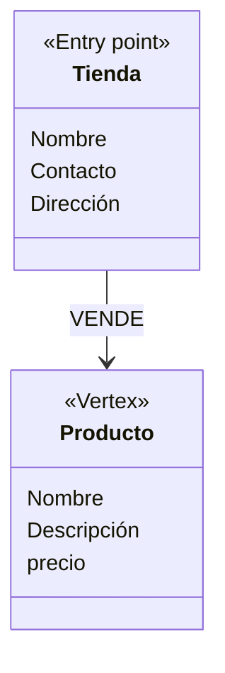
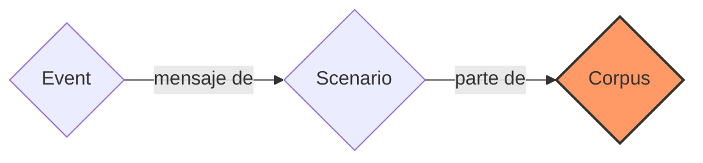
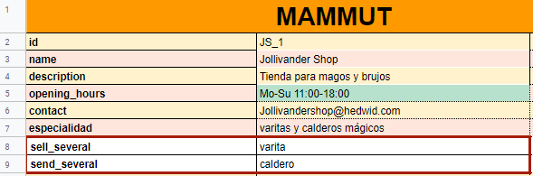
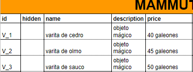

# Ontología y conocimiento

El **knowledge** y la **ontology** componen una estructura de datos que contiene toda la información que un bot sabe o que quiere saber para poder responder los mensajes de los usuarios. Esta estructura es concebida como la memoria a largo plazo a la que tiene acceso un bot con **corpus M**; por lo tanto, diferencia un [corpus N](corpusN.md) de un [corpus M](corpusM.md). El knowledge y la ontology optimiza el funcionamiento del bot a la hora de interactuar con el usuario.

## Definición

El **knowledge** es una base de datos compuesta por toda información que un agente (bot) necesita saber para interactuar en un ambiente o situación. El knowledge está constituido por el conjunto de datos que persisten en el package. Este conforma la información que el bot sabe y la que desea saber.

La **ontology**, en cambio, es la estructura grafa de esta base de datos que representa el knowledge. Esta estructura está establecida por las relaciones jerárquicas y semánticas entre los datos de un **knowledge**. En el package, el knowledge está ordenado en los siguientes elementos:

| Elemento       |  Descripción  |
| -------------- | --------------|
| [**vertex**](vertices.md)     | Noción que organiza los datos del knowledge. |
| [**Instance**](instances.md)  | Fila compuesta por datos del knowledge. |
| [**Property**](properties.md) | Atributo que puede ser adjudicado a un vertex y a los datos que engloba. |
| [**Edges**](edges.md) | Relación entre los datos de un knowledge. |

> Más información sobre estos elementos en los documentos referenciados en la sección de _conceptos relacionados_.

La estructura grafa de la ontology utiliza los datos del knowledge, los ordena en vertices y properties para luego establecer relaciones entre ellos por medio de los [**edges**](edges.md). Esto genera un esquema que adquiere una forma particular según las necesidades o intereses del desarrollador, por tal motivo es una estructura versátil que no tiene un límite de datos. Las únicas restricciones para nombrar los elementos que forman parte de una ontology son los siguientes: los **vertices** deben ser nombrados con sustantivos, los **edges** con preposiciones o verbos, y las **properties** con sustantivos o adjetivos.

**figura 1:** esquema de la jerarquía de la ontology. El vertex que funciona como entry point **tienda** es el punto más alto de la ontology, el edge **vende** enlaza el entry point con el vertex **producto**.

La **ontology** y el **knowledge** conforman un mecanismo que tiene la función de aumentar la eficiencia del léxico del bot a través de herramientas que faciliten el acceso de información en el package del bot (véase [variables](variables.md), [path](path.md)). Este mecanismo mejora la eficiencia del bot a partir de pocos ejemplos prototípicos en los corpus.

> Los datos del knowledge están íntimamente relacionados con el conjunto de ejemplos de conversaciones o [escenarios](scenario.md) establecidos en el [**corpus**](corpus.md) de un package. Estas conversaciones prototípicas proveen pautas para que el desarrollador sepa los elementos que deberían formar parte del knowledge del bot, con la finalidad de que el bot pueda responder todas preguntas de sus usuarios.

Conceptos relacionados: [vertex](vertices.md), [instance](instances.md), [edge](edges.md), [property](properties.md), [variable](variables.md).

## Formato general

Todos los sheet del Mammut package tienen íntima relación con la **ontology** del bot, por ende, todas sus partes cumplen una función específica en ella.

El [**corpus**](corpus.md) aloja los scenarios prototípicos que utilizan las variables como herramienta para acceder a los datos del knowledge.

**Figura 2:** esquema de los constituyentes de un corpus.

El **knowledge** es registrado en los [vertices](vertices.md) como el **entry_point** y los vertices particulares. Ambos tipos de vertices tienen la función común de proveer a la ontology de núcleos de información entorno a los cuales se establecerán relaciones semánticas y jerárquicas por medio de los **edges**.

Por otro lado, los datos que integran el **knowledge** debe estar dispuesta de forma jerárquica en la **ontology** de manera que elabore un mapa para la utilización de [**paths**](path.md). Estos paths son necesarios para acceder a la información que usa el bot para responder los mensajes de los usuarios.

El punto más alto de la ontology, y de la jerarquía, es representada por el sheet [entry_point](entry_point.md), ya que cumple la función de ser el punto de inicio de la ontology. Por otro lado, los vertices particulares proporcionan información adicional para responder mensajes acerca de otros datos del **knowledge** (véase [vertices](vertices.md)).

**Figura 3:** vista del entry point **tienda** desde el spreadsheet.

**Figura 4:** vista del sheet **varita** desde el spreadsheet.

La función de las [**properties**](properties.md) dentro de la ontology es la de definir los núcleos de información (vertices). Las properties adjudican atributos o características a los vertices. El sheet nombrado **properties** tiene como función especificar todas las properties utilizadas en la ontology.

La estructura del sheet **properties** tiene el siguiente formato:

|     Campo     |  Descripción  | Obligatoriedad |
| ------------- | ------------- | -------------- |
| __name__          | Columna para agregar el enunciado o nombre de la property declarada. | Obligatorio. |
| __property_type__ | Columna que indica el tipo de información en la property (string, boolean, GAttachment, etc.) | Obligatorio. |
| __cardinality__   | Columna para indicar la cantidad de edges que puede haber partiendo de un vertex dado (SINGLE o SET.)| Obligatorio. |
| __properties__    | Columna para adjudicar properties a otras properties. | Opcional. |
| __range__         | Columna para limitar los posibles valores y tipos de una property. | Opcional. |
| __lambda_lexical_form__ | Columna para determinar otras formas de escribir una property en el Knowledge. | Opcional. |

Véase [properties](properties.md).

Los vertices y las properties que definen la ontology se enlazan mediante relaciones semánticas en el sheet **vertices**.

El sheet **vertices** tiene el siguiente formato:

|  Campo  |  Descripción  | Obligatoriedad |
| ------- | ------------- | -------------- |
| __name__ | En esta columna se agrega el nombre del vertex (entry point u otro) | Obligatorio. |
| __element_type__ | En esta columna se especifica el tipo del elemento que se añade en esa fila: PROPERTY o EDGE. | Obligatorio. |
| __property_predicate__ | En esta columna se añade un edge que plantee la relación semántica entre un vertex y una property definida. Si se está declarando un edge, esta columna queda vacía. | Obligatoria en las **properties**. |
| __element_name__ | Esta columna aloja el nombre de la property o edge que se está añadiendo. | Obligatorio. |
| __edge_head__	| Esta columna contiene el nombre del vertice de llegada cuando se declara un edge que enlaza dos vertices. | Obligatorio en los edges. |
| __optional__ |	Esta columna se llena con una equis "x" en los elementos que se quieran dejar opcionales. | Opcional. |
| __default_property__ | Esta columna se llena con una equis "x" en una sola fila del vertex, ya que solo puede haber un valor por defecto para cada vertex. | Opcional. |
| __entry_point__	| Esta columna se llena con una equis "x" en todos los elementos definidos del vertex que funcione como entry point. En las demás filas se deja en blanco. | Obligatorio en el vertex entry point |
| __reverse_predicate__ | Esta columna se llena con el nombre de un edge que indique la relación semántica inversa del edge declarado en la columna **property_predicate**.| Obligatorio |
| __sink__ | Esta columna se llena con una equis "x" en los elementos que se quieran definir como sink. | Opcional. |

Véase [vertices](vertices.md).

Las relaciónes semánticas utilizadas en la ontology (edges) se declaran en el sheet **edges** y sigue el siguiente formato:

|  Campo  |  Descripción  | Obligatoriedad |
| ------- | ------------- | -------------- |
| __name__    | Columna para agregar el enunciado o nombre del edge declarado. | Obligatorio. |
| __multiplicity__ | Columna que especifica el valor de multiplicidad del edge. | Obligatorio. |

Véase [edges](edges.md).
