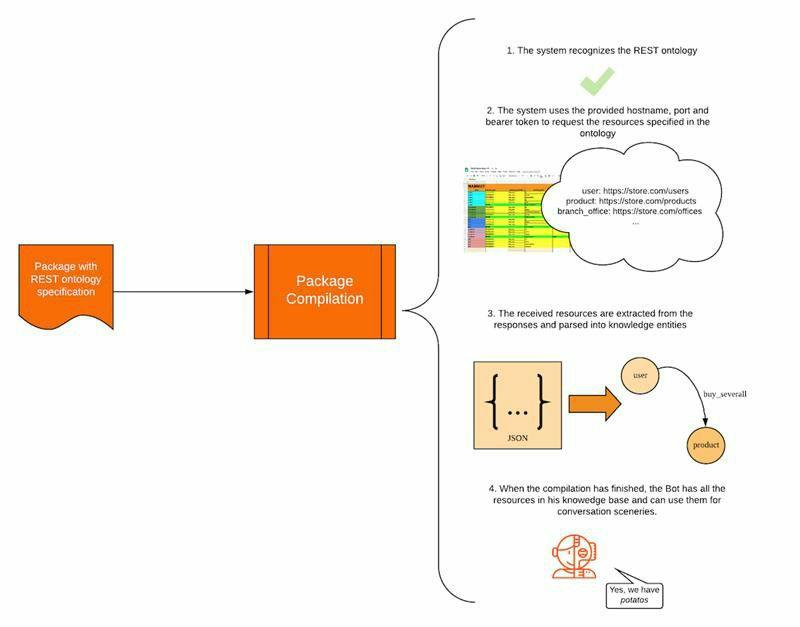

# Ontología REST

Una **ontology** del **package** puede especificar los vertices para que se basen en recursos REST API. Esto indica que esos vertices serán solicitados dinámicamente a una REST API remota, y los valores de respuesta serán analizados como properties de los vertices; todo esto durante la compilación del package. El soporte de la REST ontology está disponible sólo para las APIs basadas en JSON.

- [Estructura general de la REST ontology](#estructura-general-de-la-rest-ontology)
- [Requisitos de la REST API para la integración de la ontology](#requisitos-de-la-rest-api-para-la-integración-de-la-ontology)
- [Especificación de la REST ontology](#especificación-de-la-rest-ontology)
- [Aplicaciones](#aplicaciones)

| Contenido relacionado | [ontology](ontology.md), [vertices](vertices.md), [edges](edges.md), [properties](properties.md) |
|-|-|

------

## Estructura general de la REST ontology

La idea principal del soporte ontológico REST es permitir entrenar al bot con datos accesibles a través de una interfaz REST API.
Esto significa que la ontology puede ser modelada para mantener el esquema de los recursos del API. A continuación se enumeran algunas consideraciones:

- Las "API REST" y los vertices de la ontology están orientados a sustantivos. Por lo tanto, los vertices _se mapean_ directamente a los recursos de la API.
- Los valores de representación RESTFUL (campos en las representaciones JSON de los recursos) _se mapean_ directamente a las properties de la ontology.

El spreadsheet de la ontology ofrece una forma de especificar estas consideraciones.
En el tiempo de compilación, el sistema detectará que los elementos de la ontology _serán extraídos_ de una REST API.



Los packages para REST ontologies deben especificar:

1. Un `hostname` donde la REST API sea accesible. (También se puede especificar un `puerto` opcional).
2. Un `Bearer token` para la autenticación de la API.
3. Una `URL` para cada recurso que será parseada a los vertices del knowledge.
4. Entradas de `ruta JSON` para los vertices y properties para que el sistema sepa dónde y qué buscar en las respuestas de la API.

------

## Requisitos de la "REST API" para la integración de la ontology

**Respuesta de JSON**

La característica de REST ontology soporta sólo la aplicación/json para los tipos de medios como el tipo de contenido de las respuestas. Todas las solicitudes, especificadas en la ontology para ser usadas directamente como vertices, deben devolver este tipo de contenido.

**Bearer authentication**

El API utilizado con la característica REST ontology debe soportar la Bearer authentication. Este es el único método de autenticación soportado.

**Variedad de rutas URL**

Para que la funcionalidad de la REST ontology se ejecute correctamente es necesario que cada ruta URL utilizada para un vertex sea diferente de las demás. La ruta URL utilizada para un vertex debe ser única.

**El entry point debe ser estático**

La instancia principal del entry_point de la ontology debe ser declarada en el knowledge. En otras palabras, el entry_point no puede ser declarado para descargar.

------

## Especificación de la REST ontology

### Especificación de la presentation

Para especificar las RESTFUL ontologies que se descargarán de una API, deben especificarse los siguientes campos en la presentation.

| Campo | Description |
|--------------|----------------------------------------------------------------|
| `REST host`  | Declara el `hostname` HTTPS para solicitar la RESTful API.      |
| `REST port`  | Declara el `puerto` del `hostname` si es necesario.                    |
| `REST token` | Declara el token de la `Bearer` authentication para usar en las solicitudes HTTPS. |

### Especificación del spreadsheet

Para especificar los vertices de la ontology como recursos RESTFUL para ser descargados desde una API, se utilizan las siguientes columnas en el sheet de vertices.

| Campo | Descripción | Sintaxis |
| --- | --- | --- |
| `endpoint`     | Declara la `ruta URL` para solicitar los recursos de tipo vertex. | - plain string<br/> - property interpolated string<br/> - `{previous}` tag<br/> - `{current}` tag |
| `entity_field` | Declara la `ruta JSON` para extraer una entidad de un vertex o una property de un vertex. | Cadena del [JSON path](http://jsonpath.org) |

### Columna `endpoint`
La columna `endpoint` puede ser rellenada en las filas **edge** de un vertex. Esto significa que el vertex al que conduce el edge es un vertex REST descargable.

El sistema buscará entidades de este vertex, en la respuesta devuelta a la solicitud que se hizo usando el _valor de la celda_ del `endpoint` como la ruta URL.

>**Nota:** el sistema creará tantas instances como objetos haya en la respuesta.

#### Cadena simple

Se puede especificar una cadena simple como el valor de la celda para la columna del `endpoint`. El sistema tomará la cadena literal como la `ruta URL` de la solicitud.

**Example:** `/api/version1/users`

#### Property de la cadena interpolada

Si las filas del **edge** pertenecen a un REST vertex descargable, el valor del `endpoint` puede ser compuesto usando valores de una property directamente del propio vertex usando la etiqueta `{property name}`.

Por ejemplo, si el vertex tiene una property `name`, el valor del `endpoint` de un edge puede especificarse como: `/api/version1/users/{name}/addresses`

#### Etiqueta {previous}

La etiqueta `{previous}` puede ser usada para reutilizar la `ruta URL` del último vertex en el transversal. Desde la perspectiva del ejemplo anterior: `/api/version1/users/{name}/addresses`

Este valor podría escribirse como: `{previous}/{name}/addresses`

#### Etiqueta {current}

La etiqueta `{current}` se utiliza para indicar que los recursos necesarios para crear esos vertices se pueden encontrar en la respuesta JSON actual. Por lo tanto, no es necesario hacer una solicitud a la REST API, en su lugar los valores pueden ser extraídos de la _respuesta actual_.

### Columna `entity_path`

La columna `entity_path` debe rellenarse para las filas de **properties** de **vertices** y las filas de properties de **edges**.

#### Edge rows

Cuando el `entity_path` se rellena en una fila del edge, se hace con el `JSON path` dirigido al recurso de vertex real en la respuesta JSON.

Dado un `cuerpo` de respuesta como:

```javascript
{
    users: [
        {
            "name": 'John',
            "lastname": 'Doe',
            "state": 'AZ'
        },
        {
            "name": 'Patty',
            "lastname": 'Dactyl',
            "state": "CA"
        },
        {
            "name": 'Maureen',
            "lastname": 'Bugg',
            "state": "FL"
        }
    ]
}
```

La fila que especifica un vertex de `usuario` tendrá un valor `entity_path` que indica dónde encontrar a los usuarios, utilizando la notación del `JSON path`: `$.users[*]`

>**Nota:** en la sintaxis del `JSON path`, el objeto `root` se representa con '$'.

#### Filas de properties

Cuando se rellena el `entity_path` en una filas de properties, se hace con el `JSON path` dirigido al valor de la property en la respuesta JSON.

```javascript
{
    users: [
        {
            "name": 'John',
            "lastname": 'Doe',
            "state": 'AZ'
        },
        {
            "name": 'Patty',
            "lastname": 'Dactyl',
            "state": "CA"
        },
        {
            "name": 'Maureen',
            "lastname": 'Bugg',
            "state": "FL"
        }
    ]
}
```

La fila que especifica el `name` de la property `user`, se rellenará con el `JSON path` dirigido al campo de `name` en cada objeto.

`metadata.name`

También es posible omitir el nombre de la property. El sistema lo detectará automáticamente si un campo se llama igual que el nombre de la property de la fila.

`metadata`

>**Nota:** el objeto `root` ('$') está implícito. Se refiere al objeto actual que está siendo procesado como un vertex.

------

## Aplicaciones
El soporte de REST puede utilizarse para modelos de REST API que se adaptan fácilmente a las ontologies de Mammut, lo que hace posible que un bot incorpore automáticamente datos remotos a su knowledge.

### Integración de bKube

Integración de bKube significa integración de bot kubernetes. Esta aplicación utiliza el soporte de la REST ontology para integrar un estado de clúster de Kubernetes como el knowledge del bot, haciendo posible que las interacciones en tiempo real involucren los datos del estado del clúster.

[Referencia general de bKube](#)
