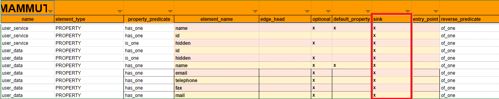

# Sink

## Definición

El **sink** es una funcionalidad que le permite al bot recoger datos enviados por un agente usuario e incorporarlos al conversation scope. Los elementos **sink** de un knowledge representan _los datos que el bot quiere saber_. 

Un elemento **sink** es aquel cuyo campo en el knowledge está vacío con el porpósito de ser llenado a partir de un dato suminitrado por los usuarios en una conversación. 

Conceptos relacionados: [corpusM](corpusM), [property](properties.md), [knowledge commit](knowledge_commit.md), [vertices](vertices.md).

## ¿Cómo funciona?

El sink se aplica a las **properties**. En el diseño de la ontology, el desarrollador decide qué properties definir como **sink**. Se debe marcar una **x** en la columna **sink** del sheet **vertices** del corpus. De esta manera, dicha property estará configurada para recoger información de la conversación.

Figure: vista de un **sink vertex** desde el sheet **vertices**.

Los datos que se atraparán en el conversation scope serán los tokens identificados por una variable que concluya en una **sink property**.

> **Nota:** Los datos incorporados al conversation scope a partir de una sink property se guardarán de forma persistente por medio de un **knowledge commit** (véase [knowledge commit](knowledge_commit.md)).

## Ejemplo

| id | sub_id | scenario_type | event_message | hidden | field | lambda_condition | ui_event | action | source | regional_settings | complexity
| - | - | - | - | - | - | - | - | - | - | - | - |
1 | 1 | Conversation | Hola! |  |  |  |  |  | Carla | es |
1 | 2 | Conversation | Hola! Bienvenido a la tienda de varitas y calderos del señor Jollivanders. ¿En qué puedo ayudarte? |  |  |  |  |  | Mammut | es |
2 | 1 | Conversation | ¿Cuál es el precio de la [`variable\|tienda.sell_several.varita.name`] en [`variable\|tienda.name`]? |  |  |  |  |  | Carla | es |
2 | 2 | Conversation | La [`variable\|tienda.sell_several.varita.name`] cuesta [`variable\|tienda.sell_several.varita.price`]. |  |  |  |  |  | Mammut | es |
2 | 3 | Conversation | Quiero comprar una de [`variable|store.manage.user_data.order`] |  |  |  |  |  | Carla | es |
2 | 4 | Conversation | De inmediato. Dame tu correo electrónico para concluir tu petición. |  |  |  |  |  | Mammut | es |
2 | 5 | Conversation | Mi correo es [`variable|store.manage.user_data.email`] |  |  |  |  |  | Carla | es |
2 | 6 | Conversation | Tu compra sera procesada. Con el email [`variable|store.manage.user_data.email`]. |  |  |  |  | **knowledge_commit(store.manage.user_data)** | Mammut | es |
