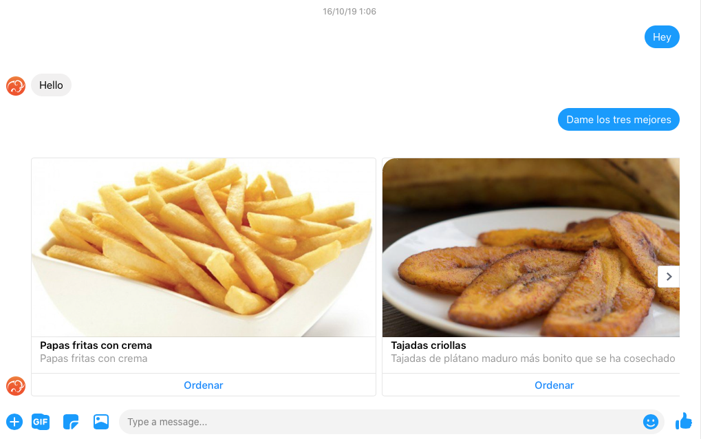

# Facebook channel

Esta sección te guía a través de la integración de Facebook Messenger con tu bot. Al final de esta sección, tu bot podrá manejar las conversaciones de las personas que envíen mensajes directos a tu página de Facebook.

Estas integraciones requieren que tengas un _ID de página de Facebook_ y un _token de acceso_ a la aplicación de Facebook a la que esté suscrita tu página.

+ [Obtén tu _ID de una página_ de Facebook](#obtén-tu-id-de-una-página-de-facebook).
+ [Obtén tu _token de acceso_ a la aplicación de Facebook](#obtén-tu-token-de-acceso-a-la-aplicación-de-facebook).
+ [Integra el Facebook Messenger a tu bot](#integra-el-facebook-messenger-a-tu-bot).
+ [Resumen](#resumen).

## Obtén tu ID de una página de Facebook

Si aún no lo has hecho, [crea una página de Facebook](https://www.facebook.com/help/104002523024878).

Comprueba cuál es tu ID de página de Facebook [aquí](https://www.facebook.com/help/1503421039731588).

-----

## Obtén tu token de acceso a la aplicación de Facebook

Para integrar con éxito tu página de Facebook con tu bot, necesitas suscribir tu aplicación de Facebook a los eventos de tu página de Facebook.

Si no tienes una aplicación de Facebook, tienes que seguir estos pasos:

* Crea tu aplicación de Facebook.
* Suscribe tu página de Facebook a tu aplicación.
* Configura tu **API URL de Mammut** como un webhook usando tu **token de verificación de Mammut** en tu aplicación.

Para llevar a cabo estos pasos con éxito, puedes seguir las instrucciones de esta [página de documentación de Facebook](https://developers.facebook.com/docs/messenger-platform/getting-started/app-setup/).

Suscríbete al webhook de tu URL Mammut para los eventos: `mensajes, entrega_de_mensajes, devolución_de_mensajes, lecturas_de_mensajes`.

Cuando hayas terminado, recuerda guardar en algún lugar el token de acceso a Facebook que has obtenido.

-----

## Integra el Facebook Messenger a tu bot

Ahora que tienes tu "ID de la página de Facebook" y tu "token de acceso a la aplicación de Facebook", puedes integrar un bot con el chat de tu página de mensajería.

Crea el bot usando REST y añade los campos JSON:

| Nombre                    | Tipo   | Observación                                   |
|-------------------------|--------|-----------------------------------------------|
| `user-type`             | string | Tu bot debe ser una "máquina".                 |
| `facebook-id`           | string | El _ID de tu página de Facebook_. |
| `Facebook-access-token` | string | Su _Token de acceso a la aplicación de Facebook_.             |
| ...                     |        | Cualquier otro valor opcional para el `User`           |

>   + **URL**
>       
>       /app:mammut-1/graph/user
>
>   + **Method**
>   
>       `POST`
>
>   + **Request parameters**
>
>     - `Content-Type`: `application/json`   
>
>   + **Request Body Example**
>       ```javascript
>            {
>                "user-type": "machine",
>               "facebook-id": "12345678",
>               "facebook-access-token": "DfkZApfHi6EaGpCfBf8ADHCqXVtH4m5hDfkZApfHi6EaGpCfBf8ADHCqXVtH4m5hDfkZApfHi6Ea",
>               "name": "Facebook customer service bot"
>           }
>       ```
>
>   + **Success response**
>       
>       + **Code**: 200
>       + **Body**: `TaskResult` response.

Si ya tienes un mammut bot creado, puedes añadir los campos mencionados anteriormente realizando una actualización:

| Nombre                    | Tipo   | Observación                                   |
|-------------------------|--------|-----------------------------------------------|
| `mammut-id`             | string | El id de tu bot                         |
| `facebook-id`           | string | El _ID de tu página de Facebook_. |
| `Facebook-access-token` | string | Su _Token de acceso a la aplicación de Facebook_.             |

>   + **URL**
>       
>       /app:mammut-1/graph/user:[id]
>
>   + **URL Parameters**
>
>     - `mammutId` 
>
>   + **Query Parameters**
>
>     - `slack-bot-id`
>     - `slack-bot-token`
>   
>   + **METHOD**
>   
>       `POST`
>
>   + **Request Example**
>
>   - `URL`: /app:mammut-1/graph/user:[125678]
>   - `Query string`:
>       facebook-id="12345678"&facebook-access-token="DfkZApfHi6EaGpCfBf8ADHCqXVtH4m5hDfkZApfHi6EaGpCfBf8ADHCqXVtH4m5hDfkZApfHi6Ea
>   
>   + **Success response**
>   
>       + **Code**: 200

Ya sea que hayas creado un nuevo bot, o actualizado uno existente, ahora está integrado con el mensajero de Facebook.

-----

## Resumen

Has integrado tu chatbot de mamut con tu _página de Facebook_ usando tu _aplicación de Facebook_.
Tu bot es ahora capaz de entablar conversaciones con los visitantes de tu página a través de Messenger

