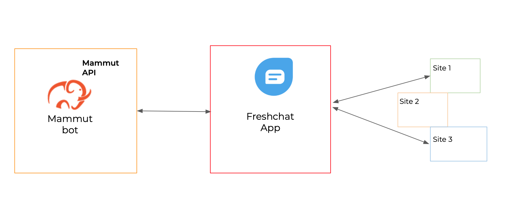

# Canal freshchat

Freshchat es una solución de chat en vivo para el soporte de los clientes. 

Los bots de Mammut pueden ser [integrados en Freshchat](https://mammut.io/freshchat/?lang=en) para potenciar características como:

- Soporte a clientes 24/7
- Conversaciones personalizadas que ofrecen información fiable y actualizada.
- Agilidad en la dinámica de los bots al solicitar la supervisión humana sólo cuando se requiere con precisión.

Esta página te guía a través de los pasos para integrar tu bot con Freshchat.

- [Requisitos previos](#requisitos-previo)
- [Prepare su información de Freshchat](#prepare-su-información-de-freshchat)
- [Configura tu Mammut Webhook en Freshchat](#configura-tu-mammut-webhook-en-freshchat)
- [Integra tu bot a Freshchat](#integra-tu-bot-a-freshchat)
- [Soporte multicanal de Freshchat](#soporte-multicanal-de-freshchat)
- [Asignación automática de Issues a un grupo](#asignación-automática-de-issues-a-un-grupo)

-----

## Requisitos previos

* Debe tener un perfil de "administrador" o "administrador de cuentas" de Freshchat.
* Su [Plan de Freshchat](https://www.freshworks.com/live-chat-software/pricing/) debe admitir la funcionalidad de las API.

-----

## Prepare su información de Freshchat

Para proceder a la integración, es necesario recoger alguna información de la aplicación Freshchat.

- **ID de APP de Freshchat:** para obtener su ID de APP de Freshchat vaya a su panel de control de Freshchat. Desde allí ve a _Ajustes_->_Ajustes de la cuenta_->_Ajustes de integración_. Allí puedes comprobar y copiar tu ID del APP.

-  **Token de la API de Freshchat:** para obtener un token de la API, ve a tu panel de control de Freshchat. Desde allí, ve a _Ajustes_->_Tokens API_. Allí podrá encontrar un token para compartir. 

   > **Nota:** Si todavía no tienes un token de la API de Freshchat, créalo utilizando la opción _Generar token_.

- **User agent_id de Freshchat:** necesitas proporcionar un user agent_id para tu bot. Para ello, debes crear un usuario utilizando la API de Freshchat. Siga [esta sección y obtenga su _agent_id_].

- **Group name** (opcional): si deseas activar la asignación automática de la conversación a ese grupo cuando se produzca un issue en la conversación.

-----

## Configura tu Mammut Webhook en Freshchat

Necesitas configurar tu webhook de la plataforma Mammut para comunicar tu aplicación de Freshchat con la plataforma del backend de Mammut.

Para la configuración de Webhook, ve a Configuración->Webhooks y configura tus preferencias.

Tu webhook Mammut para freshchat tiene esta forma:..:

    Webhook SMS Mammut: https://api.mammut.io/channels/sms/

**Importante:** la URL de tu webhook puede ser diferente si estás usando una implementación fuera de nuestra nube.

Después de configurar tu Webhook, sigue a la siguiente sección para integrar tu bot.

------

## Integra tu bot a Freshchat

Puedes crear un nuevo bot para Freshchat o puedes integrar uno ya existente. Tienes que utilizar toda la información recogida en las secciones anteriores.

Para crear un nuevo bot debes realizar una solicitud de REST a la API de Mammut.

| Nombre                     | Tipo   | Observación                                                                  |
|--------------------------|--------|------------------------------------------------------------------------------|
| `user-type`              | string | Tu bot debe ser una "máquina".                                                |
| `freshchat-actor-id`     | string | El ID de agente de Freshchat para tu bot.                                         |
| `freshchat-access-token` | string | Su Token API de Freshchat.                                                    |
| `freshchat-app-id`       | string | Su ID de la API de Freshchat.                                                       |
| `freshchat-group-name`   | string | [Opcional]. El nombre del grupo para la asignación automática de Issues en las conversaciones. |
| ...                      |        | Cualquier otro valor opcional para el tipo de `user`                                     |

**Creating a new mammut**
>   + **URL**
>       
>       /app:mammut-1/graph/user
>
>   + **Method**
>   
>       `POST`
>
>   + **Request parameters**
>
>     - `Content-Type`: `application/json`  
>
>   + **Request Body example**
>       ```javascript
>            {
>               "user-type": "machine",
>               "freshchat-actor-id": "nqHLxS-PUp5PR-Hipq11-Hipq11",
>               "freshchat-access-token": "sjNNuRi7fSOzC1F8nDUusjNNuRi7fSOzC1F8nDUusjNNuRi7fSOzC1F8nDUusjNNuRi7fSOzC1F8nDUu",
>               "freshchat-app-id": "R2W2ZRq-jLdFmet-pifAPoX-nr86hsU-skxBQm4",
>               "freshchat-group-name": "Mammut Bot Support team"
>               "name": "freshbot"
>           }
>       ```
>
>   + **Success response**
>       
>       + **Code**: 200
>       + **Body**: `TaskResult` response

Si ya tienes un bot creado, puedes añadir los campos mencionados anteriormente realizando una **actualización**:


| Nombre                     | Tipo   | Observación                                                                  |
|--------------------------|--------|------------------------------------------------------------------------------|
| `mammut-id`              | long   | El id de tu bot.                                                |
| `freshchat-actor-id`     | string | El ID de agente de Freshchat para tu bot.                                         |
| `freshchat-access-token` | string | Su Token API de Freshchat.                                                    |
| `freshchat-app-id`       | string | Su ID de la API de Freshchat.                                                       |
| `freshchat-group-name`   | string | [Opcional]. El nombre del grupo para la asignación automática de Issues en las conversaciones. |

>   + **URL**
>       
>       /app:mammut-1/graph/user:[mammut-id]
>   
>   + **Query Parameters**
>
>     - `freshchat-actor-id`
>     - `freshchat-access-token`
>     - `freshchat-app-id`
>     - `freshchat-group-name`
>
>   + **METHOD**
>   
>       `POST`
>
>   + **Request Example**
>
>   - `URL`: /app:mammut-1/graph/user:125678
>
>   - `Query string`:
>       freshchat-actor-id=`"value"`&freshchat-access-token=`"value"`&freshchat-app-id=`"value"`&group-name=`"value"`
>
>   + **Success response**
>   
>       + **Code**: 200

Con las solicitudes anteriores, el bot se integrará en la aplicación de Freshchat.

-----

## Soporte multicanal de Freshchat

La integración de Mammut con Freshchat permite [funcionalidad multicanal].

En resumen, la funcionalidad multicanal es la posibilidad de entrenar a un solo bot para que hable de acuerdo al contexto.

Por ejemplo, si tienes dos sitios principales: uno vende comida, y el otro vende utensilios de cocina, puedes entrenar a un solo bot para que hable con los clientes de ambos sitios.



La funcionalidad multicanal de Mammut está activa en Freshchat aprovechando su capacidad de múltiples sitios. Si necesitas la funcionalidad multicanal de tu bot en tu cuenta de freshchat, necesitas declarar el ID del sitio para los sitios donde usas Freshchat. Consulte este enlace para saber [cómo utilizar su cuenta de Freshchat en varios sitios](https://developers.freshchat.com/web-sdk/#multi-site).

Una vez que lo hayas hecho, tu bot será capaz de reconocer el ID del sitio de los mensajes entrantes y podrá interactuar según el contexto.

> **Nota:** recuerda que la funcionalidad multicanal se comporta de acuerdo con la especificación de tu paquete Mammut.

-----

## Asignación automática de Issues a un grupo

Al establecer la propiedad `freshchat-group-name` para tu bot, estás activando la asignación automática de conversaciones con Issues.

Cada vez que tu bot se encuentre con una "Thought Offer To Be Learned", la conversación en la que se produjo el problema será asignada a ese grupo de "Freshchat".
