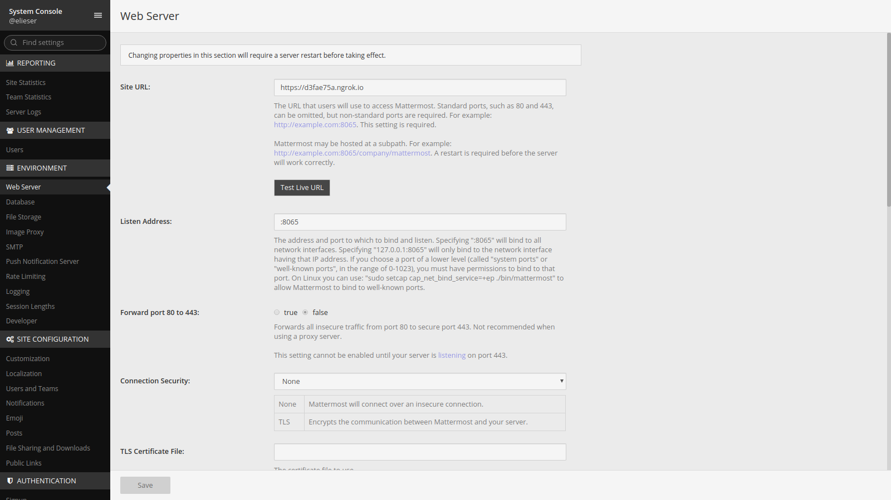
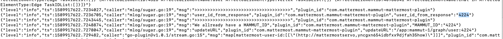

## **Mattermost**

Esta sección te guía en la integración de tu bot de Mammut como el bot en tu implementación de Mattermost.

Actualmente, soportamos la integración de tu bot a través de mensajes privados. Esto es útil para los bots de operación, como un [bKube mammut].

+ [Requisitos previos de Mattermost](#requisitos-previos-de-mattermost)
+ [Instalar el plugin de Mammut Mattermost](#instalar-el-plugin-de-mammut-mattermost)
+ [Integrar tu bot](#integrar-tu-bot)

-----

## Requisitos previos de Mattermost

Para integrar tu bot Mammut con Mattermost, tienes que instalar el [Mattermost Mammut Plugin](https://github.com/mammut-io/mammut-mattermost-plugin/blob/master). Para ello, debes tener tu propia implementación de Mattermost, o tener acceso a una.

Puedes leer más sobre cómo conseguir tu servidor Mattermost en su [documentación oficial](https://docs.mattermost.com/guides/administrator.html#installing-mattermost).

Pasa a la siguiente sección una vez que tengas tu Implementación Mattermost en funcionamiento.

-----

## Instalar el plugin de Mammut Mattermost

En esta sección se especifican los pasos para instalar el _Mattermost Mammut Plugin_ en su implementación de Mattermost.

Debería estar familiarizado con la instalación de plugins. Aquí está la [página oficial de documentación de plugins](https://docs.mattermost.com/administration/plugins.html#set-up-guide). Si se siente cómodo con la instalación de plugins, siga estos pasos:

- Descargue el paquete de _Mattermost Mammut Plugin_ `.tar` [aquí].

- Asegúrese de que la URL de su servidor Mattermost está correctamente configurada en _System Console_>_Plugins_>_mammut-mattermost-plugin_ configuration panel.

    

- Instale el _Mattermost Mammut Plugin_ como cualquier otro plugin en su implementación.

- Después de la instalación del plugin, ve a la página de configuración del plugin en _System Console_>_Environment_>****

    - Configura la **URL de la API de Mammut**.

    - Si ya tienes un bot, establece el campo _MammutUserId_. De lo contrario, deja el campo vacío.

        
        > **Nota:** si dejas el campo vacío, Mattermost creará automáticamente un bot en el sistema Mammut para tu **URL de la API de Mammut**.
        > 
        > Para obtener el `mammut-id` de este bot creado, puedes comprobar los logs de tu servidor:
        > 

- Habilita el plugin y pulsa el botón `Guardar`.

## Integrar tu bot

Si ya tenías un bot antes de instalar tu plugin, necesitas integrarlo con tu implementación de Mattermost. Para ello, tienes que configurar un nuevo campo en tu bot usando la API de Mammut:

| Nombre                 | Tipo                          | Observación                                                                                    |
|----------------------|-------------------------------|------------------------------------------------------------------------------------------------|
| `mammut-id`          | long                          | El ID de tu bot.                                                                  |
| `mattermost-user-id` | Array[Tuple2[String, String]] | Un conjunto de cadenas que contienen tuplas (pares) de  `mattermost host domain -> mattermost bot id` |

>   + **URL**
>       
>       /app:mammut-1/graph/user:[mammut-id]
>   
>   + **Query Parameters**
>
>     - `slack-bot-id`
>     - `slack-bot-token`
>
>   + **URL Parameters**
>
>     - `mammutId` 
>
>   + **METHOD**
>   
>       `POST`
>
>   + **Request Example**
>
>   - `URL`: /app:mammut-1/graph/user:125678
>   - `Query string`:
>       mattermost-user-id=["(mymattermoshost.com, yncgxn654idbfxx9djfah35how)"]
>
>   + **Success response**
>   
>       + **Code**: 200

Si la respuesta fue satisfactoria, el bot se integró con éxito en tu Implementación de Mattermost y está listo para funcionar.

> **Nota:** recuerda que tienes que anotar tu `mammut-idp  en la página de configuración del panel del plugin.

