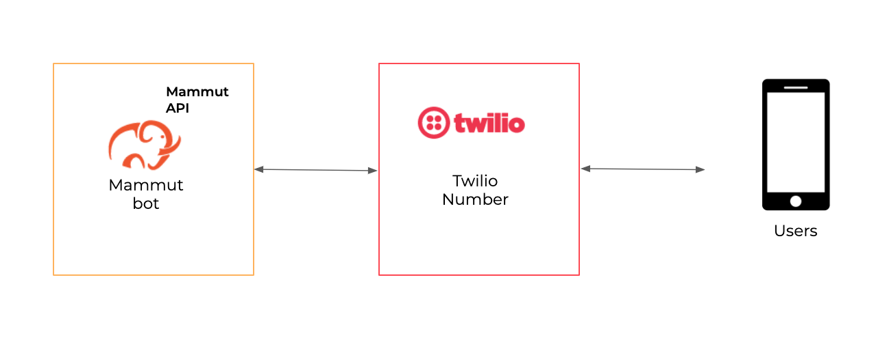
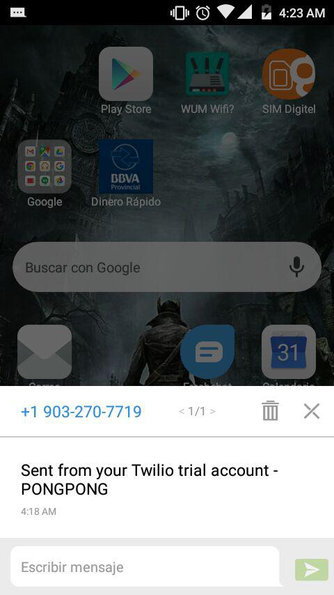

# Canal SMS

Los bots de Mammut pueden integrarse con los números de [Twilio](https://www.twilio.com/) para proporcionar comunicaciones SMS con los usuarios. Esta sección te guía a través de la integración de un canal de SMS para tu bot.

Para ello, necesitas suscribir tu bot a un número de teléfono Twilio. Después de hacer esto, tu bot será capaz de entablar conversaciones bidireccionales con los usuarios que enviaron SMS a ese número de teléfono.



+ [Cuenta de prueba gratuita de Twilio vs Twilio activado](#cuenta-de-prueba-gratuita-de-twilio-vs-twilio-activado)
+ [Configura tu información de Twilio](#configura-tu-información-de-twilio)
+ [Integra tu bot a tu número de teléfono de Twilio](#integra-tu-bot-a-tu-número-de-teléfono-de-twilio)
+ [Resumen](#resumen)

-----

## Cuenta de prueba gratuita de Twilio vs Twilio activado

Cuando eres nuevo en Twilio, puedes crear una **cuenta de prueba gratuita** y se te proporcionará un número de teléfono para probar las funcionalidades. Los números de la versión de prueba gratuita te permiten usar las mismas funcionalidades que las compradas, con algunas limitaciones.

Si tu objetivo es probar la funcionalidad de tu bot o experimentar, puedes usar tu número de Prueba. Sin embargo, sólo podrá probar la funcionalidad con "números de teléfono verificados".

Cuando estés listo, puedes actualizar tu cuenta de Twilio y comprar un número de teléfono listo para ser usado por usuarios reales.

Puedes aprender más acerca de cómo usar tu versión de prueba y cómo actualizarla [aquí](https://www.twilio.com/docs/usage/tutorials/how-to-use-your-free-trial-account).

En el resto de este documento, cuando nos refiramos a tu **número de teléfono de Twilio**, lo haremos sin importar si es un número de teléfono de prueba o uno comprado.

-----

## Configura tu información de Twilio

El soporte de Mammut SMS está integrado con [Twilio SMS](https://www.twilio.com/sms). Para una integración exitosa tienes que proporcionar tu..:

- Twilio ACCOUN SID.
- Twilio AUTH TOKEN.
- Tu número de teléfono de Twilio.

Sigue los siguientes pasos para encontrar estos valores:

- Ingresa a tu [cuenta de Twilio](https://www.twilio.com/console).

- En el Dashboard de tu proyecto Twilio, puedes encontrar el ACCOUNT SID y el Auth Token.

- También puedes ir a **Settings**, **General**, y localizar tu _ACCOUNT SID_ y tu _AUTH TOKEN_.

- Toma nota de tu ACCOUNT SID y AUTH TOKEN. Si tienes varias fichas, debes usar el Primary Token.

- Toma nota del número de teléfono activo con el que quieres integrar tu bot. Desde el panel de control, puedes ir a **All Products and Services**, **Phone numbers** y allí seleccionar el correcto.

- Configura el Mammut Webhook para tu número de teléfono. Ve a Todos los productos y servicios, Números de teléfono, Mensajería. Aquí puedes configurar tu webhook de Mammut para cuando llegue un mensaje:

    `Webhook SMS Mammut: https://api.mammut.io/channels/sms/`

    >**Nota:** la URL de tu webhook puede ser diferente si estás usando una implementación fuera de nuestra nube.

Ten a mano tu ACCOUNT SID, AUTH TOKEN y número de teléfono.Los vas a necesitar en la siguiente sección.

-----

## Integra tu bot a tu número de teléfono de Twilio

Con la información de tu cuenta de Twilio configurada, podemos proceder a integrar tu bot Mammut con tu número de Twilio.

Crea el bot usando REST y añade los campos JSON:

| Nombre                 | Tipo   | Observación                                                                                                                                    |
|----------------------|--------|------------------------------------------------------------------------------------------------------------------------------------------------|
| `user-type`          | string | Tu bot debe ser una "máquina".                                                                                                                  |
| `twilio-account-sid` | string | Tu Twilio SID                                                                                                                                |
| `twilio-auth-token`  | string | Tu Twilio ACCESS TOKEN                                                                                                                       |
| `main-phone-number`  | string | Tu número de teléfono de Twilio en [E.164 formatting](https://support.twilio.com/hc/en-us/articles/223183008-Formatting-International-Phone-Numbers). |
| ...                  |        | Cualquier otro valor opcional para el tipo de `user`.                                                                                                       |

### Creando un nuevo bot
>   + **URL**
>       
>       /app:mammut-1/graph/user
>
>   + **Method**
>   
>       `POST`
>   + **Request parameters**
>
>     - `Content-Type`: `application/json`   
>
>   + **Request Body example**
>       ```javascript
>            {
>               "user-type": "machine",
>               "twilio-account-sid": "ACCOUNT_SID",
>               "slack-bot-token": "AUTH_TOKEN",
>               "main-phone-number": "+11234567890"
>               "name": "Botwi"
>           }
>       ```
>
>   + **Success response**
>       
>       + **Code**: 200
>       + **Body**: `TaskResult` response

Si ya tienes un mammut bot creado, puedes añadir los campos mencionados anteriormente realizando una _actualización_:

| Nombre                 | Tipo   | Observación                                                                                                                                    |
|----------------------|--------|------------------------------------------------------------------------------------------------------------------------------------------------|
| `mammut-id`          | long   | El id de tu bot de Mammut                                                                                                                  |
| `twilio-account-sid` | string | Tu Twilio SID                                                                                                                                |
| `twilio-auth-token`  | string | Tu Twilio ACCESS TOKEN                                                                                                                       |
| `main-phone-number`  | string | Tu número de teléfono de Twilio en [E.164 formatting](https://support.twilio.com/hc/en-us/articles/223183008-Formatting-International-Phone-Numbers). |

>   + **URL**
>       
>       /app:mammut-1/graph/user:[mammut-id]
>   
>   + **Query Parameters**
>
>     - `twilio-account-sid`
>     - `twilio-auth-token`
>     - `main-phone-number`
>
>   + **URL Parameters**
>
>     - `mammutId` 
>
>   + **METHOD**
>   
>       `POST`
>
>   + **Request Example**
>
>   - `URL`: /app:mammut-1/graph/user:125678

>   - `Query string`:
>       twilio-account-sid=`"ACCOUNT_SID"`&twilio-auth-token=`"AUTH_TOKEN"`&main-phone-number=`"+9032707719"`
>
>   + **Success response**
>   
>       + **Code**: 200


------

## Resumen

Después de los pasos anteriores, tu Mammut bot estará integrado y preparado para manejar las comunicaciones SMS a través del número de teléfono proporcionado!

