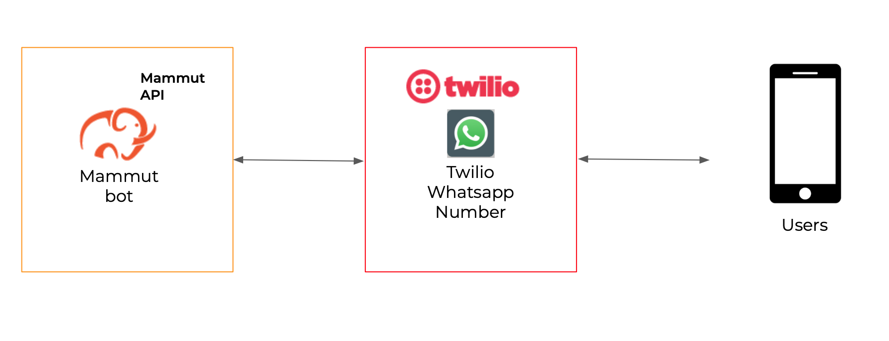

# Canal Whatsapp
Los bots Mammut pueden ser integrados con los números de teléfono de [Twilio](https://www.twilio.com/whatsapp) para soportar las conversaciones en Whatsapp. Esta sección te guía a través de la integración de un canal de Whatsapp para tu bot.

Para este soporte, tienes que suscribir tu bot a un _número de teléfono de Twilio que esté habilitado para usar Whatsapp_. Después de eso, tu bot será capaz de entablar conversaciones bidireccionales con los usuarios que hayan enviado mensajes a través de Whatsapp a ese número.



+ [Twilio Sandbox para Whatsapp](#twilio-sandbox-para-whatsapp)
+ [Consigue tu información de Twilio](#consigue-tu-información-de-twilio)
+ [Integra tu bot al número de teléfono Whatsapp de Twilio](#integra-tu-bot-al-número-de-teléfono-whatsapp-de-twilio)
+ [Resumen](#resumen)

-----

## Twilio Sandbox para Whatsapp

Cuando quieres usar Twilio para las comunicaciones en Whatsapp a través de un número de teléfono de Twilio, tienes dos etapas.

La primera es el **Sandbox de Twilio para Whatsapp**, se utiliza cuando se quiere hacer un prototipo y probar la funcionalidad sobre Whatsapp, y está disponible para utilizarlo de inmediato. Sólo necesitas tener tu cuenta de Twilio. El Sandbox Twilio para Whatsapp sólo te permite probarlo con un conjunto de usuarios que ya has añadido a tu sandbox. No está destinado a las comunicaciones con usuarios reales.

Para activar un número de teléfono real de Twilio para Whatsapp, necesitas pasar por la verificación de tu negocio con Facebook Business Manager. Cuando tu cuenta verificada de Facebook Business esté disponible, puedes solicitar la activación de Whatsapp para tu número de teléfono de Twilio.

Puedes leer en detalle acerca de Twilio Sandbox para Whatsapp [aquí en su documentación oficial](https://www.twilio.com/docs/whatsapp/api#twilio-sandbox-for-whatsapp).

También puedes encontrar información sobre cómo [habilitar Whatsapp en tu número de Twilio](https://www.twilio.com/docs/whatsapp/api#enabling-whatsapp-with-a-twilio-number) y cómo entrar en el proceso de [verificación de la cuenta de Facebook Business](https://www.twilio.com/docs/whatsapp/tutorial/connect-number-business-profile#overview-of-the-registration-process).

Para el resto de este documento, cuando nos referimos a tu Número de Twilio Whatsapp, lo hacemos sin importar si se trata de un número de teléfono del Sandbox o uno comprado con Whatsapp habilitado.

-----

## Consigue tu información de Twilio

El soporte de Mammut Whatsapp está integrado con [Twilio](https://www.twilio.com/whatsapp). Para una integración exitosa necesitarás proveer tu..:

- Twilio ACCOUN SID.
- Twilio AUTH TOKEN.
- Tu número de teléfono de Twilio para Whatsapp.

Sigue los siguientes pasos para encontrar estos valores:

- Ingresa a tu cuenta de Twilio.

- También puedes ir a **Settings**, **General**, y localizar tu ACCOUNT SID y Auth Token.

- Toma nota de tu **ACCOUNT SID** y **AUTH TOKEN**. Si tienes varias fichas, debes usar el Primary Token.

- Toma nota del número de teléfono activo con el que quieres integrar tu bot.

- Configura el Mammut Webhook para tu número de teléfono (_sólo para usuarios del Sandbox_). Ir a **All Products and Services**, **SMS programable**, **Whatsapp**, **Sandbox**. Allí podrás configurar tu webhook Mammut para cuando llegue un mensaje:

    `**Mammut Whatsapp webhook**: https://api.mammut.io/channels/whatsapp/`

    >**Nota:** la URL de tu webhook puede ser diferente si estás usando una implementación fuera de nuestra nube.

Ten a mano tu ACCOUNT SID, AUTH TOKEN y número de teléfono. Los necesitarás en la siguiente sección.

-----

## Integra tu bot al número de teléfono Whatsapp de Twilio

Con la información de tu cuenta de Twilio a mano, podemos proceder a integrar tu bot de Mammut con tu número de teléfono habilitado para Twilio Whastapp:

| Nombre                 | Tipo   | Observación                                                                                                                                    |
|----------------------|--------|------------------------------------------------------------------------------------------------------------------------------------------------|
| `user-type`          | string | Tu bot debe ser una "máquina".                                                                                                                  |
| `twilio-account-sid` | string | Tu Twilio SID                                                                                                                                |
| `twilio-auth-token`  | string | Su Twilio TOKEN DE ACCESO                                                                                                                       |
| `main-whatsapp-phone-number`  | string | Tu número de teléfono de Twilio con el formato: `whatsapp:<e164 formatted phone number>`. |
| ...                  |        | Cualquier otro valor opcional para el tipo de `user`.                                                                                                       |

### Crea un nuevo mamut
>   + **URL**
>       
>       /app:mammut-1/graph/user
>
>   + **Method**
>   
>       `POST`
>   + **Request parameters**
>
>     - `Content-Type`: `application/json`   
>
>   + **Request Body example**
>       ```javascript
>            {
>               "user-type": "machine",
>               "twilio-account-sid": "ACCOUNT_SID",
>               "slack-bot-token": "AUTH_TOKEN",
>               "main-whatsapp-phone-number": "+11234567890"
>               "name": "Botwi"
>           }
>       ```
>
>   + **Success response**
>       
>       + **Code**: 200
>       + **Body**: `TaskResult` response.

Si ya tienes un mammut bot creado, puedes añadir los campos mencionados anteriormente realizando una _actualización_:

| Nombre                 | Tipo   | Observación                                                                                                                                    |
|----------------------|--------|------------------------------------------------------------------------------------------------------------------------------------------------|
| `mammut-id`          | long   | El id de tu mammut bot.                                                                                                                  |
| `twilio-account-sid` | string | Tu Twilio SID.                                                                                                                                |
| `twilio-auth-token`  | string | Su Twilio TOKEN DE ACCESO.                                                                                                                       |
| `main-whatsapp-phone-number`  | string | Tu número de teléfono de Twilio con el formato: `whatsapp:<e164 formatted phone number>`. |


>   + **URL**
>       
>       /app:mammut-1/graph/user:[mammut-id]
>   
>   + **Query Parameters**
>
>     - `twilio-account-sid`
>     - `twilio-auth-token`
>     - `main-phone-number`
>
>   + **URL Parameters**
>
>     - `mammutId` 
>
>   + **METHOD**
>   
>       `POST`
>
>   + **Request Example**
>
>   - `URL`: /app:mammut-1/graph/user:[125678]
>   - `Query string`:
>       /app:mammut-1/graph/user:[id]?twilio-account-sid=`"ACCOUNT_SID"`&twilio-auth-token=`"AUTH_TOKEN"`&main-phone-number=`"+9032707719"`
>
>   + **Success response**
>   
>       + **Code**: 200

------

## Resumen

Después de los pasos anteriores, tu Mammut bot se integrará y preparará para manejar las comunicaciones de Whatsapp a través del número de teléfono proporcionado!