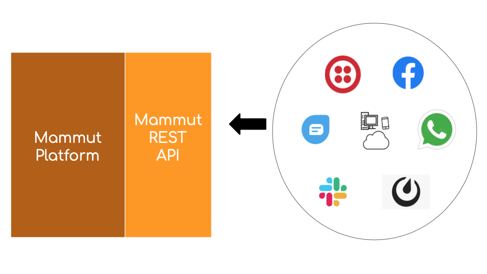
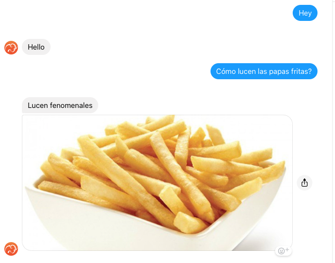

# Configuración de los canales

Esta página ofrece una visión general de la integración de los bots de la Plataforma Mammut con diferentes canales de comunicación.

Un canal de comunicación es el medio en la conversación del bot con los usuarios finales.

+ [Esquema de integración de la plataforma Mammut](#esquema-de-integración-de-la-plataforma-mammut)
+ [Ten a la mano tu URL de la API de Mammut](#ten-a-la-mano-tu-url-de-la-api-de-mammut)
+ [Canales de conversación](#canales-de-conversación)
+ [Canales de apoyo para Issues](#canales-de-apoyo-para-issues)
+ [Pasos de integración](#pasos-de-integración)

------

## Esquema de integración de la plataforma Mammut

La plataforma Mammut puede ser implementada como un servicio en diferentes formas:

* SaaS en nuestra propia nube.
* SaaS en su propia nube pública
* SaaS en su ordenador

El tipo de implementación que estás usando depende del tipo de licencia, por eso tienes que elegir tu licencia de acuerdo a tus necesidades. Si quieres saber más sobre las licencias de Mammut, ve a la [sección de documentación detallada de las licencias].

Independientemente del tipo de licencia y del tipo de implementación, Mammut proporciona una REST API como puerta de comunicación para cualquier evento externo.

La plataforma Mammut soporta la integración con plataformas de terceros para las comunicaciones de mensajería.

Esto significa que puede integrar su bot para las conversaciones con los usuarios en cualquiera de las siguientes plataformas:

+ Slack
+ Facebook
+ SMS
+ Whatsapp
+ Freshchat
+ Mattermost

La integración de los canales se apoya en la comunicación de la API de Mammut con las API de terceros. 

Un solo bot puede manejar al mismo tiempo tantas de estas plataformas como desee.

En general, para integrar un canal con tu bot, tienes que realizar operaciones REST a través de la API de Mammut para crear o actualizar el recurso de tu bot en el sistema con los datos relevantes. Esto es necesario para que tu bot pueda operar con servicios de terceros como, por ejemplo, identificadores en esos sistemas externos y tokens de acceso.

-----

## Ten a la mano tu URL de la API de Mammut

Para integrar tu chatbot con cualquier plataforma externa, necesitas una **Mammut API URL**.

Esta URL puede ser diferente según tu licencia y el tipo de implementación. Por ejemplo, si utilizas Mammut en nuestra nube, tu URL será `https://api.mammut.io`. Mientras que, si estás implementando Mammut en tu propia máquina, o en tu propia nube, tu URL será diferente.

Para integrar con éxito cualquier canal, tienes que poder realizar transacciones REST. Los pasos de integración requieren unas cuantas operaciones REST.

No te preocupes, si no eres una persona técnica, puedes llevar a cabo los pasos de integración usando el [Simulador del Notebook].

-----

## Canales de conversación

Los canales de conversación son plataformas en las que su bot puede integrarse y hablar realmente con los clientes y visitantes interesados, de esa manera puede involucrarse en escenarios de conversación "uno a uno". 

Para una descripción detallada de cómo funcionan los escenarios de conversación prácticos y las interacciones de los bots, puedes ir a la [sección de tutoriales].

Cualquiera de las plataformas disponibles puede ser integrada como un canal de conversación.

-----

## Canales de apoyo para Issues

Mammut soporta _Notificaciones y supervisión de Issues_ a través de algunos canales de clientes.

En resumen, un Issue ocurre en una conversación cuando el bot recibe un mensaje y no sabe cómo manejarlo. Entonces, el bot pide ayuda a algún supervisor humano. El supervisor puede resolver el issue proporcionando una oferta adecuada, y luego deja al bot a cargo de la conversación nuevamente.

Para una discusión detallada sobre los Issues, puedes ir al [documento de manejo de Issues].

Las siguientes plataformas pueden ser integradas para manejar las notificaciones de problemas y el soporte:

* **Slack**: como un canal de supervisión general. Es decir, en Slack, puedes monitorear los issues de las conversaciones de tu bot desde cualquier otra plataforma.
* **Freshchat**: como un canal de supervisión para las conversaciones dentro de Freshchat. Es decir, en Freshchat, puedes monitorear las conversaciones de tu bot dentro de Freshchat.

-----

## Pasos de integración

Aquí tienes secciones de integración individuales para cada canal:

+ [Slack](./channels-setup-slack_es.md)
+ [Facebook](./channels-setup-facebook_es.md)
+ [SMS](./channels-setup-sms_es.md)
+ [Whatsapp](./channels-setup-whatsapp_es.md)
+ [Freshchat](./channels-setup-freshchat_es.md)
+ [Mattermost](./channels-setup-mattermost_es.md)
