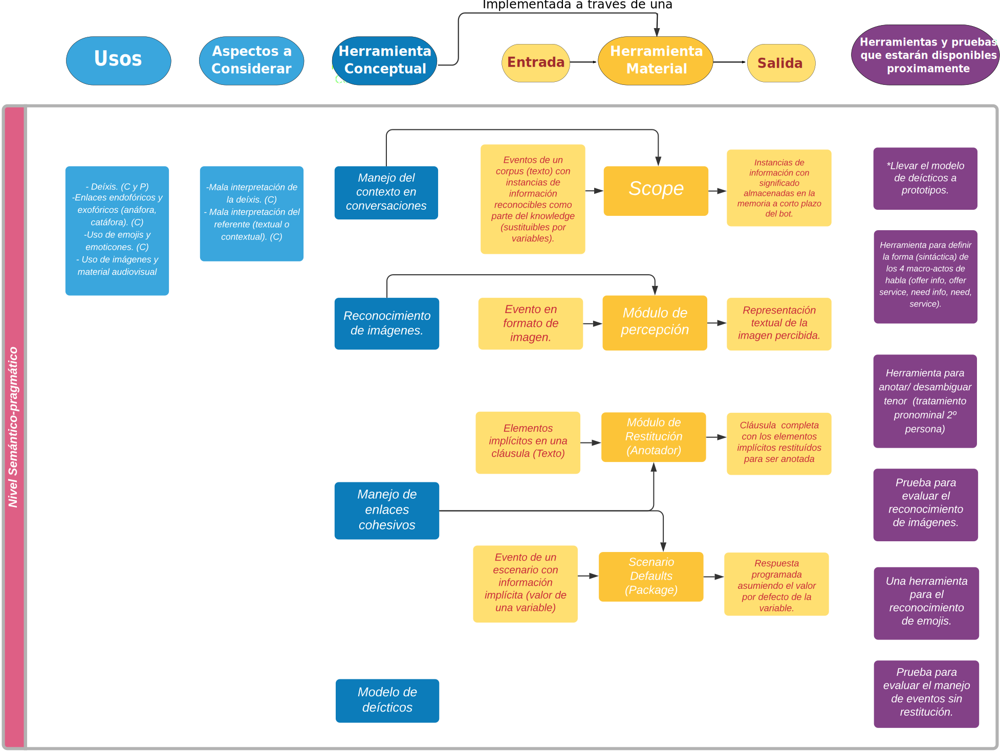

# Arquitectura de lenguaje de Mammut Framework

El siguiente mapa describe las herramientas del **Mammut Framework** que ofrecemos para el análisis del lenguaje natural. Las herramientas han sido clasificadas en cuatro niveles que, en conjunto, abarcan nuestro enfoque para el desarrollo de dispositivos conversacionales: **1) nivel léxico-morfológico, 2) nivel léxico-semántico, 3) nivel sintáctico-semántico, y 4) nivel semántico-pragmático.** En cada uno de estos niveles se encuentra un diagrama descriptivo de los procesos que comprenden las **herramientas conceptuales y materiales** del Mammut Framework, junto con una breve descripción de sus respectivos **inputs y outputs.**

