# Widget de anotación

## Descripción general

>  NOTA: El texto que se presenta a continuación contiene algunos términos lingüísitcos que son necesarios para la explicación de la herramienta. Se recomienda la lectura del glosario ubicado al final del capítulo antes de hacer la lectura del texto.

El **widget de anotación** es una herramienta que facilita la anotación de las frases o cláusulas que componen un [corpus](../concepts/corpus.md). El objetivo de esta herramienta de anotación es agregar metadatos a las frases o cláusulas que componen un texto para que el sistema de machine learning pueda ser entrenado.
A través del etiquetado de las cláusulas y sus componentes, siendo este etiquetado a su vez una herramienta del procesamiento de lenguaje natural, el **widget de anotación** puede interpretar y reproducir el lenguaje humano y así entrenar modelos de aprendizaje automático.  

Además, el **widget de anotación** soporta el etiquetado de frases o cláusulas en diversas capas de anotación que pueden configurarse en función de las necesidades concretas de un usuario. Esta herramienta sirve para anotar datos provenientes de un [corpus](../concepts/corpus.md) y permite a los desarrolladores etiquetar toda la información relevante que requiera el diseño de su chatbot. Estas anotaciones se llevan a cabo siguiendo un *esquema de anotación*

## Entrada del widget

El **widget de anotación** es una herramienta que funciona dentro del entorno de [Jupyter Notebook](cuadernos_jupyter.md)

Para que la herramienta **widget de anotación** funcione correctamente dentro de un entorno Jupyter Notebook, esta debe estar declarada en una celda de texto de la siguiente manera:

`annotation_widget = package.show_annotation_widget()
display(annotation_widget)`

Posterior a este paso, será posible utilizar la herramienta de anotación en un Jupyter Notebook.

## Funcionamiento

La herramienta **widget de anotación** permite realizar la anotación de un [corpus](../concepts/corpus.md). Con esta herramienta es posible etiquetar cualquier tipo de información que sea pertinente para un corpus específico. Además, es posible crear tantas capas de anotación o niveles de análisis como sean necesarios. Estas capas de anotación no tendrán ningún tipo de limitaciones ya que, serán desarrolladas de acuerdo a las necesidades de dicho corpus.

El **widget de anotación** permite etiquetar, en las cláusulas o frases pertenecientes a los [eventos](../concepts/events.md) que componen un [corpus](../concepts/corpus.md), diversos tipos de información lingüística, tales como:

- Morfológica: información sobre la estructura de las palabras o partes de las cláusulas.

- Sintáctica: información sobre la organización de las palabras en las cláusulas.

- Semántica: información sobre el significado de las palabras y de cómo esos significados se combinan para formar el significado de las cláusulas.

- Pragmática: información sobre el modo en que el contexto influye en la interpretación del significado.

Esta información pragmática puede ser considerada importamte para sistemas de procesamiento de lenguaje natural ya que, a través de ella es posible la recuperación de los referentes de los pronombres o de las oraciones elípticas, el análisis de  información no explícita que se desprende de un enunciado, o de las intenciones comunicativas implícitas en una frase en particular. Casi todas estas tareas implican información sobre la intención de los interlocutores, sobre el contexto extralingüístico, entre otros.

Sin embargo, la herramienta **widget de anotación** también permite etiquetar otro tipo de contenido, es decir, el desarrollador también podrá crear capas de anotación para etiquetar información sobre lugares, acciones, sentimientos, personajes, entre otros.

Así pues, independientemente del [corpus](../concepts/corpus.md), la información anotada con el **widget de anotación** servirá para el entrenamiento del chatbot.

Ahora, antes de configurar la herramienta es importante tener en cuenta que:

1. Toda la información perteneciente a cada capa de anotación debe ser definida en un documento de hojas de cálculo denominado [standard](standard.md). Dicho [standard](standard.md) almacena los parámetros (formalizaciones estadarizadas) que le permiten al desarrollador configurar la herramienta.
2. El orden de estas dimensiones o niveles de análisis deben ser definidos en este [standard](standard.md).
3. El desarrrollador debe definir en el [standard](standard.md) los distintos tipos de etiquetas necesarias para la anotación y las características que forman parte de una etiqueta.

Después de configurar la herramienta es importante tener en cuenta que:

1. Las anotaciones deben hacerse en el orden en que la herramienta muestre las dimensiones.
2.  El desarrollador no puede anotar una dimension si la anterior no ha sido anotada. Es decir que, si selecciona una dimension que no ha sido anotada, el widget automáticamente se ubicará en la ultima dimension válida.
3. El desarrollador puede crear restituciones para un [evento](../concepts/events.md). Sin embargo, la restitución debe hacerse únicamente antes de iniciar la anotación de la primera dimensión, de esa manera las siguientes dimensiones ya incluirán dicha restitucion.

> La restitución consiste restablecer algún elemento de la cláusula que haya sido omitido y que sea fundamental para el etiquetado de la misma:
> Cláusula sin restitución:  _Compré una nueva varita_.
> Cláusula con el elemento **(Yo)** restituido: **Yo** _compré una nueva varita_.

Para iniciar el proceso de anotado a través del **widget de anotación** es necesario llenar estos campos:

| Campo  | Descripción |
| ------ | ----------- |
| Select corpus  | Campo para seleccionar el corpus que se va a analizar.|
| All events    | Campo donde se reflejan los eventos que forman parte del corpus seleccionado anteriormente.|
| Select dimension   | Nivel o capa en el que se realizará la anotación de un evento seleccionado. |
| Restitution  | Campo para ingresar cualquier elemento que se desee restituir en un evento. |

> Al ingresar la restitucion es necesario hacer click en `guardar restitución`.También se debe hacer click en `guardar anotación` al terminar de etiquetar los elementos que forman parte de un [evento](../concepts/events.md). De esta manera la información anotada podrá ser almacenada en el corpus.

A manera de ejemplo, se realizará la anotación de un [corpus](../concepts/corpus.md). El ejemplo usado para esta explicación es de tema *no lingüístico*. Dicho corpus contiene diversos [eventos](../concepts/events.md) que poseen cláusulas simples sobre personajes de una película de ficción. Los eventos pertenecientes a este corpus se anotarán en una capa de anotación denominada `figure` diseñada para a anotar tanto características físicas de los personajes como algunas otras particularidades de los mismos.

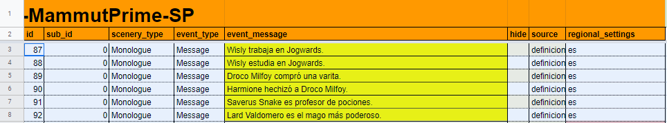

Así pues, luego de correr el **wigget de anotación** en el entorno [Jupyter Notebook](cuadernos_jupyter.md), la anotación de un determinado personaje se haría de la siguiente manera:

Lo primero que el desarrollador debe hacer es llenar los campos mencionados anteriormente como: **select corpus** para indicar el [corpus](../concepts/corpus.md) que se va a anotar; **all events** para seleccionar el [evento](../concepts/events.md) que contiene al personaje que se desea anotar; y por último seleccionar **dimension** para indicar la dimensión o nivel de análisis en el cual se anotará dicho personaje.

Para efectos de este ejemplo, el [evento](../concepts/events.md) que se utilizará será: `Wisly estudia en Jogwards`. El personaje que se anotará será `Wisly` y la dimensión o nivel de análisis que permitirá la anotación de las características del personaje será `figure`.

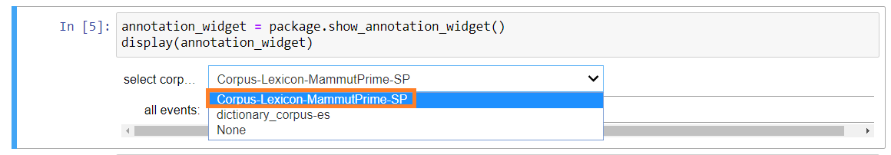

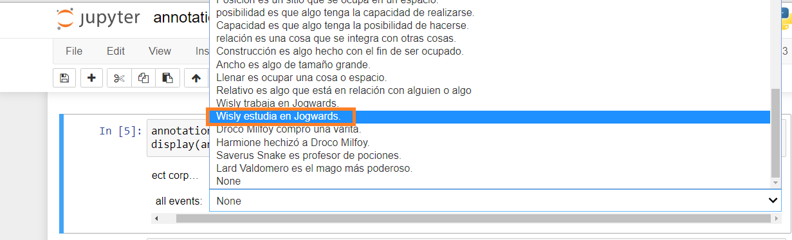

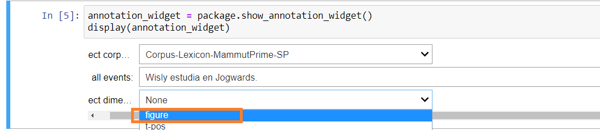

Seguidamente, para asignarle una anotación al personaje _Wisly_ el desarrollador  deberá sombrear completamente dicho nombre. De esta manera, el **widget de anotación** desplegará una ventana que permitirá seleccionar las caracterísiticas físicas que se deseen asignar a este personaje.

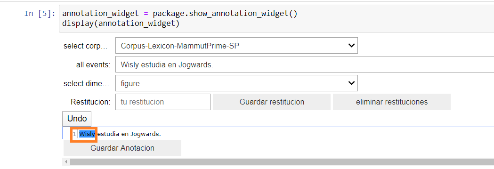

Ahora, con el **wiget de anotación** desplegado, el desarrollador podrá asignarle algunas características físicas a _Wisly_ mediante la selección de features presentes en cada una de las etiquetas dispuestas para la descripción física del personaje.

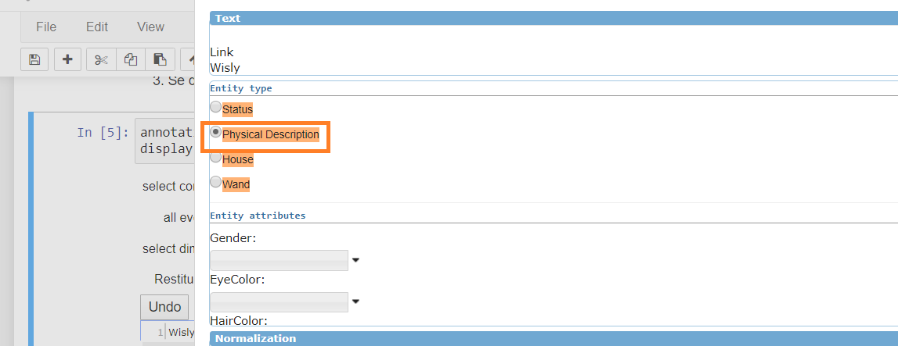

Con la etiqueta `physical description` el desarrollador podrá asignarle al personaje algunos rasgos como `gender`, `eye color` y `hair color`.

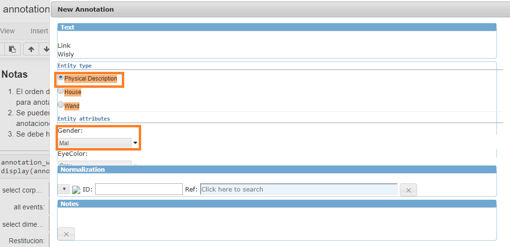

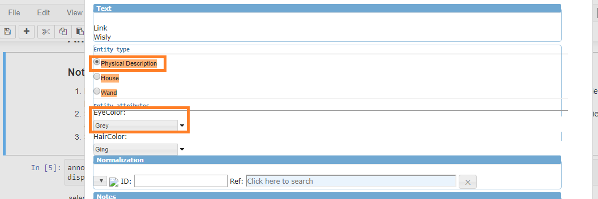

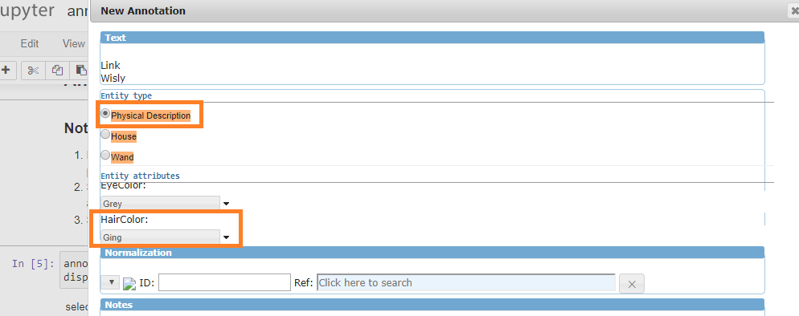

Y finalmente, luego de asignarle las características necearias al personaje el desarrollador deberá guardar la anotación para que el [corpus](../concepts/corpus.md) almacene esta data anotada.

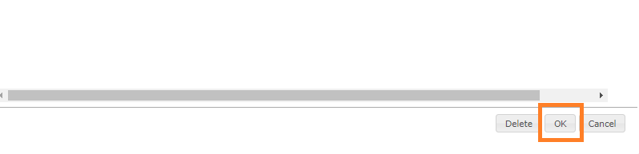

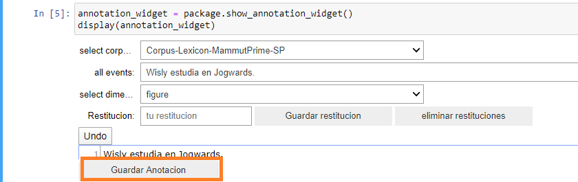

Por último, este **widget de anotación** posee otra sub-herramienta denominada _anotador de palabras funcionales_:

- Esta harramienta permite, a partir de modelos lingüísticos desarrollados por Mammut, la anotación de palabras funcionales bajo un modelado cognitivo que facilita la organización y etiquetado de la funcionalidad discursiva de preposiciones, artículos, pronombres, etc; a través de unos _features_ que se encargan de codificar las relaciones entre estas y sus argumentos.

 Si el desarrollador también desea dar uso a esta herramienta deberá declararla de la siguiente manera:

`functionals_help_widget = package.show_functionals_help_widget()
display(functionals_help_widget)`

## Almacenamiento de la data:

Las anotaciones creadas a través del **widget de anotación** se almacenan en el documento de hojas de cálculo del paquete mammut. En este caso la data anotada se guarda específicamente en la hoja de cálculo de un [corpus](../concepts/corpus.md) denominada **a-figure** que almacena las anotaciones pertenecientes a la dimensión `figure` creada en este ejemplo para anotar características físicas de personajes, tal como se puede ver en la siguiente imagen:

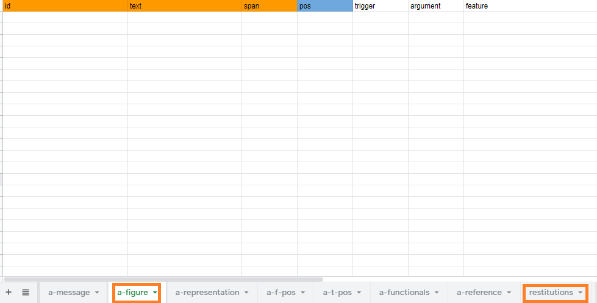

Luego de terminar el proceso de anotación, el documento de hojas de cálculo almacena todas la información anotada por el desarrollador y esta información pasará a formar parte de la data de entrenamiento del chatbot.

## Glosario

- **Argumentos**: Cada uno de los constituyentes requeridos obligatoriamente bien por una preposición, conjunción, etc.

- **Cláusulas**:  Conjunto de palabras que, formando sentido completo, encierran una sola oración o varias íntimamente relacionadas entre sí.

- **Capas de Anotación**: Cada una de las diferentes dimensiones creadas para anotar una información espcífica en cada una de las cláusulas.

- **Esquema de anotación**: Guía que contiene formalizaciones estandarizadas para realizar una anotación.

- **Enunciado**: Es un acto de habla mínimo producido por uno de los participantes en un evento comunicativo.

- **Esquema prototípico**: Guía que representa los casos modelo.

- **Palabras funcionales**: Palabras que no pueden ser definidas en el lexicón. Por ejemplo:  preposiciones, artículos, pronombres, conjunciones.
