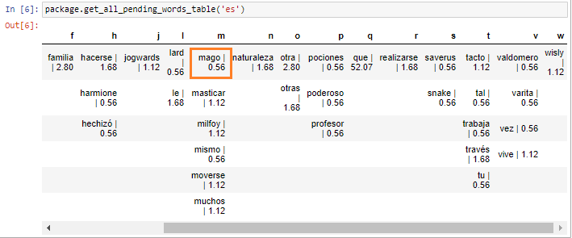
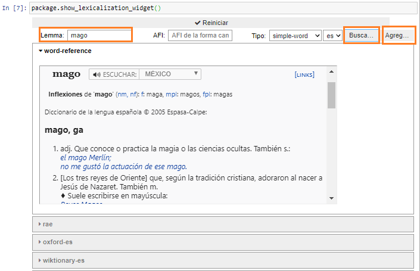
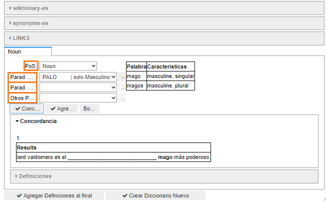
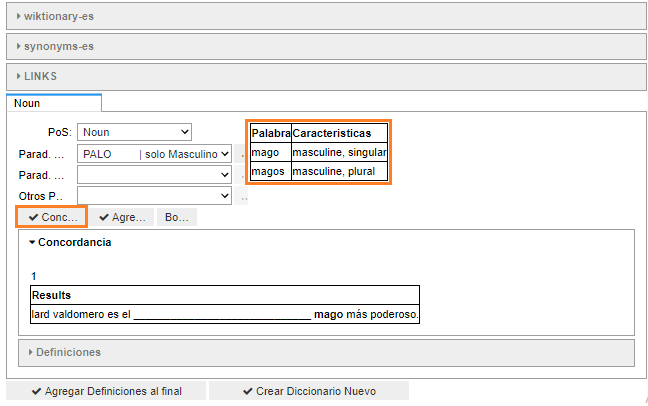
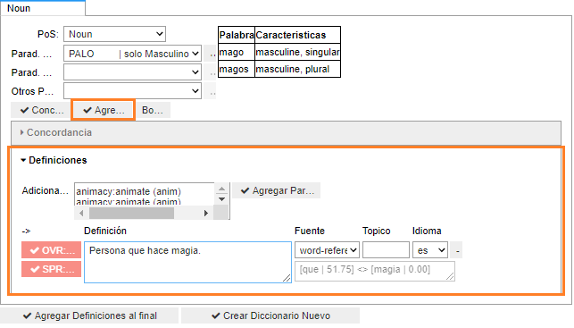
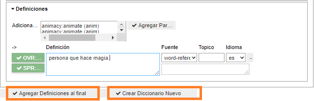
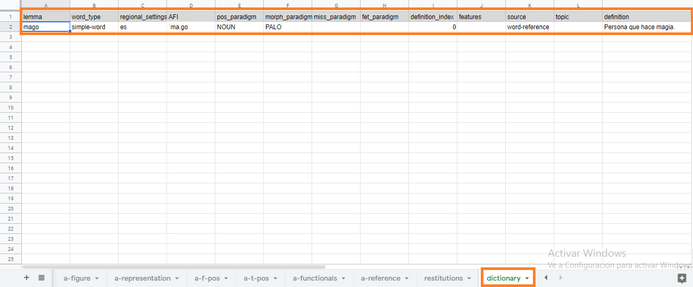

# Widget de lexicalización

## Descripción general

> NOTA: El texto que se presenta a continuación contiene algunos términos lingüísitcos que son necesarios para la explicación de la herramienta. Se recomienda la lectura del glosario ubicado al final del capítulo antes de hacer la lectura del texto.

El **widget de lexicalización** es una de las herramienta usadas para tareas de procesamiento del lenguaje natural en Mammut. Esta herramienta permite la creación de un diccionario interno o *lexicón*. El diccionario del paquete mammut tiene la finalidad de hacer explícito el conocimiento léxico en función de procesar el lenguaje natural. Las palabras que componen los [eventos](../concepts/events.md) de un [corpus](../concepts/corpus.md) se incorporan al diccionario interno a través de la lexicalización. No obstante, el desarrollador no solo puede aprovechar el **widget de lexicalización** para incluir palabras provenientes de los eventos de un corpus, sino también puede crear diccionarios terminológicos de dominios específicos sin que estos términos provengan directamente de un [corpus](../concepts/corpus.md).

A través del **widget de lexicalización** el desarrollador analiza léxica y morfológicamente las palabras, con el fin de aportar información útil en otros niveles del procesamiento del lenguaje natural. El proceso de lexicalización consiste en adjudicar metadatos a las palabras (definiciones), clasificar las palabras según sus clases (sustantivo, verbo, adjetivo o adverbio) y asignarle información morfológica clave para reconocer todas sus formas (paradigmas morfológicos).

El **widget de lexicalización** provee el fácil acceso a las plataformas online de distintos diccionarios (Oxford, RAE, WordReference, etc.) para así agilizar la creación de definiciones útiles para el sistema. Además, el widget está configurado con paradigmas precargados en inglés y español para facilitar la flexión de cualquier clase de palabra. Los paradigmas morfológicos utilizados por el **widget de lexicalización** consisten en información previamente almacenada en un documento de hojas de cálculo o [Standard](standard.md). A pesar de que están disponibles en inglés y español, el desarrollador puede crear paradigmas morfológicos para cualquier idioma. De esta manera, estarán disponibles para el proceso de lexicalización.

El proceso de lexicalización se resume en la siguientes etapas etapas:

Primera Etapa: Identificación de los lemmas provenientes de un corpus que deben ser lexicalizados.
Segunda Etapa: Incorporación de la información fonética, morfológica y semántica al lemma a lexicalizar.
Tercera Etapa: Almacenamiento
Cuarta Etapa: Lexicalización de palabras de segundo nivel. (palabras nuevas agregadas por el desarrollador al crear definiciones)

> El proceso de lexicalización es aplicable solo a palabras con significado pleno como sustantivos, adjetivos, verbos y adverbios. Los elementos funcionales (artículos, preposiciones, etc.) no se lexicalizan. El procesamiento de las palabras funcionales se realiza por medio de modelos previamente desarrollados y a través de la [herramienta de desambiguación](widget_desambiguación.md).

## Entrada del widget

El **widget de lexicalización** es una herramienta que funciona dentro de un entorno llamado [Jupyter Notebook](cuadernos_jupyter.md).

Para que la herramienta **widget de lexicalización** funcione correctamente dentro de un entorno Jupyter Notebook debe estar declarada en una celda de texto de la siguiente manera:

`package.show_lexicalization_widget()`

Posterior a este paso, será posible utilizar la herramienta de lexicalización en un Jupyter Notebook.

## Funcionamiento

> Para explicar el funcionamiento del widget de lexicalización es necesario seguir las etapas del proceso de lexicalización mencionadas en la descripción general.

### Primera Etapa

Para identificar los lemmas de un corpus que el desarrollador debe lexicalizar, el **widget de lexicalización** se apoya en otra herramienta Mammut llamada _Lista de palabras pendientes_. Esta herramienta se declara en el Jupyter Notebook con el enunciado: `package.get_all_pending_words_table('es')`. Esta lista muestra las palabras de un corpus que faltan por lexicalizar. Estas palabras pueden provenir de los eventos de un corpus o de las definiciones creadas por el desarrollador en etapas anteriores de lexicalización. De esta manera el desarrollador sabrá qué palabras deben pasar por el proceso de lexicalización.

La _lista de palabras pendientes_ puede mostrar palabras funcionales como conjunciones y preposiciones. El desarrollador debe escoger solo las palabras con significado pleno (sustantivos, verbos, adjetivos y adverbios).

> En caso de que el desarrollador utilice nuevas palabras en las definiciones de los lemmas, estas deberán ser lexicalizadas en la cuarta etapa del proceso.

### Segunda Etapa

Para iniciar la etapa de incorporación de la información fonética, morfológica y semántica desde el **widget de lexicalización** es necesario llenar tres campos:

| Campo  | Descripción |
| ------ | ----------- |
| Lemma  | Campo para introduccir la palabra a lexicalizar en su forma base (sin flexión en género y número o conjugación). **En el lexicón, el lemma será el encabezado al cual se vinculará la información morfológica y semántica.** |
| AFI    | Campo para introducir la representación fonética del lemma en el Alfabeto Fonetico Internacional (esta información algunas fuentes la proveen). **En el lexicón, el AFI es información fonética; en otras palabras, la pronunciación oral del lemma.** |
| Tipo   | Campo para indicar el tipo de palabra a lexicalizar: **Simple-word** (el lemma se forma por una palabra) **multi-word** (el lemma se forma por dos o mas palabras), **frozen-expression** (el lemma es una expresión), etc. |
| Idioma | Campo para indicar el idioma de la palabra a lexicalizar ('es' o 'en'). **Para el lexicón es a partir del idioma que el sistema provee los paradigmas morfológicos.** |

> EL **tipo** de lemma proporciona información sobre cuántas palabras componen un mismo lemma. Por ejemplo, las palabras de lemmas del tipo _multi-word_ son inseparables y no pueden ser analizadas independientemente una de la otra.
>> La opción de '**Reiniciar**' sirve para borrar el contenido escrito en los campos mencionados e iniciar de nuevo el widget.

Luego de llenar estos campos y seleccionar la opción '**Buscar lemma**', el widget buscará el lemma en las plataformas de los diccionarios online (word-reference, rae, oxford, wiktionary, synonyms) con el propósito del fácil acceso a los diccionarios más estandarizados. El desarrollador podrá tomar las definiciones tal y cómo están en las plataformas mencionadas o podrá optar por usar las definiciones de estos diccionarios como guía para crear sus propias definiciones adaptadas a las necesidades de su corpus.

El widget de lexicalización tiene la opción de '**Agregar POS**'. Esta opción despliega una pestaña del widget para agregar la información morfológica sobre las clases de palabra, la flexión y la definición del lemma. Dicha pestaña muestra los siguientes campos:

| Campo          | Descripción |
| -------------- | ----------- |
| PoS            | Campo para indicar la clase de palabra a la que pertenece el lemma a lexicalizar. **Para el lexicón, el campo PoS guarda relación con los paradigmas morfológicos y otros niveles de procesamiento.** |
| Parad. Morfema | Campo que despliega las opciones de paradigmas de conjugación o flexión en género y número. **Los paradigmas permiten el reconocimiento de los lemmas en cualquiera de sus formas.**  |
| Parad. Errores | Campo con paradigmas con errores (este campo queda vacío). **Estos permiten reconocer las palabras cuya flexión errada es común en el lenguaje natural; tal es el caso de 'cabía' y 'cupía', la última es una forma errónea pero posible en el uso.** |
| Otros Parad.   | Campo con paradigmas extra (este campo queda vacío). |

> Los paradigmas de flexión del **widget de lexicalización** son elementos prepogramados por Mammut en un documento de hojas de cálculo. Estos elementos permiten la flexión en género y número (sustantivos, adjetivos), y en tiempo, modo y persona (verbos). De esta manera, las palabras usadas en un corpus pueden ser procesadas por el sistema con solo lexicalizar el lemma.

Luego de indicar la clase de palabra y el paradigma, el widget tiene la opción de '**Ver concordancia**'. Por medio de esta opción, el widget aplica el paradigma seleccionado al lemma y lo muestra dentro de la pestaña. Esta opción es útil para que el desarrollador verifique que ha elegido el paradigma correcto para el lemma.

El botón '**Agregar definición**' despliega un cuadro de texto en donde se añadirá la definición del lemma. El desarrollador debe crear definiciones útiles para el sistema, también debe procurar no hacer definiciones muy complejas para no agregar palabras nuevas a la _lista de palabras pendientes_, ya que estas nuevas palabras deben ser lexicalizadas. En su lugar, el desarrollador puede utilizar _primitivos semánticos_; este tipo de palabra sirve para evitar el aumento de lemmas nuevos en la _lista de palabras pendientes_.

> Al final de esta guía el texto cuenta con una explicación y una lista de primitivos semánticos que puede utilizar para la creación de definiciones.

El **widget de lexicalización** contiene diferentes herramientas que el desarrollador deberá tomar en cuenta al momento de crear definiciones:

| Campo          | Descripción |
| -------------- | ----------- |
| SVO            | Campo que indica el número de palabras nuevas utilizadas en la definición. Estas palabras serán agregadas a la _lista de palabras pendientes_.    |
| SPR            | Campo que indica el número de primitivos semánticos utilizados en la definición. Estas palabras **no** se agregan a la _lista de palabras pendientes_. |
| Definición     | Campo para agregar la definición del lemma a lexicalizar. **Para el lexicón, la definición será la información léxica vinculada al lemma.**|
| Fuente         | Campo para indicar la fuente utilizada para crear la definición.  |
| Tópico         | Campo para indicar el tópico. **En caso de que sea un lexicón terminológico, este campo debe indicar el tópico o dominio que abarca. Por ejemplo, el tópico 'lingüístico' para un diccionario de términos lingüísticos**.|
| Idioma         | Campo para indicar el idioma de la definición. **Para el lexicón es importante diferenciar entre idiomas.** |

> La opción '**Agregar paráfrasis**' tiene la finalidad de incluir una forma diferente de escribir una misma definición.
>> En caso de que el desarrollador desee agregar más de una definición a un mismo lemma, puede hacerlo seleccionando de nuevo la opción '**Agregar definición**'.

### Tercera Etapa

Una vez los campos anteriores estén llenos, el desarrollador podrá pasar a la etapa de almacenamiento. La palabra lexicalizada se incorporará al lexicón del paquete Mammut por medio de la opción '**Agregar definiciones al final**'. En caso de que el desarrollador desee crear un nuevo diccionario dentro del mismo paquete, este podrá seccionar la opción de '**Crear diccionario nuevo**. Esta opción puede ser útil para el desarrollador que desee diferenciar entre las palabras utilizadas dentro de los eventos de un corpus y palabras que son parte un diccionario terminológico, por ejemplo.

El **widget de lexicalización** facilita la incorporación de palabras y definiciones al diccionario interno de un chatbot. Luego de terminar el proceso de lexicalización, el documento de hojas de calculo almacenará todas las palabras y conceptos creados por el desarrollador y pasarán a formar parte de la data de entrenamiento del chatbot. Dicha data podrá ser utilizada para los propósitos del Machine Learning.

### Cuarta Etapa

La etapa de lexicalización de las palabras de segundo nivel consiste en lexicalizar las palabras nuevas que resultaron de las primeras etapas del proceso. _Palabras de segundo nivel_ es el nombre que se les da a las palabras que fueron utilizadas al crear las definiciones de lemmas provenientes de un corpus. Las palabras de segundo nivel no forman parte de un corpus, sino que se añadieron a la _lista de palabras pendientes_ al momento de almacenar lemmas anteriores.

Para identificar específicamente las palabras de segundo nivel, el **widget de lexicalización** se apoya en otra herramienta Mammut llamada _Lista de palabras pendientes de segundo nivel_. Esta herramienta se declara en el Jupyter Notebook.

Esta lista muestra solo las palabras que fueron agregadas en procesos de lexicalización anteriores. Estas palabras provienen de definiciones creadas por el desarrollador previamente. De esta manera el desarrollador sabrá qué palabras de segundo nivel deben pasar por el proceso de lexicalización.

Las _palabras de segundo nivel_ deben ser procesadas por el sistema por medio de los pasos indicados en la segunda etapa del proceso.

## Almacenamiento de la data

Las definiciones creadas desde el **widget de lexicalización** se almacenarán en el documento de hojas de calculo del paquete Mammut. La data lexicalizada se guardará en la hoja de cálculo de un corpus denominada **dictionary**. En esta pestaña cada columna corresponde a un campo llenado desde el widget, como se puede ver en la siguiente imagen:

Al concluir el proceso de lexicalización, todas las palabras y conceptos almacenados en esta hoja de cálculo pasarán a formar parte de la data de entrenamiento del chatbot.

## Glosario

- **Análisis léxico-morfológico**: Análisis de las palabras en función de la información sobre su estructura y significado.

- **Anotación sintáctica**: Etiquetado de la información sobre la organización de las palabras en cláusulas.

- **Anotación semántica**: Etiquetado de la información sobre el significado de las palabras y de cómo esos significados se combinan para formar el sentido de las oraciones.

- **Anotación pragmática**: Etiquetado de la información sobre el modo en que el contexto influye en la interpretación del significado.

- **Paradigmas morfológicos**: Elementos prepogramados que permiten la flexión en género y número (sustantivos, adjetivos), y en tiempo, modo y persona (verbos).

- **Lemma**:  Entrada de diccionario compuesta por un conjunto de caracteres relacionado con un concepto o significado. Cada una de las palabras que el lexicón almacena.

- **Representación fonética**: Conjunto de símbolos que representan los sonidos del habla natural.

- **Primitivos semánticos**: Palabra genérica que no puede ser definida por otros elementos léxicos. Algunos primitivos semánticos son:

| pronombres | verbos    | sustantivos | adverbios |
| ---------- | --------- | ----------- | --------- |
| yo         | pensar    | persona     | aquí      |
| tú         | saber     | materia     | arriba    |
| alguien    | vivir     | lugar       | dentro    |
| algo       | hacer     | causa       | ahí       |
| esto       | haber     | acción      | allá      |
| él         | poder     | tiempo      | lejos     |
| alguno     | decir     | elemento    | cerca     |
| otro       | ser       | conjunto    | debajo    |
