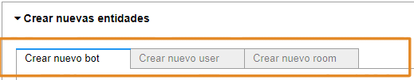
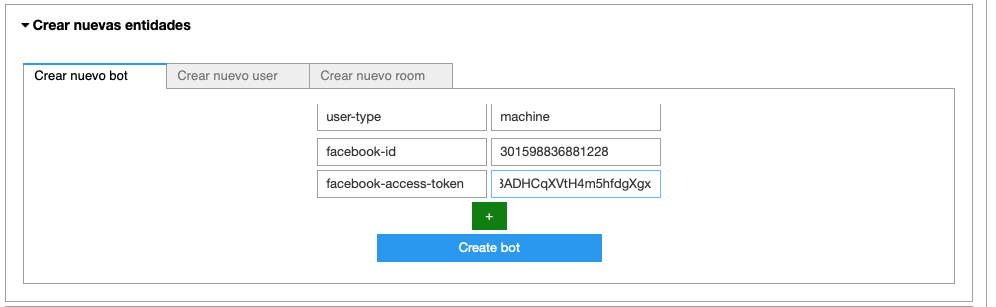
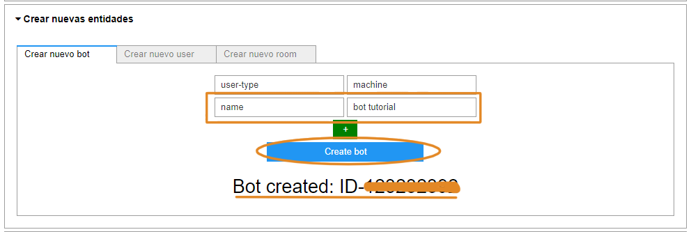

# Guía de inicio rápido: integra un chatbot con un channel

En esta guía de inicio rápido te permitirá integrar un chatbot con un [**channel**](../concepts/channels.md), particularmente con **Facebook**, con las herramientas de Mammut. Para lograrlo, debes crear un chatbot con y añadir dos parámetros:

* **facebook-access-token:** su valor es el token de tu facebook app.
* **facebook-page-id:** su valor es el ID de tu Faceeook page.

    > **Nota**: Estos parámetros son propios de Facebook. Pero puedes seguir estos pasos para integrar un chatbot con otros [diversos channels](../framework/engineering-docs/channels-setup_es.md) definiendo los parámetros correspondientes.

## Requisitos previos

* Lee los [conceptos básicos](../concepts/basic_concepts_corpus_m-es.md).

* Instala el **Mammmut Services** (MS).

    1. [Recupera el ID de esa página de Facebook](https://www.facebook.com/help/1503421039731588).
    2. [Obtener el token de Facebook App](https://developers.facebook.com/docs/messenger-platform/getting-started/app-setup/).

## Crea un chatbot integrado con un channel

1. Corre el **Simulator Notebook** del Mammut Framework:

     1. Ingresa en tu ambiente.
     2. Abre el _Simulator Notebook_.
     3. En el menú superior pulsa Kernel > Restart & Run All y luego confirma pulsando Restart & Run All Cells.

> **Nota:** tu notebook se pondrá en "Busy". Aparecerá junto al número de cada celda un asterisco (``*``) el cual indicará que la celda se está cargando. Espera mientras el asterisco desaparece en cada celda.

2. Selecciona el modo de operación para crear entidades:

     1. En _'0. Configuraciones'_ pulsa Comenzar.
     2. En _'1. Seleccionar operation mode'_ escoge _Operations_ y luego pulsa Select.

Esto desplegará un panel _“Crear nuevas entidades”_ donde podrás crear tu chatbot integrado.

 

2. Crea un chatbot integrado con Facebook:

   1. En _crear nuevo bot_ especifica las **properties** y los **values** del **chatbot**. Define un parámetro por fila.

      * Del lado izquierdo se introducen las properties. Las propiedades generales a agregar son: "_user-type_", "_name_" y las propiedades correspondientes al channel Facebook son "_facebook-access-token_" y "_facebook-page-id_".
      * Del lado derecho introduce los values. Los valores serán: "_machine_", _"bot tutorial"_, el access token y el facebook page id obtenidos.

      > **Nota:** para definir otra propiedad pulsa el signo más (``+``).
      
   2. Cuando termines de agregar las propiedades pulsa Create bot y luego de unos segundos el sistema te dará el ID del chatbot.

## Paso siguiente

> **Nota:** tu notebook se pondrá en "Busy". Aparecerá junto al número de cada celda un asterisco (*) el cual indicará que la celda se está cargando. Espera mientras el asterisco desaparece en cada celda.

2. Selecciona el modo de operaciones:

    1. En _0. Configuraciones_ pulsa **Comenzar**

    2. En _1. Seleccionar operation mode_ escoge **Operations** y luego pulsa **Select**.

Esto desplegará un panel _“Crear nuevas entidades”_ donde podrás crear el chatbot.

 

3. Crea tu chatbot integrado con Facebook:

    1. En _crear nuevo bot_ especifica _properties_ y _values_ del **chatbot**. Define un parámetro por fila. Para crear un chatbot integrado con Facebbok debes añadir dos parámetros:

        * **facebook-access-token:** su valor es el token de tu facebook app.

        * **facebook-page-id:** su valor es el ID de tu Faceook page.

        

    2. Cuando termines de agregar las propiedades pulsa **Create bot** y luego de unos segundos el sistema te dará el ID del chatbot.

## Paso siguiente

* [Entrenamiento de un chatbot](quick_start_chatbot_preparation.md).
