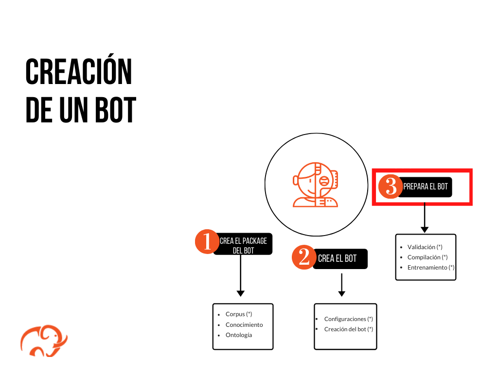
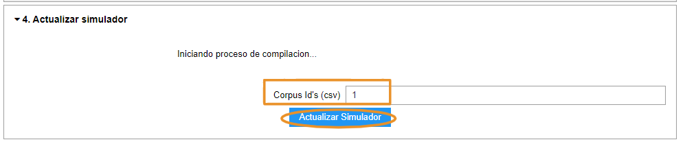

# Guía de inicio rápido: prepara e inicializa un bot

Esta guía de inicio rápido describe los pasos a seguir para que, utilizando una de las herramientas del Mammut framework, puedas preparar a un bot con los datos del package. La preparación de un bot consiste en un conjunto de procesos durante los cuales el bot recolecta todos los datos, reglas y ejemplos de interacción dispuestos en el [package](../concepts/package.md) y aprende de ellos. Estos procesos se llevan a cabo con ayuda de una interfaz gráfica en un _Jupyter Notebook_.

***La preparación constituye el tercer paso para la construcción de un bot***. 

## Requisitos previos

Antes de empezar, necesitarás hacer las siguientes configuraciones:

* Instala el **Mammmut Services** (MS).

* Crea un **mammut package** con la data de preparación:

     * [Corpus](quick_start_corpus.md)
     * [Knowledge](quick_start_knowledge_es.md)
     * [Presentation](quick_start_presentation_es.md)

  > **Nota:** el package puede estar constituído por los datos contenidos en estos tres elementos o puede ser solo un corpus + la configuración del bot, todo dependerá del tipo de corpus (N o M) y de las necesidades del usuario. Para más información, puedes leer nuestro artículo sobre el [package](../concepts/package.md) en la sección de conceptos.

  >> **Importante:** asegúrate de que los [permisos de acceso de los archivos](../shared_tips/docs_preparation.md) sean los adecuados.

* Crea y configura las entidades necesarias: [bot + user + room](quick_start_entities_creation.md).

## Lecturas previas

Para comenzar, te recomendamos leer el artículo sobre el [package data](../concepts/package_data.md) para así familiarizarte con la información que el notebook manejará en esta etapa de la creación del bot. Del mismo modo, te recomendamos hacer las [verificaciones previas](../shared_tips/package_verification.md) para asegurarte de que los datos del package hayan sido llenados correctamente. Para saber más sobre los notebooks, también puedes darle un vistazo al siguiente artículo: [Jupyter Notebooks](../vacio.md).

## Preparación de un bot

La preparación es un proceso mediante el cual el bot recolecta la información contenida en su package para aprender de ella. Para llevar a cabo la preparación del bot, utilizamos el modo de operaciones **compilation** en el widget del notebook _Dialogue Tester_. Durante esta etapa, suceden a su vez varios procesos en paralelo: la validación del package, la compilación de los datos y el entrenamiento del bot. La validación permitirá al sistema verificar que los archivos y campos del package hayan sido llenados con información válida y que en estos se encuentre toda la información básica que un bot necesita (véase: [verificación del package](../shared_tips/package_verification.md)). Por otro lado, la compilación recopilará todos los datos incluidos en el package y los interpretará para aprender de ellos. Finalmente, el entrenamiento repotencia el aprendizaje del bot, reforzando el conocimiento que este ha adquirido durante la compilación.

graph LR
    A["Preparación de un bot"]-->B[Etapas]
    B-->C[1: Validación]
    B-->D(2: Compilación);
    B-->E(3: Entrenamiento);

_Proceso de **preparación** de un bot_.

## ¿Cómo preparar un bot con el package data?

1. **Corre el _Dialogue Tester Notebook_ del Mammut Framework:**

     1. Ingresa en tu ambiente.
     2. Abre el *Dialogue Tester Notebook*.
     3. En el menú superior pulsa **Kernel > Restart & Run All** y luego confirma pulsando **Restart & Run All Cells**.
          > **Nota:** tu notebook se mostrará en estado "Busy". Aparecerá junto al número de cada celda un asterisco (`*`) que indica que la celda se está cargando. Espera mientras el asterisco desaparece en cada celda.

2. **Selecciona el modo de operaciones en el _Dialogue Tester_:** este módulo presenta las distintas operaciones que puedes hacer con el _Dialogue tester_. En este caso utilizaremos el modo **compilation**. Para escoger el modo de operaciones, sigue los siguientes pasos:

     1. En *0. Configuraciones* pulsa **Comenzar**.
     2. En *1. Seleccionar operation mode* escoge **Compilation** y luego pulsa **Select**.

3. **Selecciona el bot que vas a preparar:** en *Seleccionar bot* escoge el nombre de uno de tus bots y pulsa **Seleccionar**.

4. **Valida tu _package_:**

     1. En *3. Validar Archivo* introduce el id de tu presentation.

          > Nota: Si no sabes cuál es el id, puedes averiguarlo siguiendo [estas instrucciones](../shared_tips/doc_id.md).

     2. Pulsa **Validar Archivo** y espera unos minutos.

         * Si el archivo está correcto, podrás ver que el mensaje: "El archivo está correcto"
         * Si el archivo no está correcto, podrás ver el mensaje: "Error validando archivo". Eso significa que hay algún problema. Prueba cada una de las [verificaciones previas](../shared_tips/package_verification.md) y luego vuelve intentarlo siguiendo esta guía desde el paso 1.

5. **Compila tu _package_:**

     1. En *4. Actualizar Simulador* en el campo *Corpus Id's (csv)* introduce el id del corpus (en el corpus map) con el que quieres preparar tu bot. Si son varios, debes separarlos con comas y sin espacios en el medio (por ejemplo: 1,2,3) y pulsa **Actualizar Simulador**.

          > **Nota:** si no sabes cuál es el **id** del corpus, ingresa al archivo de hojas de cálculo de tu package y verifícalo en la pestaña **corpus_map**, columna "id".

          

     2. Este proceso tardará unos cuantos minutos; debes esperar que se arroje una respuesta:

        * Si el proceso se desarrolla correctamente, aparecerá  el mensaje: "Compilation completed successfully" .
        * Si en el proceso se identifican errores en el package, se mostrará el siguiente mensaje: "Compilation not completed". Ese mensaje estará acompañado con códigos que indican en qué parte del proceso se presentó el error. Estos errores se pueden diagnosticar consultando [aquí](../shared_tips/package_verification.md).

     > El proceso de **entrenamiento** corresponde a etapas más avanzadas de la compilación. Este da inmediatamente después de que la compilación se ha terminado con éxito, y ocurre en la misma sección del widget sin necesidad de realizar pasos extra.

## Resumen

En esta guía rápida aprendiste los pasos necesarios para preparar un bot con los datos del package. Este proceso de preparación se lleva a cabo en cinco etapas: 1) ejecutando el notebook  _Dialogue Tester_, 2) seleccionando el modo de operaciones _'compilation'_, 3) seleccionando el bot que se va a preprar, 4) validando y 5) compilando el package. De esta manera, el notebook permite revisar el package en busca de errores, compilar los datos y, finalmente, entrenar al bot con la información necesaria para que pueda comunicarse. La siguiente guía rápida te mostrará cómo hacer una prueba de simulación para conversar con el bot. Esto te permitirá probar que los datos del package hayan sido incluídos en el sistema de forma óptima y que no haya ningún problema que impida al bot interactuar en una conversación.

## Siguientes pasos

* [Conversa con tu bot](quick_start_simulator.md)
