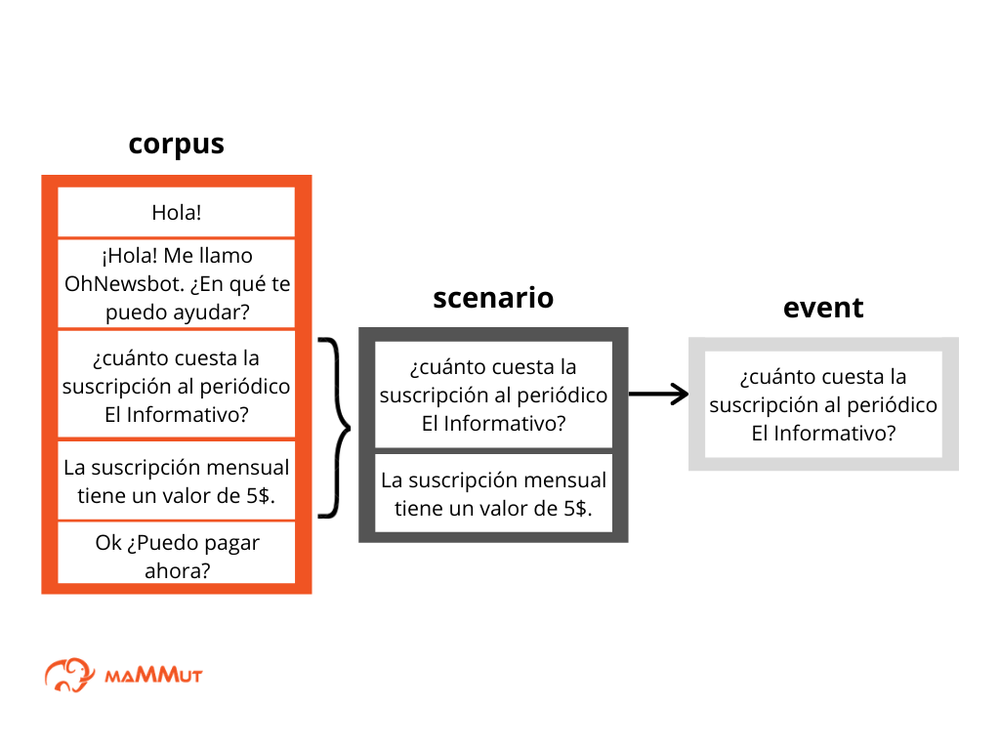
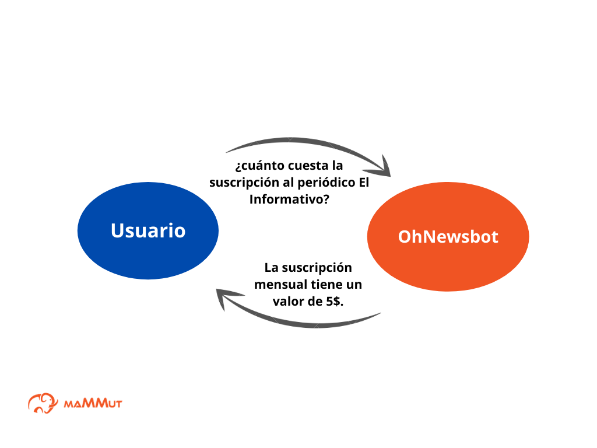

# Guía de inicio rápido: ¿cómo construir un corpus?

Esta guía rápida contiene una descripción de los pasos para construir un **corpus** para un bot Mammut. Un corpus es un conjunto de ejemplos prototípicos de conversaciones entre diversos agentes, por lo general un usuario y un bot. La estructura completa del corpus se puede observar en el artículo [corpus](../concepts/corpus.md) ubicado en la sección 'conceptos'.

El corpus es una parte escencial de un bot Mammut dado que contiene datos usados por el sistema para aprender a responder las peticiones de los usuarios.

## Requisitos previos

* Instalación del ***Mammmut Services*** (MS).

* Has una copia del documento que usarás para crear el corpus mammut. Si vas a crear un chatbot básico, usa este [spreadsheet para corpus N](https://docs.google.com/spreadsheets/d/1FojxJ09c4LLSzhLK7j_MTySRz4cxnOyNGuOjVBfdoeE/edit?usp=sharing). Si quieres crear un chatbot más complejo, usa este [spreadsheet para corpus M](https://docs.google.com/spreadsheets/d/1wcf2aPHYmAypnLKlNIodYLSDIw0YArvW8K0OtXiNXQ8/edit?usp=sharing).  

* Asegúrate de que los documentos copiados en el paso anterior estén [preparados](../shared_tips/docs_preparation.md).

## Lecturas previas

Antes de comenzar a seguir esta guía rápida, recomendamos la lectura de los siguientes documentos:
* [Artículo sobre corpus](../concepts/corpus.md).
* [Artículo sobre scenarios](../concepts/scenario.md).
* [Artículo sobre events](../concepts/events.md).
* [Artículo sobre variables](../concepts/variables.md).

## Corpus y conversación 

Los bots mammut utilizan los datos del corpus como base para aprender a manejar conversaciones. Los ejemplos prototípicos de conversaciones que forman un corpus están dispuestos en un speadsheet y organizados en partes de posibles conversaciones o **scenarios**. A su vez, cada scenario está compuesto por mensajes o **events**. 



**Figura 1**. Representación gráfica de corpus, scenario, event.

Existen dos tipos de corpus: el [corpus natural (corpus N)](../concepts/corpusN.md) que solo contiene ejemplos de las conversaciones, y el [corpus mammut (corpus M](../concepts/corpusM.md)) que tiene más funcionalidades gracias a su base de conocimiento o [knowledge](../concepts/ontology.md). Dentro de estas funcionalidades se encuentran las [variables](../concepts/variables.md) que son herramientas cuyo valor se toma del knowledge y que se pueden transformar en un texto, una imágen, un video o cualquier otro tipo de contenido. 

Los datos que contiene el corpus se pueden ampliar a través de un **corpus extension** o extensión del corpus. El corpus extension es un sheet del documento del corpus donde se guardan paráfrasis de los events emitidos por los usuarios, es decir, otras maneras posibles de expresar estos mensajes. 

> Nota: Un bot puede prepararse con tantos corpus como se desee. Un bot mammut necesita como mínimo un corpus. 

Los datos del **corpus** y el **corpus extension** hacen posible que el bot generalice conversaciones, responda correctamente las peticiones de los usuarios y sepa donde se puede usar la información proveniente del knowledge (esto último es posible con el uso del knowledge y las variables). 

Por ejemplo, en una conversación entre un usuario y un bot sobre el costo de la afiliación a un periódico digital, el bot usará los datos de un scenario del corpus. Esta conversación podría verse de la siguiente manera: 


**Figura 2**.Representación gráfica de la conversación entre dos agentes.

Ahora que hemos visto la importancia del corpus para el manejo de conversaciones, seguiremos los pasos para construir un corpus:

1º Crea las interacciones de tu corpus.
2º Amplía tu corpus con un corpus extension. 


## ¿Cómo se contruye el corpus? 

Vamos a crear el corpus con una parte de una conversación entre un usuario y el bot. 

1. Crea las interacciones de tu **corpus**.

Los mensajes o **events** del corpus se almacenan en un sheet llamado **corpus**. Este sheet debe tener como columnas los campos `id`, `sub_id`, `scenario_type`, `event_message`, `hidden`, `source`, `regional_setting`, `complexity`, \*`field`, \*`lambda_condition`, \*`ui_event`, \*`action`. Estos campos se utilizan para determinar las características de cada event que forma parte de un scenario del corpus (los campos con asterisco solo son necesarios para los corpus M): 

Característica | Descripción | Valor
---------------| ----------- | -------
`id`           | Identifica un scenario.      | Enteros. Los enteros iguales identifican a un mismo scenario. 
`sub_id`       | Identifica un event.         | Enteros consecutivos, de mayor a menor, para los events de un mismo scenario. La numeración se reinicia para events de otro scenario. 
`scenario_type`| Denota el tipo de scenario.  | `Conversation`, `Monologue`, `Dialogue`. 
`event_message`| Contenido o texto del event. | Cualquier cadena de caracteres. Para los corpus M, las variables de los events tienen un formato específico. 
`hidden`       | Desactiva un event.          | 'X' para el event que se desea desactivar. 
`source`       | Denota el origen de los events, que puede ser un usuario o el bot. | Cualquier cadena de caracteres. La cadena 'Mammut' se usa para  mensajes cuyo origen es el bot. 
`regional_setting` | Espefica el idioma en el que está escrito el event. | 'es' para español, 'en' para inglés. 
`complexity`    | 
\*`field` | Indica el tema de un event.       | 
\*`lambda_condition` | Indica una condición para que el bot envíe una respuesta determinada al usuario, dependiendo de la información que se encuentre en el scope. | Tiene normas de escritura particulares. 
\*`ui_event` | Permite al bot percibir ciertas acciones llevadas a cabo por un agente en la interfaz de usuario. | Tiene normas de escritura particulares. 
\*`action` | Indica una acción determinada que el bot puede llevar a cabo cuando tiene lugar un event dado.      | Tiene normas de escritura particulares. 

Vamos a crear dos events que son parte de un scenario. El primer event es una pregunta de un usuario sobre el precio de la suscripción mensual a un periódico digital, y el segundo event es la respuesta ofrecida por el bot a esta pregunta. Estos events pueden estar escritos sin variables si se trata de un corpus N (como verás en el ejemplo 1), o con variables si estás preparando un corpus M (ejemplo 2). La tabla 1 muestra cómo debería quedar el sheet cuando hayas llenado los datos de cada columna: 

**Tabla 1**
* Ejemplo 1 (corpus N)

| id | sub_id | scenario_type | event_message | hidden | field | source | regional_settings |
| - | - | - | - | - | - | - | - |
1 | 1 | Conversation | ¿Cuánto cuesta la suscripción al periódico El Informativo?  |  |  | Carla | es |
1 | 2 | Conversation | La suscripción mensual tiene un valor de $5. |  |  | Mammut | es |

* Ejemplo 2 (corpus M)

| id | sub_id | scenario_type | event_message | hidden | field | lambda_condition | ui_event | action | source | regional_settings | complexity
| - | - | - | - | - | - | - | - | - | - | - | - |
1 | 1 | Conversation | En ```[variable\|store.name]``` ¿cuánto cuesta la suscripción al periódico ```[variable\|store.sell.journal.name]```?  |  |  |  |  |  | Carla | es |
1 | 2 | Conversation | La suscripción al periódico ```[variable\|store.sell.journal.name]``` tiene un valor de ```[variable\|store.sell.journal.price]``` |  |  |  |  |  | Mammut | es |


2. Amplía tu corpus con un corpus extension:

Los mensajes o **events** del **corpus extension** deben estar almacenados en un sheet llamado **extension**. Este sheet tiene como columnas los campos `id`, `sub_id`, `event_message`, `hidden`, `source`, `regional_setting`. Estos campos se utilizan para determinar las características de cada event parafraseado. Es por ello que cada columna se llena con los datos idénticos al event que se está parafraseando, con la excepción de la columna 'event_message' donde se escribe la paráfrasis del event.

> Nota:  Solo los events que tienen como source a un usuario pueden ser incluidos en el corpus extension. 

En la tabla 2 podemos observar una paráfrasis del event que vimos como ejemplo en la tabla 1: 

**Tabla 2**
- Ejemplo 1 (corpus N)

| id | sub_id | event_message | hidden | source | regional_settings |
| - | - | - | - | - | - |
| 1 | 1 | ¿Qué precio tiene la suscripción al periódico El Informativo?  |  | Carla | es | 

- Ejemplo 2 (corpus M)

| id | sub_id | scenario_type | event_message | hidden | field | lambda_condition | ui_event | action | source | regional_settings | complexity
| - | - | - | - | - | - | - | - | - | - | - | - |
1 | 1 | Conversation | En ```[variable\|store.name]``` ¿qué precio tiene la suscripción al periódico ```[variable\|store.sell.journal.name]```?  |  |  |  |  |  | Carla | es |
   
## Resumen 
En esta guía rápida has seguido los pasos para contruir los events de un scenario. Los scenarios son la base del corpus mammut. Por esto, los pasos descritos en esta guía pueden ser usados como ejemplo para construir tantos events y scenarios como sea necesario hasta abarcar los ejemplos prototípicos de conversaciones en el tema de interés del desarrollador. 

## Siguientes lecturas recomendadas

- Te recomendamos leer el [tutorial 1 de corpus N](../tutorial-intro/corpusN(1).md) y el [tutorial 2 de corpus N](../tutorial-intro/corpusN(1).md). Además del [tutorial 1 de corpus M](../tutorial-intro/corpusM(1).md), el [tutorial 2 de corpus M](../tutorial-intro/corpusM(2).md) y el [tutorial 3 de corpus M](../tutorial-intro/corpusM(3).md), el [tutorial de variables](../tutorial-variable_and_knowledge/index.md) y la [guía rápida para solicitar el contexto a un usuario](quick_start_lambda_condition.md).


## Siguientes pasos

* Si construyes un corpus N, [configura tu chatbot](quick_start_presentation_es.md).

- Si construyes un corpus M, [crea el knowledge](quick_start_knowledge_es.md).
