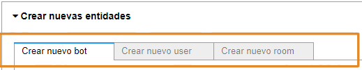

# Guía de inicio rápido: crea un bot, un user y un room

Esta guía de inicio rápido describe los pasos a seguir para que, utilizando una de las herramientas del Mammut framework, puedas crear las entidades necesarias para [preparar](quick_start_chatbot_preparation.md) un bot. Las entidades que vas a crear son: un **bot**, un **usuario**, y un **room**. Esto lo haremos con ayuda de una interfaz gráfica en el notebook _Dialogue Tester_.

## Requisitos previos

Antes de empezar, necesitas hacer las siguientes configuraciones:

* Instala el *Mammmut Services (MS)*.

* Crea un **mammut package** con la data de preparación:

     * [Corpus](quick_start_corpus.md)
     * [Knowledge](quick_start_knowledge_es.md)
     * [Presentation](quick_start_presentation_es.md)

  > **Nota:** el package puede estar constituído por los datos contenidos en estos tres elementos o puede ser solo un corpus + la configuración del bot, todo dependerá del tipo de corpus (N o M) y de las necesidades del usuario. Para más información, puedes leer nuestro artículo sobre el [package](../concepts/package.md) en la sección de conceptos.

## Lecturas previas

Antes de comenzar también te recomendamos leer el artículo sobre Jupyter Notebooks para que puedas familiarizarte con la herramienta que usarás en esta etapa de creación de entidades y en las siguientes etapas de preparación del bot.

## Creación de entidades

Luego de haber creado y llenado el package de tu bot con los respectivos datos, es necesario crear las entidades que usaremos durante los procedimientos del widget. Este paso es fundamental para llevar a cabo el resto de los procesos a los que se someterá el bot, desde la preparación con los datos del package, hasta la integración con los respectivos canales. Para crear las esntidades, utilizaremos el modo **"operations"** en el widget del notebook _Dialogue Tester_.

Como hemos mencionado anteriormente, estas entidades que vamos a crear son: un bot, un user y un room. De estas, el **bot** es la más importante, ya que se trata de la entidad que se someterá a un proceso de entrenamiento en etapas posteriores, aprendiendo de la información del package para interactuar con los usuarios. Por otro lado, tenemos al **user**, la entidad que representa al agente creador de dicho bot. Finalmente, el **room** es el sitio al cual llegarán los mensajes que resultan de las operaciones del widget.

> **Nota**: El bot es una entidad obligatoria. En cambio, el usuario y el room sólo serán obligatorias en el modo embedded del Mammut Service (MS).

## ¿Cómo crear y configurar las entidades?

1. **Para comenzar, corre el _Dialogue Tester_ Notebook del Mammut Framework:**

    1. Ingresa a tu ambiente.
    2. Abre el *Dialogue Tester Notebook*.
    3. En el menú superior pulsa **Kernel > Restart & Run All** y luego confirma pulsando de nuevo **Restart & Run All Cells**.

        > **Nota:** tu notebook se mostrará en estado "Busy" y aparecerá junto al número de la celda un asterisco (_*_) que indica que esa celda aún se está cargando. Espera mientras el asterisco desaparece en cada celda.

2. **Selecciona el modo de operaciones:**

    1. En *0. Configuraciones* pulsa **Comenzar**
    2. En *1. Seleccionar operation mode* escoge **Operations** y luego pulsa **Select**.

Esto desplegará un panel "*Crear nuevas entidades*" donde podrás crear las tres entidades necesarias.

 
 A continuación, debes proceder a llenar los campos de dicho panel con las **properties** y los **values** correspondientes para cada entidad.

> **Nota:** Estas properties de las que hablamos son las propiedades soportadas por el API de Mammut que permiten realizar ciertas operaciones en el API. 

3. **Crea el bot:**

   1. En *crear nuevo bot* especifica las **properties** y los **values** del **bot**. Define un parámetro por fila.

      * En el primer campo del lado izquierdo, introduce la property "*user_type*", la cual especificará el tipo de entidad a crear. Ya que la entidad que estás creando es el **bot**, el value para esta property será "*machine*". Introduce este valor en el campo ubicado a la derecha de esta property.

      * En el siguiente campo del lado izquierdo, introduce la property "*name*". El value para esta property será el nombre de tu bot, por ejemplo: "*bot tutorial*". Introduce este valor en el campo ubicado a la derecha de esta property.

        > **Nota:** las propiedades mínimas son "*user-type*" y "*name*", pero puedes definir otras propiedades pulsando el signo más (+).

   2. Cuando termines de agregar las propiedades pulsa **Create bot** y, luego de unos segundos, el sistema te dará el ID del bot.

        

4. **Crea el usuario:**

    1. En *crear nuevo usuario* especifica **properties** y **values** del **user**. Define un parámetro por fila.

       * En el primer campo del lado izquierdo, introduce la property "*user_type*". Para crear el **usuario**, aquí debes usar el value "*normal*". Introduce este valor en el campo ubicado a la derecha de esta property.

        * En el siguiente campo del lado izquierdo, introduce la property "*main_email*". El value para esta property será el email que idenficará a tu usuario, por ejemplo: "*bottutorial@mammut.io*". Introduce este valor en el campo ubicado a la derecha de esta property.

            > **Nota:** las propiedades mínimas son "*user-type*" y "*main_email*", pero puedes definir otra propiedad pulsando el signo más (+).

    2. Cuando termines de agregar las propiedades pulsa **Create user** y, luego de unos segundos, el sistema te dará el ID del bot. Además, te mostrará el ID del room del bot de Mammut.

        

5. **Crea el room:**

    1. En *crear nuevo room* especifica **properties** y **values** del **room**. Define un parámetro por fila.

        * En el primer campo del lado izquierdo, introduce la property "*user_type*". Para crear el **room**, aquí debes usar el value "*group*". Introduce este valor en el campo ubicado a la derecha de esta property.

        * En el siguiente campo del lado izquierdo, introduce la property "*title*". El value para esta property será el título que idenficará a tu room, por ejemplo: "*Room title*". Introduce este valor en el campo ubicado a la derecha de esta property.

            > **Nota:** las propiedades mínimas son "*user-type*" y "*title*", pero puedes definir otra propiedad pulsando el signo más (+).
            
        * Agrega una tercera property "*has@user*". Como valor ingresa el **id de tu bot** (regresa a *Crear nuevo bot* para verlo, copia solo los números posteriores a *ID-*).

    2. Cuando termines de agregar las propiedades pulsa **Create room** y, luego de unos segundo,s el sistema te dará el ID de tu room.

        

Si seguiste correctamente todos los pasos anteriores, entonces has creado todas las entidades necesarias para llevar a cabo la preparación del bot.

## Resumen

En esta guía rápida aprendiste los pasos para crear las entidades necesarias para la preparación de un bot. Este proceso de creación de entidades lo hiciste en 4 pasos: 1) seleccionaste el modo de operaciones en el *Simulator Notebook* del *Mammut Framework*; 2) creaste un bot; 3) creaste un user; 4) creaste un room. De esta manera, pudiste crear una serie de entidades para que un agente se comunique con personas.

## Siguientes pasos

* [Prepara un bot](quick_start_chatbot_preparation.md).
