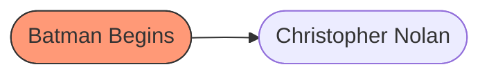

# Guía de inicio rápido: construcción de un knowledge Mammut

Esta guía de inicio rápido describe el método a seguir para crear una estructura de **knowledge** para un bot Mammut. Esta estructura es descrita en el artículo [knowledge and ontology](../concepts/ontology.md) de la sección de 'conceptos'.

Un knowledge permite que un bot pueda tener acceso a información estructurada que necesita para conseguir respuestas oportunas. El knowledge puede contener cualquier tipo de información necesaria para interactuar en un ambiente o situación, o puede almacenar información solicitada al usuario. El knowledge se concibe como una memoria a largo plazo a la que tiene acceso un bot.

## Requisitos previos

- Instalación del **_Mammmut Services_** (MS).
- Spreadsheet de Google con un [**corpusM**](quick_start_corpus.md).

Recomendamos la lectura de los siguientes temas antes de comenzar:

- [Guía de inicio rápido: construye un corpus](/quick_start_corpus.md)
- [Tutorial de Mammut chatbot: tu primer chatbot](../tutorial-intro/intro.md)

--------------------------------------------------------------------------------

## Ontology, knowledge y conversación

Una ontology es una estructura de datos relacionados semánticamente. Se trata de una **organización** del conocimiento en _vertices_ (también llamadas _clases_) y _properties_ relacionados por medio de _edges_ (que describen el tipo de relación de dos vertices, o entre un vertex y una property). Por ejemplo, el dominio "films" se podría formalizar por medio de la siguiente ontology:

**Figura 1.** Ejemplo de una ontology.

En la figura 1 de puede observar que una _película_ (un vertex) tiene un _director_ (pero un director puede haber dirigido varias películas) y un _año de estreno_ (una property).

Una ontology estructura relaciones generales entre vertices y properties. Cuando se introducen en los vertices y properties las _instances_, estamos frente a un knowledge:

**Figura 2.** Ejemplo de knowledge.

En la figura 2 los óvalos representan tres instances: _Batman Begins_, _Christopher Nolan_ y _2006_ (en óvalos). Estas tres instances juntas _definen_ una película en el knowledge (quedan por fuera algunos detalles para simplificar la explicación).

El knowledge puede utilizarse para responder a solicitudes de un user. Las properties de los vertices son elementos que forman parte (o que pueden formar parte) del conocimiento que tiene el bot sobre un tema o asunto.

Veamos esto con un ejemplo.

**Figura 3.** Ejemplo de conversación entre un user y un bot.

El user le pregunta al bot por películas relacionadas con Christopher Nolan. El bot tiene esta información en su knowledge, y por lo tanto puede responder a la solicitud, ya que conoce los siguientes "hechos":

1. Christopher Nolan tiene varias películas.
2. Una de esas películas es _Batman Begins_.
3. Puede incluir el año de la película en la respuesta, ya que es una property de la instance.

Los pasos que seguiremos para construir un knowledge en esta guía serán los siguientes:

1. Creación de vertices.
2. Configuración de properties.
3. Configuración de un _entry point_.
4. Configuración de edges.
5. Configuración de defaults.

## 1\. Creación de vertices

Vamos a crear dos vertices: _movie_ y _director_.

**Figura 4.** Los dos vertices que se van a crear.

Un vertex es una estructura de datos que contiene toda la información de una clase en particular. Esta estructura tiene el formato de una **table** en la cual cada columna es una property, y cada fila una instance del vertex. Por ejemplo, en el caso de un vertex _movie_, las instances podrían ser _Batman Begins_, _Batman, The Dark Knight_ y _Batman, The Dark Knight Rises_. Y las properties para _movie_ serán _name_, _description_ y _genre_. La única property para _director_ será _name_. En la figura 5 se pueden observar estas relaciones.

**Figura 5.** Vertices e instances (sin edges).

Recuerda que en la tabla para un vertex las properties son señaladas en los títulos de las columnas y las instances como registros de la tabla. La tabla 1 muestra como quedaría el vertex _movie_.

id  | hidden | name                          | description         | genre
--- | ------ | ----------------------------- | ------------------- | --------
M_1 |        | Batman Begins                 | Batman se disfraza. | acción
M_2 |        | Batman, The Dark Knight       | El Joker gana.      | thriller
M_3 |        | Batman, The Dark Knight Rises | Batman renuncia     | acción

**Tabla 1.** Vertex _movie_.

Las dos primeras propiedades, `id` y `hidden` son especiales. `id` es una clave única para la instance. `hidden` se utiliza para desactivar o "esconder" la instance (basta con poner una `x` en ese campo). El `id` puede ser lo que quieras, pero te recomendamos que uses alguna convención. Recuerda también que debe ser una clave única en la tabla del vertex.

Observa que las propiedades se definen para cada instance. Por ejemplo, la película _M_2_ tiene como `name` el texto _Batman, The Dark Knight_, como `description` _El Joker gana._ y como `genre` _thriller_.

Ahora vamos con el vertex de _director_ (tabla 2):

id  | hidden | name
--- | ------ | -----------------
D_1 |        | Christopher Nolan

**Tabla 2.** Vertex _director_.

> **Nota**: Las _tables_ se introducen como sheets en un Google Spreadsheet. En el Spreadsheet, crea dos sheets: _movie_ y _director_ e introduce la información que presentamos en las tablas 1 y 2 (respectivamente).

En resumen:

- Cada vertex es una tabla que junta las properties con las instances.
- La única property obligatoria es `id`.
- La property `hidden` esconde la instance.
- Cada property se define en una columna.
- Cada instance se define en una fila.

A continuación vamos a configurar los _property type_ y _cardinality_ de cada property.

## 2\. Configuración de properties

Cada property de una instance debe ser definido en una table especial denominada **properties**. Esta tabla debe tener como columnas los campos `name`, `property type`y `cardinality`. Estos campos se utilizan para determinar dos características de cada property utilizada en la ontology:

Característica  | Descripción                                      | Valores
--------------- | ------------------------------------------------ | -----------------------------------------
`name`          | Nombre del property en los vertices              |
`property type` | Tipo de dato de la property                      | `String`, `StringToUpper`, `OpeningHours`
`cardinality`   | Tipo de relación de la property con los vertices | `SINGLE`, `SET`, `LIST`

**Tabla 3.** Valores posibles para la table **properties**.

Para más detalles sobre estas características, te recomendamos consultar la referencia general, en particular el artículo sobre [properties](../concepts/properties.md).

Vamos a crear una table con la definición de las properties para la ontology de películas. Tu table **properties** debería quedar así (tabla 4).

name        | property type | cardinality
----------- | ------------- | -----------
id          | StringToUpper | SINGLE
name        | String        | SINGLE
description | String        | SINGLE
genre       | String        | SINGLE

**Tabla 4.** Table _properties_.

Esto básicamente dice que la ontology tiene 4 tipos de properties: _id_, _name_, _description_ y _genre_. Y que las últimas 3 son de tipo `String`. La cardinality `SINGLE` implica que cada una de estas properties se puede describir en su totalidad como un solo valor.

Aunque hemos terminado de darle forma a cada property, todavía no las hemos conectado con los vertices. Antes de eso, vamos a configurar primero un _entry point_.

## 3\. Configuración de un _entry point_

El **entry point** es el punto más "alto" del knowledge. Es un punto en donde se inicia toda la estructura. Por lo general, recomendamos que sea un vertex con información sobre la entidad que provee la información requerida por el bot. Por ejemplo, nuestra ontology de films podría utilizarse para un sistema de recomendaciones (podríamos llamarlo _ReachFlix_).

**Figura 6.** Entry point.

El entry point de la figura 6 se utiliza para almacenar información general sobre el uso de la ontology. En este caso, información de contacto y página web del portal de recomendaciones que usará la ontology.

> **Nota**: Siempre hay de que definir un entry point en las ontologies de Mammut. Los vertices que no estén conectados directa o indirectamente con el entry point no será tomados en cuenta en el knowlege.

El formato de la table para el entry point es distinto al del resto de los vertices ya que dispone los datos en un formato vertical (un registro es una columna y no una fila). La tabla 5 presenta un ejemplo.

| A                 | B                          |
| ----------------- | -------------------------- |
| id                | ReachFlix_1                |
| name              | ReachFlix                  |
| contact           | reachflix@mail.com         |
| webpage           | reach-flix.io              |
| recommend_several | movies                     |

**Tabla 5.** Estructura de ejemplo de un entry point.

Con el entry point definido, ya podemos conectar todos los vertices y properties usando edges. Puedes encontrar más información en el artículo de [entry point](../concepts/entry_point.md) en las referencias.

## 4\. Configuración de los edges

Un **edge** tiene como propósito vincular un vertice con otro vertice (uno o varios). También especifica el tipo de relación entre ellos (más información en el documento [edges](../concepts/edges.md)). Esta relación es determinada por el desarrollador pero, en términos generales, puede ser de dos tipos:

|    Tipo   |        Descripción       |
| --------- | ------------------------ |
| ONE2ONE   | Un vertice se conecta con otro vertice o con una propiedad. |
| ONE2MANY  | Un vertice se conecta uno o más vertex distintos. |

Estas relaciones se especifican en la table **edges**.

> **Nota**: Si estás usando un spreadsheet, los edges se definen en un sheet llamado **edges**.

La table edges debe contener los siguientes campos: **name** y **multiplicity**. En la tabla 6 se presenta un ejemplo.

|      name       | multiplicity |
| --------------- | ------------ |
|    tiene_un     |   ONE2ONE    |
|  tiene_varios   |   ONE2MANY   |
|  se_estrenó_en  |   ONE2ONE    |
|    actúa_en     |   ONE2MANY   |

**Tabla 6.** Estructura de ejemplo de edges.

Una vez definidas estas relaciones generales, debe asignarse cada una para los pares de vertices relacionados entre sí. Esto se hace en la table **vertices** (más información en el artículo [edges.md](../concepts/edges.md) de la sección conceptos).

> **Nota**: En la table **edges** solo se define la naturaleza ONE2ONE o ONE2MANY del name de una relación. Para realmente relacionar dos vertices específicos, hay que hacerlo desde la table **vertices** (sheet **vertices**).

### ONE2ONE

Una relación ONE2ONE une inequívocamente dos instances del knowledge. Por ejemplo, una película solo puede tener un año de estreno, así que será considerada ONE2ONE. El nombre de la relación como tal lo define el desarrollador, pero aconsejamos que sea claro y que siga el patrón acción_relación (por ejemplo, **sell_several**, **has_one**, **has_several**, etc.)

**Figura 7.** Edge ONE2ONE.

> **Nota**: No olvides que en este documento los óvalos representan instancias de los vertices.

En la figura 7 la relación ONE2ONE representada por el edge **has_one** implica que una película tiene un único director (no siempre es así, pero vamos a asumirlo para el ejemplo). Si lo vemos a nivel de instances, _Batman Begins_ tiene como director a _Christopher Nolan_.

En la table **vertices**, el ejemplo de la figura 7 se configuraría de la siguiente manera:

| name | element_type | property_predicate | element_name | edge_head | optional | default_property | entry_point | reverse_predicate | sink |
| - | - | - | - | - | - | - | - | - | - |
| película | EDGE | | tiene_un | director | | | | |

**Tabla 7.** Configuración de un edge ONE2ONE en la table **vertices**

> **Nota**: Recuerda que la table **vertices** es el lugar donde se configuran las relaciones entre los vertices de la ontología.

Como se puede observar en la tabla 7, dos vertices (`película` y `director`) se vinculan por medio de un `EDGE` llamado `tiene_un`. Y de la tabla 6 sabemos que **tiene_un** es una relación ONE2ONE.

Puedes consultar el valor de cada campo de esta table en el documento [vertices](../concepts/vertices.md).

### ONE2MANY

Una relación ONE2MANY vincula una instance con otras (una o más). Por ejemplo, si quisiéramos relacionar una película con sus actores, tendríamos una ontology como la de la figura 8.

**Figura 8.** Edge ONE2MANY.

Una relación ONE2MANY entre dos vertices de una ontology implica que a nivel de instances (knowledge), una de las instances se puede vincular con varias instances de otro vertex. Esta configuración se hace en la table **vertices**.

| name | element_type | property_predicate | element_name | edge_head | optional | default_property | entry_point | reverse_predicate | sink |
| - | - | - | - | - | - | - | - | - | - |
| película | EDGE |	|	tiene_varios | actor | | | | |

**Tabla 8.** Configuración de un edge ONE2MANY en la table **vertices**

En la tabla 8 se observa cómo se configura una relación ONE2MANY para un par de vertices. En este caso `película` tiene un vínculo `EDGE`de tipo `tiene_varios` con el vertex `actor`. Y sabemos, de la tabla 6, que **tiene_varios** es un edge de tipo ONE2MANY.

### Definición de properties

Aunque las relaciones entre una instance y sus properties no son edges propiamente dichos, igualmente se definirán en la table **edges**. En este sentido, debemos definir si una property de un vertex es ONE2ONE (la propiedad contiene solamente un valor) o si dicha property es ONE2MANY (la propiedad tiene varios valores separados por comas).

La tabla 9 presenta un ejemplo.

| name | element_type | property_predicate | element_name | edge_head | optional | default_property | entry_point | reverse_predicate | sink |
| - | - | - | - | - | - | - | - | - | - |
| película | PROPERTY | tiene_un | nombre |  | | | | |
| película | PROPERTY | tiene_un | descripción |  | | | | |
| película | PROPERTY | tiene_varios | género |  | | | | |

**Figura 9.** Configuración de varias properties en la table **vertices**

En la figura 9 se observan tres properties del vertex `película`: `nombre`, `descripción` y `género`. El último, _género_, puede ser una propiedad con varios valores: _acción_, _suspenso_ y _superhéroes_, así que será una relación ONE2MANY.

## 5\. Ontology y knowledge

Una vez configurados los vertices, edges y properties, le hemos dado forma a la ontology. Nuestra ontology de películas quedaría finalmente así:

**Figura 10.** Forma de la ontology _Películas_

Las líneas sólidas representan la relación entre dos vertices. Las líneas punteadas, el vínculo entre un vertex y una property.

En la figura 11 damos un ejemplo de cómo se verían dos películas utilizando esta estructura a nivel de knowledge.

**Figura 11.** Ejemplos de la ontology con dos películas.

El diseño de la ontology dependerá tanto de la organización del conocimiento como del diseño conversacional del bot. Recomendamos empezar siempre con algunas conversaciones de ejemplo para extraer tanto las entidades claves que se van a organizar en la ontology como las relaciones entre dichas entidades. Si, por ejemplo, nuestro sistema de recomendación de películas recibe como primera petición del usuario "Recomiéndame una película de acción", entonces lo mejor sería empezar la organización de la ontología alrededor de los conceptos _película_ y _género de la película_.

## Lecturas recomendadas

## Paso siguiente

- [Crea la presentation del **package**](quick_start_presentation_es.md)
