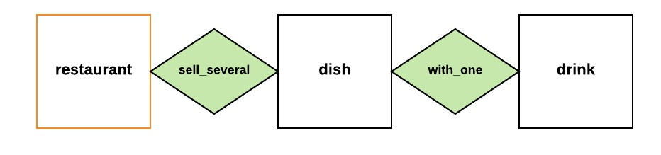

# Guía de inicio rápido: programa dos respuestas posibles para un mismo event

Esta guía de inicio rápido describe los pasos a seguir para programar dos posibles respuestas del bot a un mismo event utilizando las [**conditions**](../concepts/condition.md). En esta ocasión, estarás programando conditions que usen la información disponible en el [scope](../concepts/scope.md) para adaptar las respuestas del bot de acuerdo con los datos que haya proporcionado el usuario. De esta manera, el bot aprenderá a solicitar por sí mismo la información que necesita para responder adecuadamente a los usuarios.

Esta posibilidad permitirá al bot manejar un sinnúmero de scenarios, asegurando la continuidad de las conversaciones.

## Requisitos previos

Antes de empezar, necesitas hacer las siguientes configuraciones:

* Instala el ***Mammmut Services*** (MS)

* Crea un [**corpus**](/quick_start_corpus.md) y un [**knowledge**](/quick_start_knowledge_es.md).

> **Nota:** Para seguir esta guía rápida puedes duplicar el spreadsheet del package de [_Sylvia_](https://docs.google.com/spreadsheets/d/1PipFFyOWTcou9yYm3Uyc_bcNmnzh7kmKHdqR2jKgkyc/edit?usp=sharing). _Sylvia_ es un bot que atiende a los usuarios de la pequeña cadena de restaurantes _Mammut Restaurant_. Para lograrlo, ella cuenta con un [**corpus M**](../concepts/corpusM.md) y un [**knowledge**](../concepts/ontology.md) del cual obtiene la información para responder a las solicitudes de los clientes.


**Fig.1:** _Representación gráfica del path de la ontología de Sylvia y los vertices del knowledge que contienen los datos del restaurant_.

## Lecturas previas

Para comenzar, te recomendamos leer el artículo sobre el [conversation scope](../concepts/scope.md), así como también el artículo sobre las [conditions](../concepts/condition.md) en nuestros conceptos.

## Conditions

Las [conditions](../concepts/condition.md) son expresiones en código que permiten determinar el comportamiento del bot utilizando información específica como el [channel](../concepts/channels.md), el sub-channel, o la información almacenada en el [**scope**](../concepts/scope.md) de la conversación. Por lo tanto, aprenderemos a configurar una condition que usará la información almacenada en el scope para programar dos repuestas diferentes para un evento del corpus. 

Por ejemplo: imaginemos que un bot tiene información sobre varias tiendas y un usuario pregunta: "_¿Cuál es la dirección?_". Para responder a esa pregunta, el bot requiere saber a qué **tienda** en particular se está refiriendo el usuario. A esto le llamamos _contextualización_, la cual consiste en incluir instancias en el scope para que el bot esté al tanto de lo que ocurre durante una conversación. En este caso, el bot podría dar dos respuestas diferentes al mismo evento: una para atender a la pregunta del usuario (si este ya sabe de qué tienda se está hablando), u otra para solicitarle a este la información (no incluida en el scope) que necesita para responderle apropiadamente (***solicitud de contextualización*** sobre la _tienda_).

Para configurar ambas respuestas en el corpus, debes programar una condition para cada una de ellas utilizando las expresiones booleanas correspondientes e incluyéndolas en la columna **lambda_condition** del sheet **corpus** tal y como veremos en la siguiente sección.

## ¿Cómo configurar dos repuestas posibles para un mismo event ?

Para comenzar, observa el siguiente evento:

| id | sub_id | scenario_type | event_message | hidden | field | lambda_condition | ui_event | action | source | regional_settings | complexity |
| - | - | - | - | - | - | - | - | - | - | - | - |
| 1 | 1 | Conversation | Sylvia, ¿cuál es la dirección de [`variable\|restaurant.name`]? |  |  |  |  |  | Carmen | es | |

Aquí podemos observar que _Sylvia_ tiene dos opciones:

1. Responder con la dirección de la tienda (en tanto esta haya sido ya especificada en la conversación).
2. Preguntar al usuario a cuál restaurant se está refiriendo (solicitando la contextualización en caso de que falte dicha información).

A continuación, observemos cómo configurar ambas respuestas usando las **conditions**:

1. **Crea una respuesta a la pregunta del usuario:** Aquí debes especificar una respuesta del bot a partir de información almacenada en el **scope**.

    1. En el sheet del **corpus** del **spreadsheet** de _[Sylvia](https://docs.google.com/spreadsheets/d/1PipFFyOWTcou9yYm3Uyc_bcNmnzh7kmKHdqR2jKgkyc/edit#gid=1068576320)_, ubícate en el escenario 1, evento 2.

    2. Aprovechando la respuesta que ya tienes en el corpus, escribe la condition `restaurant.in_scope` en la columna **lambda_condition**: 

        | id | sub_id | scenario_type | event_message | hidden | field | lambda_condition | ui_event | action | source | regional_settings | complexity |
        | - | - | - | - | - | - | - | - | - | - | - | - |
        | 1 | 1 | Conversation | Sylvia, ¿cuál es la dirección de [`variable\|restaurant.name`]? |  |  |  |  |  | Carmen | es | |
        | 1 | 2 | Conversation | Nuestra dirección es [`variable\|restaurant.address`] |  |  | `restaurant.in_scope`  |  |  | Mammut | es | |

    De esta forma, especificarás la condition para que esa sea la respuesta por defecto cuando la información esté contextualizada.

    > En el caso del evento en nuestro ejemplo _"Sylvia, ¿cuál es la dirección de [`variable\|restaurant.name`]?"_, es importante notar que la información sobre el restaurant ya forma parte del scope gracias al uso de la [variable](../concepts/variables.md). Sin embargo, programar dos respuestas diferentes para este evento será de ayuda en caso de que un usuario formule la pregunta sin proveer esta información como, por ejemplo: _"Sylvia, ¿cuál es la dirección?"_.

2. **Crea una segunda respuesta con la *solicitud de contextualización*:**

    1. Crea una fila nueva en el corpus, para agregar la segunda opción de respuesta. En esta nueva fila, identificaremos el campo **id** con el número entero _1_, el campo **sub_id** con el número entero _2_ y el campo **scenery_type** con 'Conversation'. Como puedes ver, estos son los mismos datos de la primera opción de respuesta.

    2. En el campo **event_messege** agrega la segunda opción de respuesta. Puedes usar, por ejemplo: _"Necesito saber el nombre del local que te interesa para ayudarte. ¿Podrías dármelo en el siguiente mensaje?"_.

    3. Deja vacíos los campos **hidden** y **field**.

    4. Escribe en la columna **lambda_condition** la condition para la segunda respuesta ```restaurant.not_in_scope```.

    5. Completa el campo **source** con 'Mammut', para indicar que esta es una respuesta y luego escribe 'es' en la columna **regional_settings** para indicar que el idioma es _español_. Deja vacíos los campos **ui_event** y **action**.

        | id | sub_id | scenario_type | event_message | hidden | field | lambda_condition | ui_event | action | source | regional_settings | complexity |
        | - | - | - | - | - | - | - | - | - | - | - | - |
        | 1 | 1 | Conversation | Sylvia, ¿cuál es la dirección de [`variable\|restaurant.name`]? |  |  |  |  |  | Carmen | es | |
        | **1** | **2** | Conversation | Nuestra dirección es [`variable\|restaurant.address`] |  |  | `restaurant.in_scope`  |  |  | **Mammut** | **es** | |
        | **1** | **2** | **Conversation** | **Necesito saber el nombre del local que te interesa para ayudarte. ¿Podrías dármelo en el siguiente mensaje?** |  |  | `restaurant.not_in_scope`  |  |  | **Mammut** | **es** | | |

    De esta forma, especificarás la condition para que esa sea la respuesta por defecto cuando la información **no** se encuentre en contexto.

3. **Crea un event con la *contextualización* que da el usuario:**  

    1. Crea una fila nueva en el corpus. En esta nueva fila, identifica el campo **id** con el número entero _1_, el campo **sub_id** con el número entero _3_, y el campo **scenery_type** con **Conversation**.

    2. En el campo **event_message** escribe la contextualización que esperas del usuario, por ejemplo: _"Quiero saber sobre el [```variable\|restaurant.name```]"_.

    3. Completa de nuevo el campo **source** con 'Mammut', para indicar que esta es una respuesta del bot y luego escribe 'es' en la columna **regional_settings** para indicar que el idioma es _español_. Deja vacíos los campos **ui_event** y **action**.

        | id | sub_id | scenario_type | event_message | hidden | field | lambda_condition | ui_event | action | source | regional_settings | complexity |
        | - | - | - | - | - | - | - | - | - | - | - | - |
        | 1 | 1 | Conversation | Sylvia, ¿cuál es la dirección de [`variable\|restaurant.name`]? |  |  |  |  |  | Carmen | es | |
        | 1 | 2 | Conversation | Nuestra dirección es [`variable\|restaurant.address`] |  |  | `restaurant.in_scope`  |  |  | Mammut | es | |
        | 1 | 2 | Conversation | Necesito saber el nombre del local que te interesa para ayudarte. ¿Podrías dármelo en el siguiente mensaje? |  |  | `restaurant.not_in_scope`  |  |  | Mammut** | es | |
        | **1** | **3** | **Conversation** | **Quiero saber sobre el [`variable\|restaurant.name`]** |  |  |  |  |  | **Mammut** | **es** | |

4. **Crea un event con la respuesta del bot:** Aquí debes crear un event en el que _Sylvia_, luego de saber el valor de [```variable\|restaurant.name```], responda con la dirección del local.

    1. Crea una fila nueva en el corpus. En esta nueva fila, identifica el campo **id** con el número entero _1_, el campo **sub_id** con el número entero _4_, y el campo **scenery_type** con **Conversation**.

    2. En el campo **event_message** escribe la respuesta del bot con la dirección, por ejemplo: _"Nuestra dirección es [```variable|restaurant.address```]"_.

    3. Completa el campo **source** con 'Mammut', para indicar que esta es una respuesta y luego escribe 'es' en la columna **regional_settings** para indicar que el idioma es _español_. Deja vacíos los campos **ui_event** y **action**.

        | id | sub_id | scenario_type | event_message | hidden | field | lambda_condition | ui_event | action | source | regional_settings | complexity |
        | - | - | - | - | - | - | - | - | - | - | - | - |
        | 1 | 1 | Conversation | Sylvia, ¿cuál es la dirección de [`variable\|restaurant.name`]? |  |  |  |  |  | Carmen | es | |
        | 1 | 2 | Conversation | Nuestra dirección es [`variable\|restaurant.address`] |  |  | `restaurant.in_scope`  |  |  | Mammut | es | |
        | 1 | 2 | Conversation | Necesito saber el nombre del local que te interesa para ayudarte. ¿Podrías dármelo en el siguiente mensaje? |  |  | `restaurant.not_in_scope`  |  |  | Mammut | es | |
        | 1 | 3 | Conversation | Quiero saber sobre el [`variable\|restaurant.name`] |  |  |  |  |  | Mammut | es | |
        | **1** | **4** | **Conversation** | **Nuestra dirección es [`variable\|restaurant.address`]** |  |  |  |  |  | **Mammut** | **es** | |

    ¡Excelente! Si seguiste todos estos pasos, has logrado crear dos respuestas diferentes para un mismo evento en el corpus. Puedes verificar lo que hiciste en [este spreadsheet de Google](https://docs.google.com/spreadsheets/d/1SaY2Pk6RIcDkEmlIbGn0fEdQP25lakma1efLq933izI/edit?usp=sharing).

## Resumen

En esta guía rápida aprendiste los pasos necesarios para configurar dos respuestas a un mismo evento del corpus. Esto lo lograste en cuatro pasos principales: 1) creando una respuesta a la pregunta del usuario, 2) creando una segunda respuesta con la *solicitud de contextualización*, 3) creando un event con la *contextualización* que da el usuario, y 4) creando un nuevo event con la respuesta del bot. Esta configuración en los eventos del corpus es posible gracias a las conditions, las cuales permiten programar al bot para solicitar la información que necesita para responder de forma apropiada. De esta manera, el bot es capaz de seguir interactuando con el usuario, aún cuando este no le provea datos suficientes.

## Siguientes lecturas recomendadas

Para continuar, te recomendamos leer nuestra [guía de inicio rápido para incorporar instances al scope](quick_start_scenario_defaults.md), en la cual aprenderás a configurar algunas instances por defecto en la memoria del bot dependiendo del canal por el que se comuniquen los usuarios. Esto permitirá al bot responder sin necesidad de que el usuario deba indicarle el contexto de forma explícita.
