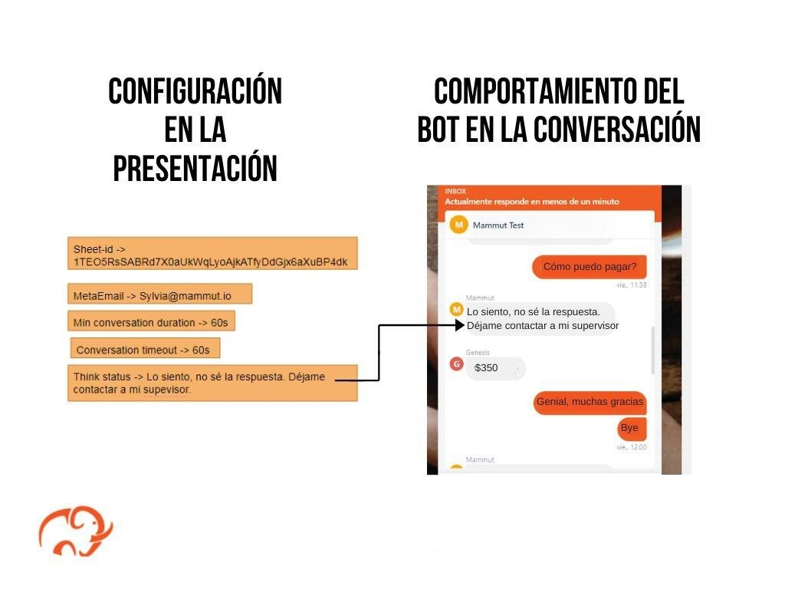

# Guía de inicio rápido: configuración de parámetros conversacionales

Esta guía de inicio rápido describe los pasos a seguir para que puedas configurar una serie de  parámetros del bot desde la  **presentation** que forma parte del **package**.

## Requisitos previos

Antes de empezar, necesitas hacer las siguientes configuraciones:

- Instalación del *Mammmut Services (MS)*.

> Nota: Es importante haber creado un spreadsheet y una presentation. Si no haz creado estos archivos:

- Haz una copia de la [plantilla de la presentation](https://docs.google.com/presentation/d/1n0Q9LQSB99Qj2kxxi1JPHTBm42PkLeDdR6kgOVXTilo/edit?usp=sharing).

- Crea el **spreadsheet** del package. Copia la [plantilla del spreadsheet para un corpus N](https://docs.google.com/spreadsheets/d/1FojxJ09c4LLSzhLK7j_MTySRz4cxnOyNGuOjVBfdoeE/edit?usp=sharing) o la [plantilla del spreadsheet para un corpus M](https://docs.google.com/spreadsheets/d/1wcf2aPHYmAypnLKlNIodYLSDIw0YArvW8K0OtXiNXQ8/edit?usp=sharing).

- Asegúrate de que los [permisos de acceso de los archivos](../shared_tips/docs_preparation.md) sean los adecuados.

## Lecturas previas

Antes de comenzar también te recomendamos leer el artículo sobre [la configuración del bot](../concepts/bot_configuration.md) para que así puedas familiarizarte con la organización y vinculación de las diferentes partes de un *Mammut package* y la especificación de los parámetros que son obligatorios para la creación de un bot.

## Configuración del bot

La configuración del bot es uno de los pasos principales para la creación de un bot. Esta se lleva a cabo estableciendo una serie de parámetros básicos que el bot asume durante las interacciones con los usuarios.

Estos parámetros básicos de configuración se alojan en la presentación que creamos en la sección anterior y determinan el tiempo de culminación de la conversación; la duración mínima de la conversación; el mensaje que envía el bot cuando hay un issue, entre otros. Además, durante el proceso de configuración del bot se añaden en la presentation algunos datos esenciales del package para vincular a la misma con el spreadsheet.

Estos datos son indispensables para el correcto funcionamiento del bot, y son un requisito obligatorio para poder llevar a cabo los pasos posteriores, como por ejemplo: la creación y preparación del bot.

## Configuración y conversación

Los bots de Mammut utilizan la configuración alojada en la presentación al momento de interactuar con los usuarios. Estos parámetros determinan cuánto tiempo asumirá el bot que durará una conversación, cuánto tiempo debe esperar luego de que una conversación termine, e incluso qué mensaje debe enviarle a un usuario cada vez que no sepa la respuesta a sus preguntas.

## ¿Cuáles son y en qué consisten los parámetros de configuración del bot?

1. **Min conversation duration (duración mínima de conversación):** Es el período de tiempo mínimo que dura una conversación con tu bot.

2. **Conversation time out (tiempo de culminación de conversación):** Es el lapso de tiempo máximo que debe haber entre cada mensaje de la conversación.

3. **Think status (estado de espera):** Es un mensaje programado para responder a los usuarios en aquellos momentos en los que el bot no cuente con la información necesaria para responder a un evento.

4. **Think status (estado de espera):** Es un campo donde se agrega la identificación del Google Spreadsheet del package.

> Nota: Para más información sobre los parámetros véase [configuración del bot](../concepts/bot_configuration.md)

## ¿Cómo configurar un bot desde la presentation?

1. **Para comenzar, entra a la presentation que creaste.**

2. **Llena cada uno de los siguientes parámetros de la plantilla de la presentación:**

   1. En el campo **Min conversation duration:** agrega una unidad en tiempo expresada en milisegundos (millis), segundos (s), minutos (min), horas (h) o días (d/day).
   Por ejemplo: *1h*.
   2. En el campo **Conversation timeout:** agrega una unidad en tiempo expresada en milisegundos (millis), segundos (s), minutos (min), horas (h) o días (d/day).
   Por ejemplo: *45min*.
   3. En el campo **Think status:** selecciona un mensaje para el estatus de espera.
   Por ejemplos: *te responderé en un momento*.
   4. En el campo **Sheet-id:** introduce el identificador del spreadsheet.
   Por ejemplo: *1n0Q9LQSB99Qj2kxxi1JPHTBm42PkLeDdR6kgOVXTilo*.

## Resumen

En esta guía rápida aprendiste los pasos necesarios para configurar un bot desde la presentation. 1) Creaste el spreadsheet y la presentation del packge; 2) Llenaste cada uno de los parámetros de configuración en la presentation. De esta manera, pudiste realizar uno de los pasos principales para la creación de un bot.

## Siguientes pasos

* [Crea las entidades de tu bot](quick_start_entities_creation.md).
