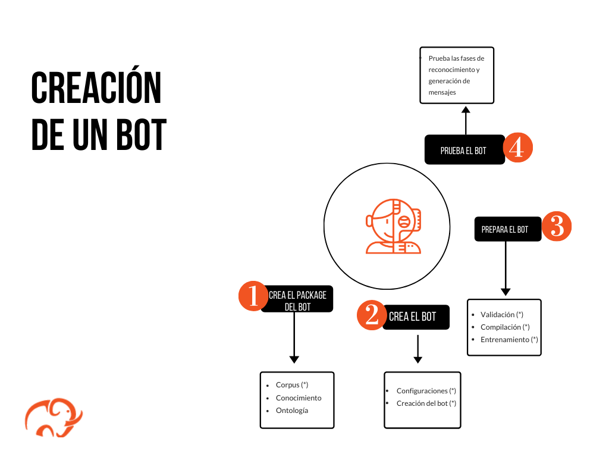
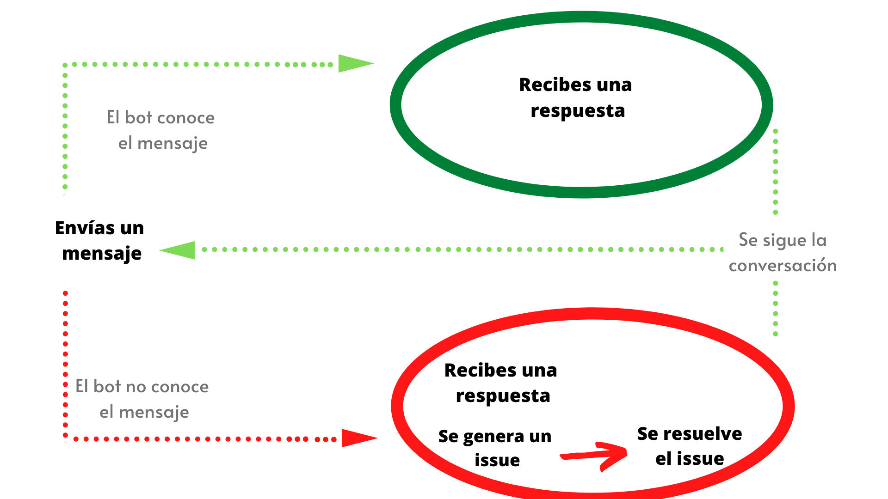
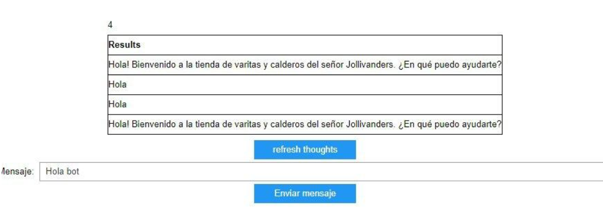

# Guía de inicio rápido: prueba tu bot

Esta guía de inicio rápido describe los pasos a seguir para que puedas probar los scenarios de los corpus que has preparado para usar en tu bot. Con esta prueba podrás asegurarte, antes de hacerlo público, de que el bot recibe y responde mensajes satifactoriamente. Para probarlo, mantendrás una conversación con tu bot por medio de una herramienta Mammut llamada _Dialogue tester_, la cual está alojada en un _Jupyter Notebook_.

> Nota: Si en el sistema el reconocimiento y la generación de mensajes está funcionando adecuadamente, obtendrás la respuesta que programaste en el corpus para el event enviado. De lo contrario, recibirás como respuesta un mensaje automático y se generará un issue (es decir, un inconveniente). Este issue será registrado en el spreadsheet de tu package para que puedas resolver la falla posteriormente.

Las pruebas hechas en el modo de operaciones **{{ terms.framework.dialogue_tester }}** corresponden al paso número 4 de la creación del bot, tal y como lo muestra el siguiente gráfico:

**Figura 1:** etapas de la creación de un bot.

## Requisitos previos

Antes de empezar, debes hacer las siguientes configuraciones:

* Instalación del Mammmut Services (MS).

* Diseña un Mammut package de acuerdo a tus necesidades (véase: [corpus](quick_start_corpus.md), [knowledge](quick_start_knowledge_es.md) y [presentation](quick_start_presentation_es.md)).

* Crea las entidades que necesitarás, es decir, [un bot, un user y un room](quick_start_entities_creation.md).

* [Prepara un bot](quick_start_chatbot_preparation.md).

## Lecturas previas

Antes de probar tu bot, es necesario que hayas finalizado la preparación del package. Para ello, te recomendamos leer y seguir el [tutorial introductorio](../tutorial-intro/intro.md), así como el artículo sobre [_Jupyter Notebooks_](../framework/cuadernos_jupyter.md) para que puedas familiarizarte con la herramienta que usarás en esta etapa.

## Pruebas con el _Dialogue tester_ y el funcionamiento del sistema

El _Dialogue tester_ es una herramienta Mammut que facilita diferentes operaciones. En el modo de operaciones {{ terms.framework.dialogue_tester }}, este widget realiza pruebas del sistema por medio de una conversación con el bot. Es por ello que el modo **{{ terms.framework.dialogue_tester }}** debe ser utilizado una vez que el bot ha aprendido a manejar conversaciones. Este conocimiento es adquirido por el bot en etapas anteriores de su construcción, por medio de los datos contenidos en su package y del procesamiento que hace el sistema de esta información.

Las pruebas hechas en el modo de operaciones **{{ terms.framework.dialogue_tester }}** del _Dialogue tester_ permiten probar el funcionamiento del bot durante una conversación. De esta manera, puedes identificar problemas que han tenido lugar en etapas anteriores a esta prueba para, posteriormente, solventar las fallas del package.

**Figura 2:** Esquema de la prueba de conversación.

## ¿Cómo probar los scenarios de tu corpus en una conversación con tu bot?

1. Para comenzar, entra al _Dialogue tester_. Ten a la mano los datos del bot, el usuario y el room que utilizarás para esta prueba.

2. **Selecciona el modo de operaciones en el _Dialogue tester_** : este módulo presenta las distintas operaciones que puedes hacer con el _Dialogue tester_. En este caso utilizaremos el modo **{{ terms.framework.dialogue_tester }}**. Para escoger el modo de operaciones, sigue los siguientes pasos:

    * Corre el _Simulator_ Notebook.
    * En _0. Configuraciones_ pulsa **Comenzar**
    * En _1. Seleccionar operation mode_ escoge **{{ terms.framework.dialogue_tester }}** y luego pulsa **Select**.

3. **Selecciona las entidades (bot, usuario y room) con las que vas probar tu package**:

    * Selecciona el bot: en _Seleccionar bot_ pulsa la flecha y escoge el nombre del bot con el que harás la prueba.
    * Selecciona el usuario: en _3. Seleccionar Usuario_ escoge el **e-mail** con el que has identificado tu usuario.
    * Selecciona el room: en _4. Seleccionar Room_ pulsa el **título** que le has puesto a tu room.

4. **Envía el mensaje seleccionado para la prueba**:

    * En _5. Enviar mensaje_ escribe el event o mensaje que utilizarás para la prueba. Una vez que hayas escrito el mensaje, pulsa **enviar mensaje**.
    * Luego de unos segundos, pulsa **refresh thought**. Este paso te permitirá observar la respuesta que enviará el bot a la pregunta que le enviaste en el paso anterior.

    
    **figura 3:** Resultado del _Dialogue tester_ cuando el funcionamiento de tu bot es satifactorio.

En caso de que el sistema reconozca el mensaje que enviaste y genere una respuesta, el _Dialogue tester_ te mostrará el event que programaste en el corpus como respuesta; así te asegurarás de que tu bot está funcionando adecuadamente. A través de esta conversación, has logrado probar de manera concreta los scenarios de los corpus compilados que usarás en tu bot.

    Si el _Dialogue tester_ te muestra el event que programaste en el corpus como respuesta al mensaje que enviaste, significa que el sistema ha reconocido el mensaje enviado y ha generado una respuesta como muestra de su funcionando adecuado. 

Sin embargo, si falla el reconocimiento y generación de un event, el _Dialogue tester_ motrará el **think status**; es decir, el mensaje que programaste en tu package en caso de que el bot no reconozca un event. Además, se producirá un **issue** que identificarás con el siguiente mensaje: _There is a new issue in the conversation_. Este issue será registrado en un sheet dentro del spreadsheet de tu package.

Luego de que el _Dialogue tester_ haya devuelto un **issue**, tu bot no podrá responder más preguntas hasta que reinicies la conversación. Para reiniciarla, debes serguir los siguientes pasos:

* En _6. Solve issue_ y pulsa **Ignorar**; el sistema debe indicar _Issue ignorado correctamente!_.
* Una vez hecho lo anterior, puedes volver a _5. Enviar mensaje_ y continuar tus pruebas.

## Resolver issues producidos en la prueba

Al momento de que el _Dialogue tester_ haya registrado el primer issue en la prueba, el sistema crea un nuevo sheet en el spreadsheet del package encabezado con el enunciado **issue_corpus**. En este sheet el sistema muestra las especificaciones de los issues resultantes de una prueba. De esta manera, podrás identificar el event que está dando problemas al funcionamiento del bot.

> **Nota:** El **issue_corpus** muestra dónde se produjo el issue (el sub-id del event, el event_message, su source y su regional_settings); además, ofrece detalles como el id del issue, su tipo, la fecha y la hora en las que se produjo.

Puedes utilizar esta información para ubicar los issues dentro del package del bot y decidir cómo reforzar tu package. Algunos errores pueden ser producto de un problema de configuración de id, sub-id, source, regional_settings del event en cuestión; o pueden deberse a que el event necesita ser parafraseado en el **corpus_extension**.

## Resumen

En esta guía rápida seguiste los pasos para hacer una prueba en el modo **{{ terms.framework.dialogue_tester }}** del _Dialogue tester_. Esta prueba te permitió observar el funcionamiento del bot durante una conversación. Este proceso lo hiciste en tres etapas: 1) seleccionando el modo de operaciones **{{ terms.framework.dialogue_tester }}** en el _Dialogue tester_, 2) seleccionando las entidades (bot, usuario y room) para probar tu package y 3) enviando un mensaje a través del _Dialogue tester_. De esta manera, pudiste identificar problemas del sistema para luego resolverlos desde el spreadsheet del package antes de hacer público tu bot. La siguiente guía rápida te mostrará cómo hacerlo público integrándolo con un channel.  

## Siguientes pasos

* [Integra un bot con un channel](channels_connection_es.md)
