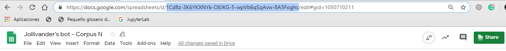

# ¿Cómo saber cuál es el ID de los documentos?

Al crear un documento de Google se genera un código único. El código es una serie de caracteres compuesta por un conjunto de letras, números o símbolos. Para saber la identificación de un archivo de Google (doc, spreadsheet, presentation, etc.) es necesario recuperarlo a partir del URL del mismo archivo. 

El URL de los archivos de Google está compuesto por la dirección de los documentos: *https://docs.google.com/* seguido de la identificación de la naturaleza del archivo dispuesto entre barras oblicuas */file/ /document/ /presentation/ o /spreadsheet/*. Luego encontramos una letra d entre barras oblicuas */d/*. La cadena de caracteres que aparece después de esta barra oblicua, y que termina donde se encuentra la siguiente barra oblicua, es el id del archivo.

