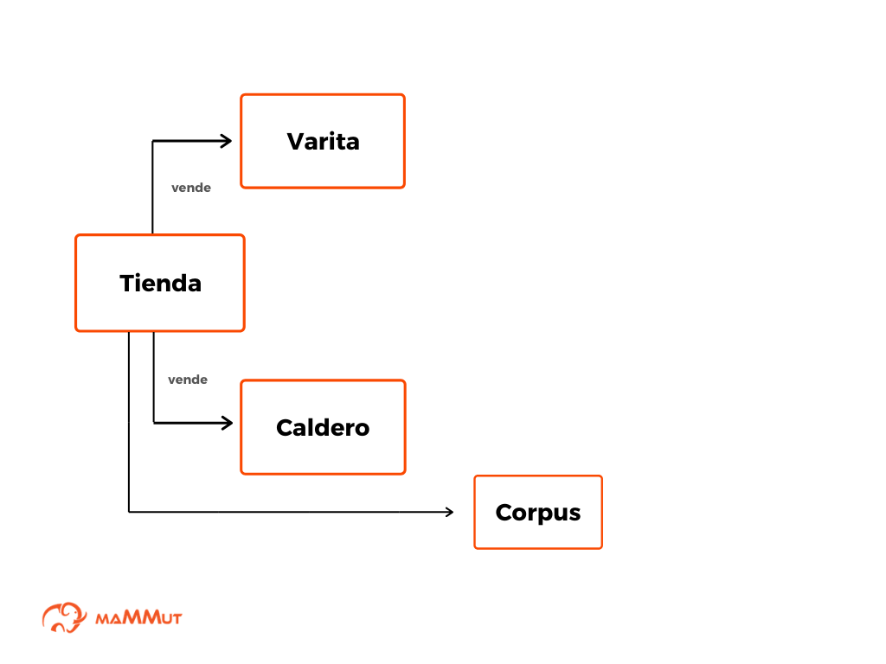

# Capítulo 4. Construye un bot más avanzado

En los capítulos anteriores vimos [cómo crear un bot básico](corpusN(1).md) y [cómo obtener respuestas predeterminadas](corpusN(2).md) de _Dobibot_. No obstante, es posible mejorar las capacidades de nuestro vendedor con algunos cambios en el **package**. Entenderemos package como la colección de datos alojada en un archivo **spreadsheet** y una **presentation** que _Dobibot_ necesita para funcionar.

> **Nota:** recordemos también que parte de la información que _Dobibot_ necesita para funcionar es el **corpus**. Este contiene los ejemplos de las diversas interacciones del bot con los usuarios.

Sin embargo, el **corpus** que preparamos en el capítulo anterior de nuestro tutorial es un corpus básico, también conocido como [corpus N](../concepts/corpusN.md). Este corpus N lo convertiremos en un [corpus M](../concepts/corpusM.md) para mejorar la funcionalidad de _Dobibot_, nuestro asistente estrella.

## ¿Qué vamos a programar en este capítulo?

Vamos a configurar lo necesario antes de construir un  corpus M. Este tipo de corpus, se trata de un corpus ampliado, de manera que contendrá el corpus que preparamos en el [capítulo anterior](corpusN(1).md), pero aumentando dramáticamente lo que _Dobibot_ puede entender utilizando directamente al **knowledge** (base de conocimiento) del inventario de la tienda virtual. Primero, vamos a ver las diferencias entre el corpus N y el corpus M.

## ¿Qué es un corpus N?

Para ponerte en contexto, cuando hablamos de **corpus N** nos referimos a un conjunto de interacciones simples que le enseñamos a nuestro _Dobibot_ para que este pueda comunicarse con un usuario. Estas interacciones están dispuestas en un spreadsheet y son creadas en lenguaje natural. Se trata de peticiones y respuestas alineadas entre sí que redactamos explícitamente. Por ejemplo, si un usuario dice "gracias" podemos crear respuestas como "de nada" o "ha sido un placer". Fíjate que las respuestas no suponen extraer o inferir información de alguna otra parte: el usuario pregunta y el bot busca el mensaje apropiado como respuesta. Nada mal, ¿cierto? Pero tenemos herramientas más poderosas a nuestra disposición.

## ¿Qué es un corpus M?

Cuando hablamos de un **corpus M** nos referimos también a un conjunto de interacciones ([scenarios](../concepts/scenario.md) y [events](../concepts/events.md)). Sin embargo, estas interacciones hacen uso de un lenguaje formal que hace más expresiva la capacidad de respuesta del bot. Se trata de una manera de ampliar el corpus N utilizando [variables](../concepts/variables.md) que funcionan de manera similar a palabras muy generales, y que permitirán relacionar el corpus con un [knowledge](../concepts/ontology.md). En este sentido, el corpus N es una versión un poco más restringida de un corpus M.

**figura 1**: esquema de la ontology y knowledge de Dobibot en función de un corpus.

El uso de un corpus M permitirá que _Dobibot_ pueda manejar el contexto en una conversación a través de datos más específicos que almacenará o recuperará en su knowledge. Pero descuida, construiremos el knowledge de _Dobibot_ paso a paso y verás lo útil de un corpus M. _Dobibot_ utilizará los datos de su knowledge para resolver inquietudes y peticiones de los usuarios en sus interacciones.

## Limitaciones de un corpus N

Un **corpus N** es un corpus muy útil para ciertas tareas, ya que consta únicamente de interacciones sencillas, creadas en lenguaje natural y almacenadas en un **spreadsheet**. Debido a su simplicidad, este tipo de corpus no permite que _Dobibot_ pueda asumir información alguna de las conversaciones, para así asistir a un usuario de manera más eficiente. Imagina la siguiente conversación con nuestro asistente:

- **Usuario:** Hola Dobibot
- **Dobibot:** ¡Hola! ¿Qué puedo hacer hoy por ti?
- **Usuario:** Me gustaría saber qué escobas tienes en oferta.
- **Dobibot:** ¡Perfecto! Ahora mismo tengo la Nimgus 3000 y la Saeta Veloz 2020 en oferta. ¿Te interesa alguna?
- **Usuario:** ¿Cuánto cuesta la Saeta Veloz?
- **Dobibot:** La Saeta Veloz vale dos galeotes de oro.
- **Usuario:** ¡Me la llevo!

En el diálogo anterior hay algunos mensajes que, aunque se podrían construir con un corpus N, tendrían un mantenimiento costoso en términos de tiempo. Por ejemplo, tendríamos que verificar cada cierto tiempo cuáles son las escobas en oferta, y cambiar los mensajes de respuesta del bot cada vez que esta información se actualice. Lo mismo pasaría con los precios de los artículos. Y si hay varias respuestas con esa información, ¡habría actualizar todas y cada una por separado! El **corpus M** nos permite mantener las respuestas inalteradas mientras extrae información de un **knowledge** (base de conocimiento) que puede cambiar.

Como ventaja, el corpus M sí puede manejar convenientemente el contexto: fíjate que al final, el usuario dice "_¡Me la llevo!_" refiriéndose a una escoba en particular (_Saeta Veloz 2020_). En un corpus M, _Dobibot_ sabrá cuál escoba quiere el usuario si esta ha sido mencionada anteriormente en la conversación. En este caso, al usuario haber preguntado "_¿Cuánto cuesta la Saeta Veloz?_", _Dobibot_ la incluyó en el **scope**.

> **Nota:** entenderemos **scope** como la gama de asuntos considerados o tratados en la conversación de un bot. Estos asuntos deben ser parte de lo que el bot sabe.

## ¿Qué ventajas me da utilizar un corpus M en lugar de un corpus N?

Si utilizas un **corpus M** tu bot podría tener estas habilidades:

- **Preparación de un knowledge**: creación de un **knowledge** en donde repose el saber del bot. En nuestro caso, _Dobibot_ requiere tener acceso a la información del inventario de la tienda de artículos mágicos, y eso supone que debe manejar un knowledge especializado.
- **Uso de una red semántica**: se creará una **ontology** (ontología o red semántica) que organizará al knowledge. Esta ontology le permite construir relaciones entre las partes del knowledge y crea vínculos para facilitar la búsqueda de información a _Dobibot_.
- **Generalización de events**: en un corpus M se podrán usar las **variables** para generalizar **events**. Esto permitirá que el bot use los datos que tiene en su knowledge para convertir un event en distintas posibilidades.
- **Respuestas precisas**: las respuestas del bot estarán vinculadas a su knowledge. De esta manera, el bot buscará en su knowledge los datos correctos para responder al usuario en base a la pregunta que se hizo.
- **Manejo de contexto**: utilizar un corpus M permite que _Dobibot_ pueda manejar el contexto en una conversación a través de datos que almacena en el **scope**. De esta manera se obtienen conversaciones más fluidas.
- **Utilización de imágenes**: posibilidad de incluir imágenes en el knowledge. Eso le permitirá al bot enviar imágenes en sus conversaciones.

# El package para _Dobibot_

## Requisitos previos:

- Asegúrate de haber preparado tu [corpus N](corpusN(1).md). 
- Asegúrate de leer estos términos básicos: corpus_M, corpus_extension_M, corpus_map.

## Prepara el package

Vamos a realizar algunos cambios en el package para transformar nuestro corpus N en un corpus M. Incluiremos algunas otras partes:
**corpus_M, corpus_extension_M, corpus_map, entry_point, properties, edges, vertices, defaults, varita, caldero.**

Todas estas nuevas partes son importantes de completar, ¡no dejes de hacerlo!

Llenar el **(a) corpus, (b) corpus_extension y (c) corpus_map** es indispensable para la funcionalidad de _Dobibot_, sin embargo, como ya aprendimos a llenarlas en el [capítulo anterior](corpusN(1).md), te dejaré en el siguiente vínculo un archivo listo para usar, el cual contiene el formato del corpus M y el corpus N que construimos anteriormente.

También te dejaré un archivo **presentation** con la configuración necesaria y los datos pertinentes para ser usada. Recuerda que si deseas cambiar algunos datos de estos parámetros puedes verificarlo en el siguiente enlace: [pasos para preparar los documentos del package](../shared_tips/docs_preparation.md).

- *[Spreadsheet listo para usar](https://docs.google.com/spreadsheets/d/1YyLZmXATFbAJi4UvZ7eKdXT6hqDUZ8oIcRW125_4_qY/edit?usp=sharing)*

- *[Presentation lista para usar](https://docs.google.com/presentation/d/1n0Q9LQSB99Qj2kxxi1JPHTBm42PkLeDdR6kgOVXTilo/edit?usp=sharing)*

¡Listo! Ahora que tenemos nuestro **package** preparado, llenaremos las sheets restantes, paso a paso, para construir el knowledge de nuestro _Dobibot_.

## ¿Qué sigue?

Para sacarle el máximo provecho a _Dobibot_ vamos a construir un **knowledge** (base de conocimiento) y una **ontology** (ontología) para nuestro bot.

[Crea el knowledge de tu bot](corpusM(2).md)
