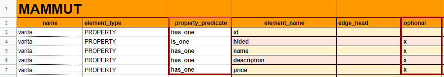

# Capítulo 5. Crea el knowledge de tu bot

El proceso para crear el **knowledge** de nuestro _Dobibot_ va a tener varias fases. En realidad no hay una sola manera de construirlo, esta forma que te vamos a enseñar es una de las muchas alternativas en las que puedes crearlo.

## ¿Qué vas a aprender aquí?

- Diseñar una [ontology](../concepts/ontology.md) que nos permita organizar el [knowledge](../concepts/ontology.md) de los artículos mágicos que tendrá _Dobibot_.
- Poblar la ontology con el knowledge (vertices e instances) correspondietes. Esto incluye cada item que se venderá en nuestra tienda, y sus características.

## Organizando el inventario de la tienda Jollivanders en el knowledge de _Dobibot_

Ahora que sabes que _Dobibot_ necesitará de un corpus M para poder responder preguntas sobre el inventario de artículos mágicos, pasaremos a diseñar un **knowledge** y una **ontology** (organización de dicho knowledge).

### ¿Qué es el **knowledge** de _Dobibot_?

Se trata de todos los conceptos que _Dobibot_ debe saber del mundo para poder responder a las preguntas que le hagan. En este caso, los conceptos que _Dobibot_ debe saber son los relacionados a la tienda y sus productos. El knowledge de _Dobibot_ está estructurado en forma de ontology. La ontology le permite a _Dobibot_ enlazar los conceptos del knowledge e inferir las relaciones entre las partes que lo conforman.

> **Nota:** una ontology es una especificación explícita de los términos o conceptos que hay en un dominio del saber (en nuestro caso, un inventario de artículos para hacer magia) y de las relaciones entre ellos. Por ejemplo, tenemos una tienda (_Jollivanders Shop_) que vende artículos mágicos. En ese sentido, tendríamos una ontology muy simple que especifica que tienda -- vende --> producto. No es más que un mapa conceptual de cosas y relaciones. Un knowledge, en cambio, es una ontology + instances individuales: se trata de la organización y de los elementos organizados.

**figura 1**: esquema de la ontology de _Dobibot_.

## Elementos principales de la ontology de _Dobibot_

En esta parte resumiremos los principales componentes de una **Mammut ontology**.

> **Nota:** cabe destacar acá que una ontology en Mammut se construye en forma de **grafos** así que, de ahora en adelante, encontrarás mucha información sobre vertices (vértices), edges (aristas) y properties (propiedades).

Ahora que conoces lo referente al knowledge, la ontology y su utilidad para _Dobibot_, y ya que tenemos **(a) un corpus, (b) un corpus extension y (c) un corpus map** listas para usar, procederemos a llenar el **entry point** que es fundamental para _Dobibot_.

## ¿Qué es el entry point (punto de entrada)?

El **entry point** es un vertex destinado a almacenar toda la información general de la tienda para la que trabaja _Dobibot_, en este caso _Jollivanders Shop_. Este componente es el inicio del grafo, el punto de entrada de la ontology de nuestro bot.

## ¿Para qué sirven los vertices (vértices)?

Los [vertices](../concepts/vertices.md) sirven para almacenar información que forma parte del knowledge de _Dobibot_. Estos vertices contienen las [instances](../concepts/instances.md) (instancias) o cada una de las opciones o unidades de información que forman parte de un mismo vertex.

> **Nota:** cada vertex se dispone en un sheet del archivo **spreadsheet**. Típicamente escogeremos como nombre de este un sustantivo que denote de manera global los datos que definimos ahí, por ejemplo, "tienda" o "producto".

## ¿Para qué sirven las instances (intancias)?

Las **instances** son unidades de información que forman parte de algún **vertex**, representando tipos englobados en el concepto que está generalizado por este. Las instances contienen diferentes valores de properties. Por ejemplo: _Dobibot_ puede trabajar para dos tiendas, _Jollivanders Shop_ y _Diagon Mistery_, estas dos tiendas representan dos instances diferentes para el vertex 'tienda', por ende, posiblemente tengan diversos valores para properties como _name_, _description_, etc.

## ¿Para qué sirven los edges (aristas)?

Los [edges](../concepts/edges.md) permiten establecer una relación entre un vertex y otro vertex o entre un vertex y una property. A través de estos edges _Dobibot_ podrá establecer la relación entre la tienda y los productos que esta vende.

> **Nota:** cada edge denota una relación entre dos elementos. Escogeremos como edges elementos como verbos, preposiciones o conjunciones que cumplan con la función de nexo, por ejemplo, "have", "on" o "with".

## ¿Para qué sirven las properties (propiedades)?

Las [properties](../concepts/properties.md) sirven para describir aspectos, características o información de nuestra tienda o sus productos. Si queremos que _Dobibot_ sepa el horario de nuestra tienda, entonces crearemos una property llamada **opening_hours** y la agregamos a nuestro **entry point**.

> **Nota:** cada property denota un atributo. Típicamente escogeremos como property a adjetivos, adverbios o conjuntos, que nos permitan especificar características a una entidad, por ejemplo, "description", "cost" o "name".

Eres libre de agregar cualquier property que creas útil para _Dobibot_, como el horario de la tienda, una descripción de la tienda, el correo, los números de contacto, direcciones, etc. Estas properties pueden ser agregadas con cualquier serie de caracteres; con la limitación que no puede haber espacios entre palabras, ni guiones o puntos, solo se recomienda usar guiónes bajos "_" entre cada palabra.

> **Nota:** sobre esto te explicaré más detalladamente en la sección **properties** de este mismo tutorial

Sin embargo, existen algunas properties que son necesarias y que todo **knowledge** debe tener, por ejemplo: el **id** y el **name** de la tienda, compañia, negocio, etc.

## ¿Qué son los valores o datos?

Los **valores** son los que permiten definir las **properties**. Por ejemplo, para describir la property 'opening_hours' que contiene información sobre el horario de la tienda, le asignaremos a la property 'opening_hours' el valor "_Mo-Su 11:00-18:00_" que especifica el horario de apertura y cierre de la tienda. Estos valores varían dependiendo de la instance a la que identifiquen.

## Diseño de la ontology de _Dobibot_

### Paso a paso para llenar el entry point

1. Como primer paso, debemos situarnos en el [sheet llamado 'tienda'](https://docs.google.com/spreadsheets/d/1YyLZmXATFbAJi4UvZ7eKdXT6hqDUZ8oIcRW125_4_qY/edit#gid=706982878). Como puedes ver, este **entry point** tiene un nombre particular. El nombre del entry point debe ser un nombre que tenga relación con el negocio para el cual va a trabajar nuestro bot. En este caso _Dobibot_ trabajará para una tienda, así que, el entry point se llamará 'tienda'.

    
    
    **figura 2**: vista del nombre del sheet **entry_point**.

2. En el entry point, las **properties** estarán dispuestas en la primera columna de izquierda a derecha. Y en la columna siguiente estarán los valores o datos de estas properties.
3. La primera **property** que vamos a definir es el **id**, esta property la definiremos en la fila número dos de nuestro sheet 'tienda'. En la primera columna, de izquierda a derecha, escribiremos 'id' y en la segunda columna, en este mismo sentido, agregaremos cualquier secuencia de letras y/o números (sin espacios) que identifique a nuestra tienda. Prueba con 'JS_1' (este formato es opcional).
4. Ahora, haremos lo mismo con la siguiente property **name**, ubicada en la fila número tres. En la primera columna, de izquierda a derecha, escribiremos el nombre de la property que definiremos, en este caso la property llamada 'name'. En la segunda columna, en este mismo sentido, agregamos el nombre de la tienda donde _Dobibot_ va a trabajar. Puede ser _Jollivanders Shop_, por ejemplo.
5. Si ahora queremos incluir una descripción para _Jollivanders Shop_, lo que debemos hacer es dirigirnos a la primera columna, ubicada de izquierda a derecha, definir la property **description**, y  seguidamente, escribir una breve descripción de la tienda.

¡Listo! Ahora, siguiendo este patrón de forma reiterativa, podemos incluir todas las properties que queramos. 😁 Es decir, para definir las siguientes properties solo debemos seguir el mismo procedimiento que explicamos anteriormente.

**figura 3**: vista del entry point **tienda** con sus properties.

### Relación entre vertices y el entry point de la tienda de magia

Luego de haber incluido todas las properties que queramos y que definen nuestro **entry point**, llamado 'tienda', tenemos que establecer la relación entre la tienda y los productos que ella vende.

En el **knowledge** de _Dobibot_ las relaciones serán **edges** (aristas), y los conceptos que _Dobibot_ debe manejar, que en este caso serán los productos de la tienda, los denominaremos **vertices** (vértices). Pero descuida, más adelante ampliaremos la explicación de los vertices.

Por ahora es importante saber que estas relaciones entre vertices dadas por los edges también deben ser incluídas en el entry point, listándolas inmediatamente después de las properties que ya definimos.

Para crear las relaciones entre el entry point y los demás vértices:

1. En este caso vamos a tener dos vertices, uno que llamaremos 'varita' y otro que llamaremos 'caldero',  ya que la tienda _Jollivanders Shop_ es una tienda que vende calderos y varitas.
2.  En la primera columna, de izquierda a derecha, en la fila posterior a la última property definida, escribiremos el **edge** que va a enlazar la tienda con el **vertex**. Puede ser por ejemplo: 'sell_several'. Luego, agregaremos el nombre del vertex en la siguiente columna; por ejemplo, _varita_ .
3. Así pues, debemos repetir este procedimiento para enlazar el vertex 'caldero' con la tienda. Toma en cuenta que los edges para cada vertex deben ser distintos. Para el vertex denominado caldero puedes utilizar el edge 'send_several'.

**figura 4**: vista del entry point **tienda** con properties, edges y vertices.

Listo, ¡ya tenemos la primera fase completada! ¡Creamos el **entry point** (_tienda_) del **knowledge** de _Dobibot_!

Para tu comodidad, ya te hemos llenado el entry point (tienda). Lo puedes descargar en este link:

- *[Jollivanders' bot corpus M - entrypoint](https://docs.google.com/spreadsheets/d/1pP1jFa9aZB-IsU7n2Mrs45Qph3R6i3XyhaRPEZ1j34Y/edit#gid=706982878)*

### ¡Vamos a llenar las instances del vertex "varita"!

En esta fase te daré un ejemplo de cómo llenar los diferentes **vertices** con las **instances** que puede tener el knowledge de un bot. Para este tutorial te mostraré cómo llenar el vertex 'varita' de _Dobibot_:

1. Como primer paso, nos ubicaremos en el sheet 'varita' de nuestro package. Para comenzar debemos delimitar qué **properties** de las varitas que se venden en la tienda necesitaremos que _Dobibot_ conozca.

2. Para este ejercicio, te ayudaré a elegir las **properties** que utilizaremos para describir las varitas que vende el señor _Jollivanders_, pero recuerda que no hay límites para las properties que desees declarar. En esta caso declararemos las siguientes properties: **id**, **hidden**, **name**, **description** y **price**. Estas properties estarán dispuestas de forma horizontal en la fila dos del vertex **varita**.

    
    
    **figura 5**: vista de las properties del vertex **varita**.

    Al igual que en el entry point ('tienda'), el id y el name son properties obligatorias.

    Desde ahora, cada fila representará una **instance** en el knowledge de _DobiBot_.

    > **Nota:** ¿Qué es una instance (instancia)?
    >
    > En términos sencillos una instance, para fines del **knowledge** de _Dobibot_, está representada por un tipo de varita que se vende en la tienda _Jollivanders Shop_ donde cada tipo de varita tiene un nombre y un precio particular que le permite diferenciar una varita de los demás tipos de varitas.

3. Seguidamente, agregaremos la primera instance del vertex denominado 'varita'. Empezaremos asignándole un **id** a la instance. Este id puede estar conformado por cualquier secuencia de letras y/o números (sin espacios) que identifique la instance en cuestión. Prueba con 'V_1', 'V_2' y 'V_3' (este formato es opcional).

4. La columna de la property denominada **hidden** nos será de ayuda cuando necesitemos ocultar una instance, por los momentos no necesitamos hacer uso de esta columna así que la dejaremos vacía.

5. En la columna de la property llamada **name** incluiremos los nombres de los tipos de varitas que se venden en la tienda. En nuestro caso _Jollivanders Shop_ vende tres tipos de varitas en su tienda: _varita de cedro, varita de olmo y varita de sauco_. (Cada una de estas varitas representa una **instance** diferente).

    
    
    **figura 6**: vista de las properties **name**, **hided** y **id** de las instances del vertex **varitas**.

6. La siguiente columna denominada **description** es opcional. Esta columna nos será útil para preguntas como: *¿Qué es una varita de cedro?*. La información de esta columna la decides tú. Prueba con: _objeto mágico_.

7. Para finalizar, incluiremos una última property llamada **price**. En esta columna declararemos los precios que maneje nuestra tienda _Jollivanders Shop_ según la **instance** que estemos definiendo. Prueba llenar esta columna con los datos que podrás ver en esta imagen:

    
    
    **figura 7**: vista del verte **varita** con todas sus properties.

¡Muy bien! 😁 Has terminado esta parte del tutorial exitosamente.

Te dejaré en este enlace el archivo spreadsheet con los datos del vertex **caldero** listo.

- *[Jollivanders' bot corpus M - entrypoint, varita y caldero](https://docs.google.com/spreadsheets/d/1JgFHffMRimITeZ9acD3w-axyVcZXd-wHLNY756Ap8Uo/edit#gid=1400400156)*

### Llenado del sheet 'properties'

En esta fase de la creación de la **ontology** de _DobiBot_ declararemos las **properties** que nos han servido para definir las instances que hemos utilizado en el vertex denominado 'varita' y en el **entry point** ('tienda'). Como las properties del vertex 'caldero' son iguales a las del vertex 'varita', no necesitas agregarlas nuevamente en este sheet. Localiza el sheet **properties** y llénala como te indicaré a continuación:

1. En la columna **name** agregaremos los nombres de todas las properties que hemos utilizados a lo largo del tutorial, las que definen el entry point ('tienda') y el vertex 'varita'. Si utilizamos la misma property en varios vertices, solo debemos declararla una vez.

    Prueba agregando en esta columna las palabras: **id**, **name**, **description**, **opening_hours**, **contact**, **especialidad**, **price**, **hidden**. Cada una de estas palabras irá en una fila distinta de esta columna.

    
    
    **figura 8**: vista del sheet **properties**.

2. Para llenar la columna **property_type** existen varias opciones que dependen del formato que sigan los datos a utilizar en la columna de la property en cuestión. Aquí solo te explicaré las que vamos a usar en el llenado de la columna property_type de este tutorial. Si deseas más información sobre otros tipos de properties, puedes consultar en la [referencia de las properties](../concepts/properties.md).

    Llena esta columna como te indicaré:
    | property type | Descripción |
    | ------------- | ----------- |
    | **String** (cadena) | Este tipo de property acepta datos como cadena de caracteres alfanuméricos. Por ejemplo, la property **description** que tiene como dato _Tienda para magos y brujos_. También son **String** las properties: name, contact, especialidad, price. |
    | **Boolean** (booleano) | Este tipo de property acepta un dato lógico o booleano que puede representar valores binarios, normalmente del tipo FALSE y TRUE. Puedes indicar que la property **hidden** es un **boolean**. |
    | **StringToUpper** | El dato es una cadena de caracteres (texto) que se llevará a mayúsculas. Por ejemplo, la property **id** que tiene como dato el ID- JS_1 en el entry point 'store'. |
    | **OpeningHours** | Es un tipo de property que expresa el horario de trabajo de un establecimiento. Por ejemplo, la property **opening_hours** que tiene como dato _Mo-Su 11:00-18:00_ en el sheet del entry point. |

    Antes de continuar, asegúrate de que tu sheet **properties** se vea igual a la imagen que te ofrecí en el paso 1 esta parte del tutorial llamado _properties_.

3. En la columna **cardinality** se indica con cuántos datos o valores se puede describir a una property.

    > **Nota:** si la property se describe con un solo valor, se llena esta columna con el valor **SINGLE** (como es el caso de todas las properties que incluimos en este sheet). Si deseas más información sobre otros tipos de **cardinality**,  puedes consultar la sección de referencias.

4. La columna **properties**, **range** y **lambda_lexical form** corresponde a corpus más elaborados. Para más información puedes consultar nuestra sección de referencias. En este tutorial podemos dejar estas columnas vacías.

Te dejaré en este enlace el archivo spreadsheet con los datos del sheet **Properties** listo.

- *[Jollivanders' bot corpus M - entrypoint, varita y caldero, properties](https://docs.google.com/spreadsheets/d/1Eioa3h5z4V_frsULJA3GPXUSqQmEvYWSs6cSFcB3JkE/edit#gid=2099088252)*

### Llenado del sheet 'vertices'

La siguiente fase para la creación del knowledge es registrar o declarar todos los **vertices** que hemos incluido en un bot. En este tutorial te guiaremos en el llenado de el sheet 'vertices' con los datos del vertex 'varita'.  

El vertex denominado 'varita', el vertex denominado 'caldero' y el entry point ('tienda') representan los conceptos que _Dobibot_ debe conocer para poder responder cualquier pregunta que se le haga al respecto.

> **Nota:** los vertices son elementos que almacenan información. Ellos contienen las **instances** o cada una de las opciones o unidades de información que forman parte de un mismo **vertex**. En nuestro caso, _Dobibot_ deberá conocer el concepto de _varita_, sabrá que este es un vertex y también que _varita de cedro_, _varita de olmo_ y _varita de sauco_ son los tipos de varitas o instances del vertex denominado 'varita'.

Ahora que sabes esto, paso a paso, llenaremos el sheet denominada 'vertice'. Este es un proceso iterativo, por lo tanto, te mostraré el paso a paso llenando los campos correspondientes al vertex denominado 'varita'  y este mismo procedimiento lo repetiremos para los demás vertices. El sheet 'vertices' contiene la información que caracteriza a cada vertex de _Dobibot_. La llenaremos de esta forma:

1. Para empezar, nos ubicaremos en el sheet 'vertices'. En la fila tres empezaremos a agregar la información.

2. La primera columna que llenaremos es la denominada **name**. Aquí escribiremos el nombre del vertex que estamos declarando, en este caso, 'varita'. Como el vertex 'varita' tiene cinco properties (id, hidden, name, description, price), puedes escribir la palabra _varita_ cinco veces, una vez en cada fila, a partir de la fila tres de la columna **name**.

3. La siguiente columna es **element_type**, aquí tendremos que indicar qué tipo de elemento es el que vamos a declarar. Los vertices pueden mantener relación con dos tipos de elementos, las **properties** y los **edges**. Por cuestiones de practicidad, primero declararemos todas las properties que definen un vertex. Puede probar escribiendo _property_ para las cinco filas del vertex **varita** que vas a declarar en este sheet.

    En este caso, los vertices 'varita' y 'caldero' de esta ontology no están utilizando **edges** en sus sheets (podrían hacerlo en una ontology diferente.); el **entry point** es el único vertex que siempre usa **edges**, así que será necesario declararlos.

4. Luego, llenaremos la columna **property_predicate**. En esta columna incluiremos edges que establezcan relación entre properties y vertices. A diferencia de la relación entre dos vertices, estas sí pueden repetirse; es decir, se puede definir diferentes properties con el mismo **edge**. Por ejemplo, podemos utilizar el edge "_has_one_" para indicar que las varitas incluidas en el vertex 'varita' tienen properties llamadas **id**, **name**, **description** y **price**. La property llamada **hidden** la podemos declarar con un **property predicate** llamado "_is_one_".

5. Seguidamente llenaremos la columna **element_name**. Es importante prestar atención a las properties que incluiste en cada vertex; por ejemplo, en el vertex 'varita' tenemos cinco properties: **id**, **hidden**, **name**, **description** y **price**, cada una de ellas debe estar declarada en una fila diferente en este sheet. Antes de continuar, asegúrate de que tu sheet **vertices** se ve como la imagen siguiente:

    
    
    **figura 9**: vista del llenado del sheet **vertices** de un spreadsheet.

6. La columna **edge_head** es exclusiva si estamos declarando un **edge**. Como hasta ahora hemos declarado solo properties, esta columna queda vacía.

    
    
    **figura 10**: vista del llenado de la columna **edge_head** del sheet **vertices** de un spreadsheet.

7. La columna **optional** se llenará marcando con una ‘x’. Solo la property **id** queda vacía en esta columna.

    
    
    **figura 11**: vista del llenado de la columna **optional** del sheet **vertices** de un spreadsheet.

8. Para la columna **default_property** marcaremos la fila de la property **name**  con una ‘x’ y las demás filas quedarán vacías. De este modo indicamos que el valor por defecto del vertex 'varita' es su **name**.

    
    
    **figura 12**: vista del llenado de la columna **default_property** del sheet **vertices** de un spreadsheet.

9. La columna denominada **entry_point**  se llena con una "x" en todas las properties y edges que formen parte del entry_point. Como en este caso estamos llenando las características del vertex 'varita', que no es nuestro entry_point, dejamos vacía esta columna.

10. Y por último llenaremos la columna **reverse_predicate** con la relación inversa del **property_predicate**; es decir, si en la columna property_predicate escribimos "_has_one_", entonces su relación inversa sería "_of_one_", y si en la columna property_predicate hemos escrito "_is_one_", su relación inversa es también "_is_one_".

    Esta columna nos sirve para indicar que un vertex tiene una property pero también que una property es parte de un **vertex**.

    
    
    **figura 12**: vista del llenado de la columna **reverse_predicate** del sheet **vertices** de un spreadsheet.

Ahora sí, ¡tu sheet **vertices** está completa!

Para tu comodidad, ya te hemos llenado este sheet. Lo puedes descargar en este link:

- *[Jollivanders' bot corpus M - entrypoint, varita y caldero, properties, vertices](https://docs.google.com/spreadsheets/d/1yIXFB1iKsdrxxp7wnxXH0kPHhit8Fh_W3nfpcSLhqsg/edit#gid=482672040)*

### Llenado del sheet 'edges'

Otra de las fases importantes en la creación del **knowledge** de _Dobibot_ es declarar los **edges** que hemos utilizado a lo largo de este proceso. Estos edges nos permiten establecer una relación entre un **vertex** y otro **vertex** o entre un **vertex** y una **property**.

En este sheet 'edges' específicamente en la columna **name** debemos declarar todos los edges que hemos utilizado durante la creación del knowledge. En este tutorial te guiaré por el llenado de los edges que unen el vertex 'varita' con las properties de ese mismo vertex.

Comienza por escribir en la columna **name** el edge "_is_one_". En las siguiente filas de la columna name puedes escribir el edge "_has_one_", así como el reverse predicate "_of_one_".

La columna denominada **multiplicity** configura un **edge** para que pueda usarse con una o varias properties, o con uno o varios vertices de llegada. La multiplicidad limitada por **ONE** admite solo un vertex o property de llegada, y la multiplicidad abierta por **MANY** admite varios vertices o properties.

Es decir, **ONE2ONE** es un edge que se va a poder unir a un solo vertex o a una sola property, mientras que  **ONE2MANY** es un edge que tiene la posibilidad de unirse a varios vertices o properties.

Tanto **ONE2ONE** como **ONE2MANY** aplican para unir 'vertices con vertices' o 'vertices con properties'.

> **Nota importante:**
>
> Un **edge** puede unir:
>
> - **vertex** con **vertex** (incluyendo un vertex hacia sí mismo)
>
> - **vertex** con **property**
>
>
> (Una **property** no puede ser unida con otra **property**).

Ahora, para efectos del knowledge de nuestro _Dobibot_ esta columna de **multiplicity** la llenaremos de la siguiente manera: el edge "_sell_several_" es de multiplicidad **ONE2MANY**, mientras que los demás edges que has declarado en este sheet tienen multiplicidad **ONE2ONE**, tal y cómo puedes ver en esta imagen:

**figura 13**: vista del llenado del sheet **edge** de un spreadsheet.

Para facilitarte el proceso de llenado de este sheet, te dejaré en el siguiente enlace el archivo spreadsheet con el resto de los edges llenos:

- *[Jollivanders' bot corpus M - entrypoint, varita y caldero, properties, vertices, edges](https://docs.google.com/spreadsheets/d/1aIHpnCrL4VEIir7myqGOYrIlLBsNhpgg0G2b7Gm446E/edit#gid=1959718176)*

### Llenado de el sheet 'defaults'

En esta fase siguiente nos corresponde llenar el sheet 'defaults'. Sin embargo, para hacerte la tarea más sencilla, en el archivo spreadsheet que te facilitamos en la sección anterior de este tutorial, llamada: "*Prepara el package para Dobibot*" te dejaremos este contenido preparado y listo para usar.

No obstante, es importante saber que los **defaults** le permiten a un bot asumir valores por defecto en los **vertices** de una **ontology**. Eso no importa mucho para este proyecto, pero te será muy útil en ontologías más grandes que permitan petiticiones más complejas por parte de los usuarios.

## ¿Qué sigue?

En el capítulo 5 llamado "[Usa las variables Mammut en el corpus para acceder al knowledge de tu bot](corpusM(3).md)" estaremos creando **variables** en el corpus M para relacionar el knowledge con las preguntas y respuestas de _Dobibot_.
