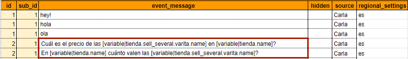

# Capítulo 6. Crea escenarios con variables para el corpus de Dobibot

El [corpus M](../concepts/corpusM.md) soluciona muchas de las limitaciones que tiene el [corpus N](../concepts/corpusN.md), esto es posible porque los [scenarios](../concepts/scenario.md) que maneja _Dobibot_ en un corpus M se construyen en una mezcla de lenguaje natural y de variables que pueden generar oraciones a partir de lo que tengamos en el [knowledge](../concepts/ontology.md) (conocimiento).

## ¿Qué son las variables?

Las variables son símbolos asociados a un valor que puede cambiar. Las variables en un bot desarrollado por Mammut funcionan como 'palabras especiales'; son palabras más generales que "incorporan" a otras más específicas. Por ejemplo, en este tutorial, la variable 'varita' podría incluir nombres tales como _varita de cedro_, _varita de olmo_ o _varita de sauco_. Se trata de una forma cómoda de hacer referencia a la información en el **knowledge** desde otro lugar, como el **corpus**.

Las [variables Mammut](../concepts/variables.md) tienen una estructura fija que denota una transformación y un **path** o **transverse** (ruta) del knowledge. Estas indican al bot en qué parte de la ontología está la información que necesita encontrar para reconocer. De esta manera, combinar un corpus y un knowledge le permite al bot responder a una mayor cantidad de preguntas de los usuarios.

En este capítulo, te voy a explicar cómo crear una de estas variables. Además, en este paso a paso te enseñaré también a convertir un **scenario normal** (corpus N) en uno con variables (corpus M).


**figura 1**: vista de un scenario normal en el sheet **corpus** de un spreadsheet.

## Convierte tu corpus N en un corpus M

### Variables en la petición del usuario

En esta sección veremos finalmente cómo transformar nuestro anterior corpus N en un corpus M. En las páginas anteriores de este capítulo estuvimos preparando el terreno con el diseño de una ontology y la creación del knowledge (la base del conocimiento). Ahora vamos a crear una **variable** para relacionar este knowledge con las respuestas de nuestro bot.

Aquí van los pasos. ¡Síguelos al pie de la letra!

1. Nos ubicamos en el sheet **corpus_M** de nuestro **package**. Iremos al **event** (evento) a convertir en cuestión, en este caso será: _Cuál es el precio de la varita de sauco en Jollivander Shop?_.

2. Lo segundo que debemos hacer es identificar las palabras que son **valores** o datos dentro del **knowledge** de _Dobibot_. Estas podrán convertirse en variables.

    Si observamos la columna **name** del vertex 'varita', podemos darnos cuenta de que la tienda _Jollivander Shop_ vende varios tipos de varitas. Esto hace que 'varita' sea un nombre que se puede entender como cualquiera de sus instances (_varita de cedro_, _varita de olmo_, _varita de sauco_).  

    
    
    **figura 2**: vista de la property **name** de la instance a convertir en variable.

    Además, vamos a suponer que en el futuro, el señor _Jollivander_ va a abrir una tienda física también, y que los datos de esta segunda tienda van a estar guardados en el mismo vertex 'tienda'. Por eso, vamos a convertir al **entry point** 'tienda' en otra variable. De esta manera cada tienda (la virtual y la física) podrían manejar inventarios diferentes.

    
    
    **figura 3**: vista de la property **name** de la instance del entry point.

3. Las variables tienen una estructura específica que debe respetarse, estas se escriben entre corchetes y siguen este patrón: ```[tipo de transformación|path]```. El primer elemento, tipo de transformación, típicamente será 'variable' ya que este indica que se trata de una transformación de texto. El segundo elemento, el **path**, está determinado por la **ontology**. El path seguirá el siguiente patrón: ```entry_point.edge.vertex.property```. Empezamos con el **entry point** que es el punto de entrada del knowledge (recuerda que la forma de las variables es la de una ruta entre los elementos del knowledge). Luego del entry point debes escribir una o más combinaciones de "edge.vertex". Esto puedes verlo como una manera de dar direcciones en el espacio: a partir del punto de inicio (entry point) se especifica una calle (edge) que hay que recorrer hasta un punto (vertex); si ese punto no es el final del recorrido, entonces especificas otra calle y otro punto de destino. De esta manera, usando una serie de calles y puntos de referencias, indicas un camino a seguir para llegar a la información que realmente necesitas. Este camino termina, en nuestro caso, en un **property**.

    > **Name:** En caso de que la variable no termine en una property, el sistema reconocerá como final de la variable la property que se programó por defecto para el **vertex** (es decir, la property denominada **name**).

4. Ahora, siguiendo el formato ```[transformación|entry_point.edge.vertex.property]```, crearemos las dos variables para cada elemento intercambiable.

    1. Variable para _varita de sauco_ - [variable|entry_point.edge.vertex.property] = ```[variable|tienda.sell_several.varita.name]```.

        - El path siempre comienza después de la barra vertical ( | ) con el nombre del sheet de la **entry point**; en este caso, 'tienda'.

        - En el lugar del **edge** escribiremos el enunciado que utilizamos como enlace entre el entry point y el vertex 'varita', es decir, _sell_several_.

            
            **figura 4**: vista del edge **sell_several** con el vertex que enlaza al entry point.

        - Después, escribiremos el nombre del vertex correspondiente; es decir, _varita_.

        - Y para finalizar, _varita de sauco_ es un dato que identifica la property **name** de una instance del vertex 'varita', es por esto que la variable concluye en esta property.

            
            
            **figura 5**: vista de la property **name** de la instance a convertir en variable.

    2. Variable para **Jollivander shop** - [variable|entry_point.property] = ```[variable|tienda.name]```

        - Esta variable es más corta debido a que el recorrido lo es. Comenzamos la ruta desde el **entry point** ('tienda'), y debido a que la información que buscamos está dentro de ese mismo vertex, no hay que llegar hasta otro vertex para encontrar el elemento intercambiable dentro del knowledge de _Dobibot_.
        - El path siempre siempre comienza después de la barra vertical ( | ) con el nombre del entry point; es decir, 'tienda'.
        - Y para finalizar, _Jollivander shop_ es un dato que identifica la property **name** de la tienda, es por esto que la variable concluye en esta property.

            
            
            **figura 6**: vista de la property **name** de la instance del entry point.

5. Ya que tenemos nuestras dos variables debemos intercambiarlas por los elementos del **event**.

    
    
    
    **figura 7**: comparación de un event normal con un event con variables.


6. ¡Recuerda que los **events** pueden ser parafraseados en el **corpus_extension**  para aumentar su efectividad!

    
    
    **figura 8**: vista del scenario parafraseado en el sheet **corpus_extension** de un spreadsheet.

### Variables en la respuesta del bot

1. Para programar las respuestas de _Dobibot_ utilizaremos el **event** siguiente que tiene el dato 'Mammut' para la property  **source**  y lo convertiremos en un event con variables.

    
    
    **figura 9**: vista del event de **source** 'Mammut' sin variables.

2. Nuevamente hay dos elementos en el event que son intercambiables por datos del knowledge y, por ende, por variables. Estos son: *la varita de sauco* y *50 galeones*.

3. La variable de 'varita de sauco' la definimos anteriormente, de este modo solo debemos copiarla: ```[variable|tienda.sell_several.varita.name]```.

4. Ahora crearemos la variable para '50 galeones'. Este dato se corresponde con la property **price** de una instance del vertex 'varita'. La variable es similar a la anterior, solo debemos cambiar la property final por **price** en lugar de **name**: ```[variable|tienda.sell_several.varita.price]```.

    
    
    **figura 10**: vista de la property **price** de la instance a convertir en variable.

5. Es hora de intercambiar los elementos del event por las variables que creamos. Lo haremos escribiendo las variables que acabamos de crear, justo en el lugar donde irían las palabras *la varita de sauco* y *50 galeones* en el event.

    
    
    
    **figura 11**: comparación de un scenario normal con un scenario con variables.

## El scope

Es la información que se le da a un bot para que tenga knowledge o conocimiento sobre lo sucedido en mensajes anteriores. El **scope** comprende la información que el bot va adquiriendo a partir de diversas interacciones y que le puede servir para otras interacciones.

Por ejemplo, si un usuario pregunta: _¿Cuál es el precio?_ no podemos responder sin saber a qué refiere el precio que nos piden. Este podría estarse refiriendo bien a "varitas" o "calderos".

Lo mismo le ocurre a _Dobibot_. _Dobibot_ no puede responder _¿Cuál es el precio?_ sin que antes se haya mencionado el nombre del producto (_varita_ o _caldero_).

Para conseguir la información de la property **price** a través de la variable, necesitamos que el usuario, previamente, provea la información de la property **name**, es decir, el nombre de la **instance** (_varita de sauco_, por ejemplo). De este modo, _Dobibot_ usará la información que le han dado para buscar el precio de la instance que tenga dicho nombre.

El conversation **scope** es la gama de datos considerados o tratados en la conversación de un bot. Estos siempre son parte de lo que previamente diseñamos como **knowledge**.

¡Felicidades! ¡Has creado tu primer bot con Mammut! Cuando converses con él, verás que valió la pena.

## ¡Comprueba tu package!

En los siguientes vínculos encontraremos un archivo **spreadsheet** y una **presentation** previamente preparada para que puedas comprobar que, efectivamente, seguiste los pasos al pie de la letra. Si algo no está claro, puedes utilizar estos archivos como referecia.

- *[Archivo de comprobación del spreadsheet](https://docs.google.com/spreadsheets/d/19EQnKdpnEzQ1G4zCXG_kCoGJNJNfj1Ey_bNM5amROEM/edit?usp=sharing)*

- *[Archivo de comprobación de la presentation](https://docs.google.com/presentation/d/1vv-02sNJNKAmBasTmmR0ns7X28j64hmdmiIoe7wdLTk/edit?usp=sharing)*

## ¿Qué aprendiste en este capítulo?

¡Aprendiste a crear el knowledge de _Dobibot_! Ahora _Dobibot_ puede responder preguntas usando este recurso a través de las variables. Para ello vimos su estructura básica compuesta por el **entry point**, **vertices**, **edges** y **properties**. Aprendiste también el formato de las variables Mammut y cómo se utilizan en un **corpus M**.

## ¿Qué sigue?

Ya _Dobibot_ está listo para estrenarse como asistente. En el próximo capítulo estaremos viendo cómo interactuar con el bot que has construido.

Siguiente capítulo: [Conversa con tu bot](integration.md)
