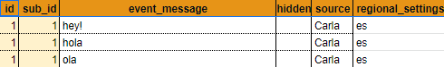

# Capítulo 2. Un chatbot mammut básico

Recordemos que _Dobibot_ va a ser el asistente de nuestra tienda de artículos mágicos _Jollivanders Shop_. Como asistente, _Dobibot_ debe conocer el inventario de nuestra tienda, atender clientes y, por supuesto, proveerles información acerca de los productos que la tienda vende. Para efectos de este tutorial, enseñaremos a _Dobibot_ a atender a los clientes; esto significa que debe aprender a responder a todas sus preguntas. Un buen asistente debe manejar la información de la tienda y de sus productos mágicos. Además de dar información sobre los artículos, _Dobibot_ también debe ser cortés con los clientes y responder a sus saludos y despedidas.

## ¿Qué vamos a construir en este capítulo?

En este capítulo vamos a dar los primeros pasos construir a tu asistente _Dobibot_. Yo te acompañaré a lo largo de todo el proceso. Te podrá parecer un poco difícil en un principio, pero en el fondo estarás utilizando un poco de lógica y herramientas que seguramente son familiares para ti. Al final de esta parte tendrás preparado un bot capaz de responder correctamente a preguntas simples. En particular, el bot responderá a preguntas generales sobre los artículos mágicos disponibles en la tienda.

El siguiente gráfico muestra el esquema de funcionamiento general de nuestro bot.

**Figura 1**: esquema del funcionamiento de un bot desarrollado por Mammut.

Como puedes ver, consideraremos a _Dobibot_ como un trabajador más de la tienda. _Dobibot_ deberá dar respuesta a cada solicitud de información o petición de un usuario.

## ¿Qué vamos a aprender aquí?

En esta parte del tutorial vas a introducirte en los conceptos y herramientas básicas para diseñar y construir un bot. Veremos cómo se construyen las conversaciones a partir de elementos básicos: [corpus](../concepts/corpus.md), [scenario](../concepts/scenario.md) y [events](../concepts/events.md). También vas a aprender la estructura básica de estos elementos ensamblándolos en un archivo spreadsheet.

Antes que nada, vamos a ver un esquema de los conceptos esenciales de este capítulo:

**Figura 2**: esquema de los conceptos esenciales.

Un **event** es un mensaje emitido por un agente. Por ejemplo, una petición hecha por un cliente es un event; también lo es la respuesta que el bot proporciona a tal petición. En realidad se trata de mucho más pero, para este tutorial, esa defición será suficiente.

Dos o más events que trabajan juntos se organizan en un **scenario**. Puedes imaginar los scenarios como partes de una conversación o diálogo. Por ejemplo, si un cliente le da las gracias a , este debería responder con un "_¡Siempre a tu disposición!_" o algo similar. Y no importa si el agradecimiento está al principio, en medio o al final de la conversación, es una parte importante de ella.

El **corpus** es un conjunto no ordenado de scenarios. En un corpus establecemos posibles scenarios alternativos por los que puede discurrir una conversación con el bot. Un corpus, entonces, contiene los scenarios. Puedes tener tantos corpus como quieras para organizar los scenarios.

> **Nota:** muchos de estos conceptos son más amplios y poderosos de lo que te describimos aquí pero, si te haces una idea general con lo que te hemos contado, será suficiente para comenzar. Si quieres información más amplia sobre estos temas, te recomendamos consultar el apartado de referencia general de esta documentación.

## Plantillas de inicio rápido

Para que  pueda llevar a cabo su tarea, necesitará tener configurados los corpus, scenarios y events. Esta información la iremos almacenando en un **package** (paquete de datos) que llenaremos juntos.

> **Nota:** toda la información relacionada con package se almacena actualmente en un archivo **spreadsheet** y una **presentation** que _Dobibot_ necesita para funcionar.

¡El package es muy importante! Pero no te preocupes, te acompañaré en el proceso para completar su preparación.

Ahora, para facilitar la creación del package, abre los siguientes enlaces y haz una copia de las plantillas que te dejaré a continuación. Todo lo necesario para la preparación del package te lo dejaré en el siguiente apartado.

- *[Plantilla del archivo spreadsheet](https://docs.google.com/spreadsheets/d/1EEaV0yADaIzSAzDhHy_vm-ZDIAWBo1hzTmn0ooJKuAE/edit?usp=sharing)*

- *[Plantilla de la presentation](https://docs.google.com/presentation/d/1CF_8NNBHKt5tvq7A84xEwqc4HH6PwD3QS6WCfIXDScA/edit?usp=sharing)*

## Preparación de las plantillas

### Haz una copia de las plantillas

1. Desde tu cuenta Google haz una copia del archivo **spreadsheet** y de la **presentation** que te facilitamos en el apartado anterior. Puedes ponerle los nombres que quieras a las copias de las plantillas.

2. Al realizar la copia, tendrás a la mano un par de documentos. El sheet que almacenará las diversas interacciones con los usuarios, es decir, nuestro **corpus**, y la presentation que servirá para definir algunos parámetros globales.

3. Es importante hacer algunos cambios en ambos archivos. ¡No olvides este paso! Es muy importante para que nuestro bot funcione correctamente. Ajustaremos estos permisos siguiendo este paso a paso:  *[preparación de Google Docs](../shared_tips/docs_preparation.md)*

### Pasos para configurar la presentation

1. En tu copia de la [plantilla de la presentation](https://docs.google.com/presentation/d/1CF_8NNBHKt5tvq7A84xEwqc4HH6PwD3QS6WCfIXDScA/edit?usp=sharing), podrás ver que el primer campo a llenar es el **sheet_id**. Aquí irá el ID del sheet que creamos antes.

    > **Nota:** para conocer el ID de los documentos, puedes verlo en [este archivo](../shared_tips/docs_preparation.md).
    >
    >
    >
    >**figura 3**: vista del ID del spreadsheet.

2. El siguiente parámetro a llenar será el **Think status**, este será el mensaje preprogramado que  enviará cuando no cuente con la información necesaria para responder la pregunta. Esto podemos utilizarlo, por ejemplo, para darle tiempo a un supervisor humano para responder la pregunta a través de .

    > **Nota:** podemos probar con algo como: _“Un momento, le preguntaré al señor Jollivanders.”_

3. El próximo parámetro a introducir es el **Min conversation duration**. Aquí se configura el tiempo mínimo que queremos que la conversación entre un usuario y  dure. Después de que se cumpla este período, se activa el Conversation timeout (lapso de tiempo máximo que debe haber entre cada mensaje de la conversación).

    > **Nota:** el tiempo debe estar expresado en alguna unidad de tiempo como: milisegundos (millis), segundos (s), minutos (min), horas (h) y días (d/day). Por ejemplo: _10min_.

4. El último parámetro a configurar es el **Conversation timeout**. Aquí pondremos el periodo de tiempo máximo que _Dobibot_ va a esperar la respuesta después de que el **Min conversation duration** haya finalizado. Si el usuario no responde en este periodo de tiempo _Dobibot_ reinicia la conversación.

    > **Nota:** reiniciar la conversación implica que el bot, en su próxima interacción con el usuario, conversará sin hacer uso de datos temporales relacionados con la conversación anterior.

    La medida de tiempo utilizada aquí sigue el mismo formato utilizado en el **Min conversation duration**. Por ejemplo: _5min_.

Después de seguir estos pasos, tu presentation se verá como la siguiente imagen.

**figura 4**: vista de la presentation y sus parámentros.

Ahora, vamos a describir los campos requeridos para crear el corpus.

## Campos del corpus y corpus extension

A continuación te presento un resumen de lo que debe ir en cada campo del diseño del **corpus**. Esta descripción es válida tanto para el sheet 'corpus' como para lo que denominamos [corpus_extension](../concepts/extension.md).

**figura 5**: vista de un scenario en el sheet **corpus** de un spreadsheet.

> **Nota:** un corpus extension es un poco distinto a un corpus. Un ejemplo te servirá para entender rápidamente esta diferencia. Si un usuario está interesado en saber de una varita en particular, puede preguntarle a _Dobibot_ "_Oye, ¿cuánto cuesta una Ningus 3000?_". Pero también puede decirlo de una forma distinta: "_Precio de la Ningus 3000_". Para un ser humano, son dos frases que básicamente solicitan el mismo tipo de información, a pesar de las diferencias en la redacción o en el vocabulario. Un bot aprende a manejar estos casos asignando ambas frases a un mismo event. Y eso lo hacemos por medio de un corpus extension (corpus extendido). Puedes ver este corpus extension como una forma resumida de ampliar tus **scenarios** y **events**. En lugar de construir un scenario para cada variación de este tipo, usas un corpus extension para hacer más poderoso cada scenario previamente diseñado.

### ID

La primera columna que nos encontramos es la columna **id**. El id es muy importante porque nos servirá para identificar los scenarios que forman parte las posibles conversaciones que mantendrá _Dobibot_ con nuestros clientes.

Los scenarios se identifican aquí con números enteros y consecutivos (los events de un mismo scenario compartirán el mismo id).

Este campo es obligatorio.

### Sub ID

La columna **sub_id** identifica las intervenciones de peticiones o respuestas dentro de esa conversación (lo que hemos denominado events). Cada **event** de un scenario tiene su propio sub_id. Estos deben ser configurados con números enteros y consecutivos.

> **Nota:** los events marcados por el sub_id deben serlo de manera consecutiva, empezando por el número 1. Esto es importante porque los events son secuenciales dentro de un scenario, y esta numeración ordenada ayudará al chabot a saber el lugar de un event dentro de un scenario.

En la imagen anterior vemos que el scenario identificado por el id 4 consta de 2 events, cada uno identificado con un sub_id que es un número entero y consecutivo, y que estos números responden al orden de dichos events.

Este campo es obligatorio.

### Scenario type

La columna siguiente se llama **scenario_type**, aquí indicaremos el tipo de scenario según los participantes de la interacción. Si queremos que _Dobibot_ hable con un cliente, utilizaremos la opción **conversation**; pero si queremos que _Dobibot_ pueda sostener conversación con más de un usuario a la vez (dos o más clientes de manera simultánea, por ejemplo), utilizaremos la opción **dialogue**.

Este campo es obligatorio.

### Event message

¡En la columna **event_message** nos pondremos creativos! Aquí incluiremos los mensajes que queremos que _Dobibot_ sepa responder y también los que queremos que emita. Más adelante en este tutorial lo haremos juntos. Pero te adelantamos que este campo es muy importante, porque incluye los mensajes a los que responderá _Dobibot_.

Este campo es obligatorio.

### Hidden

La columna **hidden** es opcional, se llena con una **x** cuando no queremos que _Dobibot_ tome en cuenta un scenario.

### Field

En la columna **field** indicaremos una palabra vinculada al tema del event. Por ahora, la podemos dejar vacía.

Este campo es opcional.

### Source

La columna **source** nos sirve para diferenciar los events que recibe _Dobibot_ de aquellos que envía. Los mensajes recibidos por _Dobibot_ pueden tener como source cualquier nombre, mientras que el source de un mensaje enviado por _Dobibot_ siempre debe tener el valor 'Mammut'.

Este campo es obligatorio.

### Regional settings

Por último tenemos la columna **regional_settings**. Esta columna sirve para configurar el idioma del **event** de nuestro **corpus**. Los idiomas que soportamos por ahora son inglés y español. Usaremos 'es' para indicar que el idioma es _español_ y 'en' para indicar que es _inglés_.

Este campo es obligatorio.

## El empaquetado de _Dobibot_

Ahora que conoces los parámetros de un **corpus**, vamos a ver rápidamente tres elementos del **package** diferentes (puedes hacer clic en ellos para obtener más información):

- [corpus](../concepts/corpus.md)
- [corpus extension](../concepts/extension.md)
- [corpus map](../concepts/corpus_map.md)

Estos elementos del package **corpus**, **corpus extension** y **corpus map** los llenaremos manualmente con los datos para preparar la programación de nuestro _Dobibot_.

## ¿Qué contiene el corpus de _Dobibot_?

El [corpus](../concepts/corpus.md) de nuestro _Dobibot_ está compuesto por interacciones entre _Dobibot_ y los usuarios (clientes potenciales). Estas interacciones son entradas de información como preguntas o solicitudes de un usuario, y las salidas serán las respuestas que _Dobibot_ les facilite a estos.  

### ¿Qué contiene el corpus extension?

Como adelantamos más arriba, el [corpus extension](../concepts/extension.md) de nuestro _Dobibot_ está compuesto por un sheet complementario del corpus con mensajes emitidos por los usuarios (events), almacenados en el sheet 'corpus', pero formulados de una manera distinta.

La extensión de un **event** consite en tomar un mensaje de el sheet 'corpus' y "redactarlo" de una manera distinta con la finalidad de que _Dobibot_ pueda aprender que un mismo mensaje se puede decir de diversas formas. Estas diversas formas de representar un event enriquecerán el lenguaje de nuestro _Dobibot_.

**figura 6**: vista del sheet **corpus_extension** de un spreadsheet.

### ¿Qué es el corpus map?

El [corpus map](../concepts/corpus_map.md) contiene justamente un mapa del conjunto de los **corpus** que forman parte de un mismo bot. Este mapa muestra el vínculo que existe entre los distintos elementos del package que forman parte de un corpus: dice la función y tipo de cada una, las relaciona, etc.

La función del corpus map es contener las identificaciones de las partes de un mismo corpus y evidenciar su función. Además, en el corpus map también se almacenan los diferentes corpora que puede manejar nuestro bot.

Pero, descuida. Para hacer más fácil el proceso del llenado del **corpus_map** te dejaremos una imagen con datos que podemos imitar para llenar con éxito este sheet.

**figura 7**: vista del sheet **corpus_map** de un spreadsheet.

## ¿Qué sigue?

En el próximo capítulo programaremos el primer scenario de _Dobibot_, es decir, le enseñaremos a entender un saludo, y a responder adecuadamente a este.

[Comienza con la construcción de _Dobibot_](corpusN(2).md)
