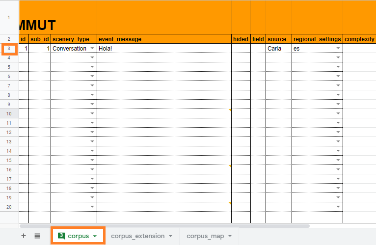
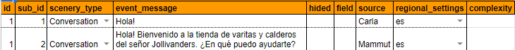
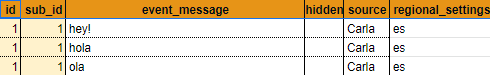
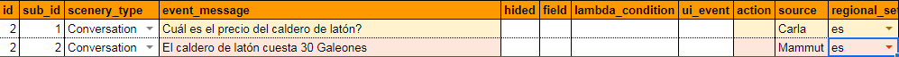

# Capítulo 3. Construir el primer escenario

 En esta parte del tutorial vas a aprender a construir un bot. También le enseñaremos a _Dobibot_ a entender un saludo y a responder adecuadamente a este.

## Comencemos con la construcción de _Dobibot_

Ahora que sabes para qué sirve cada campo del corpus, ¡podemos empezar a programar a _Dobibot_! Empezaremos por enseñarle a saludar (los buenos modales son importantes para nuestro asistente 😁).

### Requisitos previos:

- Asegúrate de haber preparado los archivos que conforman tu package (el spreadsheet y la presentation) y haber ajustado los permisos necesarios del mismo. ¡No olvides este paso! Es muy importante para que nuestro bot funcione correctamente.
- Asegúrate de leer la sección de términos básicos ubicada al final de está pagina.

### ¡Programemos el primer scenario de _Dobibot_!

Sigue las siguientes instrucciones para preparar el primer **scenario**.

1. Nos situaremos en la sheet llamada 'corpus'.  A partir de la fila 3 de la sheet empezaremos a agregar valores a los campos.

    
    
    **Figura 1**: vista de sheet **corpus** desde el spreadsheet.

2. Identificaremos nuestro primer scenario llenando la columna **id** con el número entero '1'.

3. Llenaremos el campo **sub_id** del primer event del scenario con el número entero '1'.

4. ¡Excelente! Ahora llenaremos el campo **scenario_type** seleccionando la opción **Conversation**.

5. En esta ocasión llenaremos la celda **event_message** con el posible mensaje que _Dobibot_ va a recibir. Como le estamos enseñando a entender un saludo prueba con _Hola!_.

6. Por ahora, dejaremos las columnas **hidden** y **field** vacías.

7. Vamos a continuar con la columna **source**, aquí indicamos que este event será enviado por otro usuario hacia _Dobibot_. ¡Puedes utilizar cualquier nombre! Intenta con _Carla_.

8. ¡No olvides indicar el idioma en la columna **regional_settings**! Recuerda que los idiomas que soportamos por ahora son inglés y español. Usaremos 'es' para indicar que el idioma es español.
Ya _Dobibot_ puede entender un saludo. Ahora, vamos a enseñarle a responder al saludo.

### ¡Enseñemos a _Dobibot_ a responder un saludo!

1. Para completar el scenario, vamos a enseñarle a _Dobibot_ a responder al saludo. Nos situamos nuevamente en la pestaña del archivo spreadsheet llamada **corpus**, esta vez en la fila 4.

2. Como la respuesta al saludo forma parte del mismo scenario, llena el campo **id** de esta fila con el número entero '1'.

3. Llenaremos la columna **sub_id** del segundo event del scenario con el número entero '2'.

4. Continuaremos por el llenado de la celda **scenario_type** con la opción **Conversation**.

5. La columna **event_message** la llenaremos con la respuesta que _Dobibot_ dará al saludo del usuario. Puedes probar con _Hola! me llamo Dobibot. En qué puedo ayudarte?_

6. Para este event, también puedes dejar las columnas **hidden** y **field** vacías.

7. En la columna **source** indicaremos que este event es una respuesta de _Dobibot_. Lo haremos llenando esta columna con la palabra _Mammut_. Recuerda que este valor indica que será el bot el que va a emitir el mensaje que estamos configurando.

8. ¡Ya casi lo logramos! Solo falta llenar la columna **regional_settings** con el valor 'es'.

¡Lo lograste! Ya _Dobibot_ entiende un saludo y sabe responder saludando al usuario. ¿Viste qué fácil es?

**Figura 2**: vista del primer escenario de Dobibot.

Estos pasos puedes repetirlos para patrones de solicitud de información / respuesta del bot. Solo recuerda tener presente que un **scenario** es una conversación o parte de ella, y que los **events** son mensajes que deben ir en cierto orden (no tiene mucho sentido dar un respuesta sin que antes haya una pregunta, ¿no?).

### Expandamos el primer scenario

1. Ahora que tenemos nuestro primer scenario, podemos enseñarle a _Dobibot_ que se puede saludar de muchas formas. Para esto vamos a tomar el primer event de los que acabamos de crear y le agregaremos diferentes formas de decir lo mismo (a estas formas alternativas se les conoce como paráfrasis). Para crear estas paráfrasis de manera más sencilla y rápida, vamos a utilizar un **corpus extension**.
Movámonos a la pestaña del spreadsheet llamada **corpus_extension** y en la fila 3 de este sheet empezaremos a agregar valores a las columnas.

2. De acuerdo, empecemos por llenar las columnas **id** y **sub_id**. En la primera añadiremos el número de id del scenario al que pertenece el event que vamos a parafrasear y en la columna **sub_id** vamos a introducir el número del **sub_id** del event que estamos parafraseando (es decir, id '1' y sub_id '1').

3. ¿Cuántas formas existen para saludar? Prueba escribir _Hey!_ en la columna **event_message**.

4. Las columnas **source** y **regional_settings** se llenan con los mismos valores que están en la pestaña **corpus**.

5. Este procedimiento se debe repetir cada vez que queramos agregar otra parafrasis al mismo event.

    
    
    **Figura 3**: vista del sheet **corpus_extension** desde el spreadsheet.

    Ampliar el repertorio de paráfrasis que puede entender _Dobibot_ será tan fácil como asociar los events prototípicos del **corpus** con nuevos events en el **corpus extension**. En el gráfico que está justo por encima de este párrafo puedes ver cómo podemos enseñarle a _Dobibot_ que *"hola", "hey!"* y *"ola"* son formas similares de decir *"Hola!"* (nuestro mensaje original).

### Algunas consideraciones

1. Es importante recordar que los **scenarios** serán bloques de información (conversaciones o partes de ellas) compuestos de varios **events**. Por ejemplo, puedes probar creando un scenario en el que un usuario pregunte por los precios de un caldero mágico y _Dobibot_ dé una respuesta y entonces añadir, a ese mismo scenario, otro event distinto en el que le enseñes a _Dobibot_ a despedirse.

2. En muchas ocasiones lo más cómodo es que cada uno de los saludos y las despedidas se programen como scenarios separados de los demás. De esta manera, estos bloques funcionarán de forma más o menos independiente en cualquier conversación.

3. Ya que nuestro corpus es bastante flexible, podemos crear events que inicien con una solicitud de información o con una pregunta directamente (sin que tengan que comenzar con un saludo o terminar con una despedida), así como puedes ver en la imagen siguiente:

    
    
    **Figura 4**: vista de un scenario sin saludo desde el spreadsheet.

## ¡Comprueba tu package!

En los siguientes vínculos encontraremos un archivo spreadsheet y una presentation previamente preparados para que puedas comprobar que, efectivamente, seguiste los pasos al pie de la letra. Si algo no está claro, puedes utilizar estos archivos como referecia.

- *[Archivo de comprobación de sheets](https://docs.google.com/spreadsheets/d/1Cd8z-3K6YKXNYk-O8JKG-5-wpVb6qSqAvw-8A5Foghc/edit?usp=sharing)*

- *[Archivo de comprobación de la presentation](https://docs.google.com/presentation/d/1wbHx0tlzMC2dUdN_eTdTApTdZZzgxmNiAQc6sewEmjY/edit?usp=sharing)*

## Términos básicos

A continuación te presentamos un resumen de los conceptos básicos vistos en este capítulo.

- **Package:** está compuesto por el conjunto de datos que _Dobibot_ necesita para funcionar.

- **Corpus:** el corpus es la información que contiene las diversas interacciones entre _Dobibot_ y los usuarios.

- **Corpus extension:** es el complemento del corpus que posee mensajes emitidos por los usuarios, formulados de una manera distinta.

- **Event:** los events son los mensajes emitidos consecutivamente por un agente, este agente puede ser un usuario o un bot.

- **Scenario:** cada scenario es un conjunto de mensajes compuesto de varios events.

[corpus](../concepts/corpus.md), [corpus extension](../concepts/extension.md), [scenario](../concepts/scenario.md), [events](../concepts/events.md).

## ¿Qué aprendiste en este capítulo?

Le enseñaste a _Dobibot_ a entender un saludo, y a responder adecuadamente a este. Para ello vimos la estructura básica del package Mammut. También aprendiste la estructura básica de un **corpus**, y cómo este se conforma de **scenarios** y **events**. También viste la utilidad de crear paráfrasis por medio de un **corpus extension**.

## ¿Qué sigue?

En el próximo capítulo observaremos que un bot desarrollado por Mammut puede manejar respuestas más amplias que las programadas como events "prefrabricados" y que es capaz de extraer la respuesta haciendo inferencias a un **knowledge** (base de conocimiento).

[Crea un bot más avanzado](corpusM(1).md)
