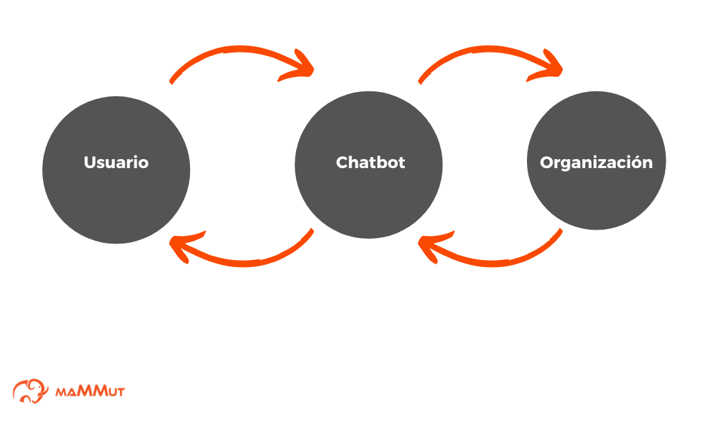
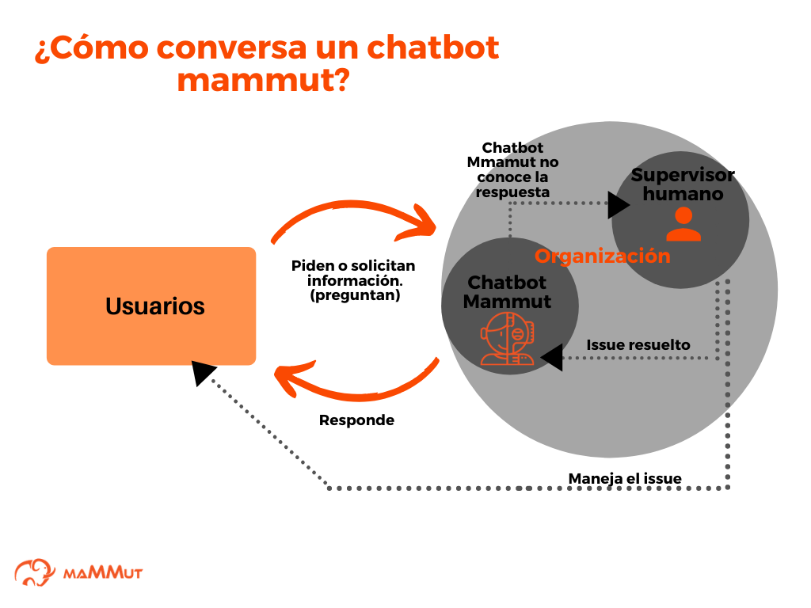

# Capítulo 1: Introducción

## ¿Qué vas a aprender en este tutorial?

Este tutorial te guiará, paso a paso, en la creación de un bot completamente funcional que podrá comunicarse en lenguaje natural con los clientes. El [capítulo 1](intro.md) te ofrece una introducción sobre los bots desarrollados por Mammut, luego en el [capítulo 2](corpusN(1).md) empezaremos con los primeros pasos de la creación de un bot básico. Después, en el [capítulo 3](corpusN(2).md) programaremos el primer **scenario** de nuestro bot básico. Desde el [Capítulo 4](corpusM(1).md) veremos cómo podríamos convertirlo en un bot más avanzado. En el [capítulo 5](corpusM(2).md) crearemos su **knowledge** (base de conocimiento) basado en el inventario de la tienda. En el [capítulo 6](corpusM(3).md) capacitaremos al bot a realizar consultas en su knowledge para interactuar con los clientes. Por último, en el [capítulo 7](integration.md) podrás probar tu bot en acción.

## ¿Cómo funcionan los agentes conversacionales?

Antes de empezar a programar tu bot, vamos a dedicar un momento a ver cómo funcionan en general los bots. El funcionamiento de un **agente** o **interfaz conversacional** suele ser el siguiente:

**Figura 1**: esquema del funcionamiento de una interfaz conversacional.

Como puedes ver, un bot se comunica en lenguaje natural (es decir, en un idioma como inglés, chino, hindi o alemán) con un usuario. El usuario puede entonces hacer preguntas o peticiones utilizando un channel de mensajería o su voz, y el bot responderá a tales solicitudes. En la actualidad nos topamos con estos agentes conversacionales de manera cada vez más frecuente: el del banco, el asistente virtual que reproduce música en tus audífonos, el que te ayuda a configurar la impresora, el que simplemente escucha cómo te fue durante el día... Pero, ¿te has preguntado cómo funcionan?

En el dibujo de arriba puedes ver que un bot típico "escucha" una petición de un usuario, y la convierte en código interpretable para una máquina. Cuando ya tiene una "interpretación", la convierte en una respuesta para el usuario, o en una acción. Muchas veces esta respuesta implica conectarse a la base de datos que le pertenece a una organización, para buscar una solución adecuada a la petición del usuario.

Como puedes ver, el bot funciona como un intermediario entre la organización y tú. Un intermediario que traduce el lenguaje natural en acciones computacionales y viceversa.

## ¿Cómo conversa un bot desarrollado por Mammut?

Ahora bien, el funcionamiento de nuestro bot es diferente:

**Figura 2**: esquema del funcionamiento de un bot desarrollado por Mammut.

Un bot desarrollado por Mammut es concebido como un agente que forma parte de la organización misma. Imagínalo más como un agente de una organización que conoce lo que necesita para responder adecuadamente. Si el bot no está seguro de conocer la respuesta apropiada en un momento dado, siempre puede preguntarle a alguien: a quien llamamos **supervisor**. El supervisor es un agente humano -también parte de la organización- que ayuda a resolver situaciones nuevas para el bot. Tu bot será capaz de aprender nuevas conductas cada vez que el supervisor lo guíe.

> **Nota:** por cierto, ¿sabes cómo funciona el 'aprendizaje' en cualquier bot? Por lo general se trata de pares de peticiones-respuestas. Un usuario hace una petición en lenguaje natural y el bot intenta clasificar dicha petición utilizando un **modelo**. La respuesta se produce cuando la petición ha sido clasificada. Pero, por lo general, si la clasificación hecha por el modelo no tiene cierta certidumbre (o sea, si no se está muy seguro de la clasificación) el bot suele responder con un génerico "_Lo lamento, no puedo entender lo que me dices_". Y para subsanar esta conducta, los desarrolladores deben agregar la nueva petición y entrenar de nuevo al bot para obtener un nuevo modelo. Un ciclo interminable. En cambio, en Mammut, al incorporar un supervisor y un aprendizaje dinámico, tu bot aprende sobre la marcha (como lo haría cualquier entidad inteligente).

¿Cómo funciona un bot desarrollado por Mammut? Empecemos por decir que la forma básica en la que le enseñamos a entender un idioma, está basada en la manera en la que los especialistas estudian el lenguaje humano: con un [corpus](../concepts/corpus.md). El **corpus** para un bot de Mammut está hecho de [scenarios](../concepts/scenario.md) (contextos alternativos en los que se puede desarrollar una comunicación) en los cuales ocurren [events](../concepts/events.md) (cosas que ocurren y alteran un scenario). Parte de tu tarea al diseñar un bot es, tanto especificar los mensajes prototípicos que este puede recibir de un usuario como construir las respuesta adecuadas, todo esto en forma de events, mientras construyes las posibles conversaciones en forma de scenarios.

> **Nota:** por ahora piensa que un event está formado por la petición de un usuario, y que eso desencadena otro event como respuesta. Cada tipo de conversación sería un scenario. En el [próximo capítulo](corpusN(1).md) tendremos ocasión de ver como funcionan los events y scenarios en la práctica, y de ver más a fondo en qué consisten.

Son estas conversaciones prototípicas las que el bot aprovechará como base para aprender nuevas maneras de responder a las peticiones de sus usuarios.

> **Nota:** entender un idioma también implica comprender significados, no basta con aprender conversaciones de memoria. Para ello contamos con un componente de representación del significado.

## ¿Qué sabe un bot desarrollado con Mammut Framework?

Tu bot no solo debe entender lo que se le dice, sino que para responder a una petición, debe saber. Este saber es representado por un **knowledge** (base de conocimiento) que puede utilizar para elaborar mejores respuestas. Por ejemplo, si le pregunto _¿me puedes decir el precio de este caldero?_, el bot debe conocer dos cosas: a qué caldero me refiero y cuál es su valor en el inventario de la tienda. A este saber lo llamamos [knowledge](../concepts/ontology.md) y se estructura en forma de una **ontology** (en los capítulos [3](corpusM(1).md), [4](corpusM(2).md) y [5](corpusM(3).md) del tutorial hablaremos más sobre esto).

Tanto el corpus como el knowledge pueden ser diseñados a la medida de tus necesidades. Este tutorial te explicará paso a paso cómo hacerlo.

> **Nota:** puedes utilizar varios corpus con varios knowledge si así lo deseas. Por ejemplo, puedes organizar un tema distinto por corpus y de esa manera un mismo bot podrá conversar sobre diferentes tópicos.

## ¿Qué sigue?

Como vimos en la introducción, paso a paso vamos a crear un bot para nuestra tienda ficticia _Jollivanders Shop_. En el siguiente capítulo, empezaremos con la [creación de una versión básica](corpusN(1).md) de _Dobibot_, nuestro bot mágico.
