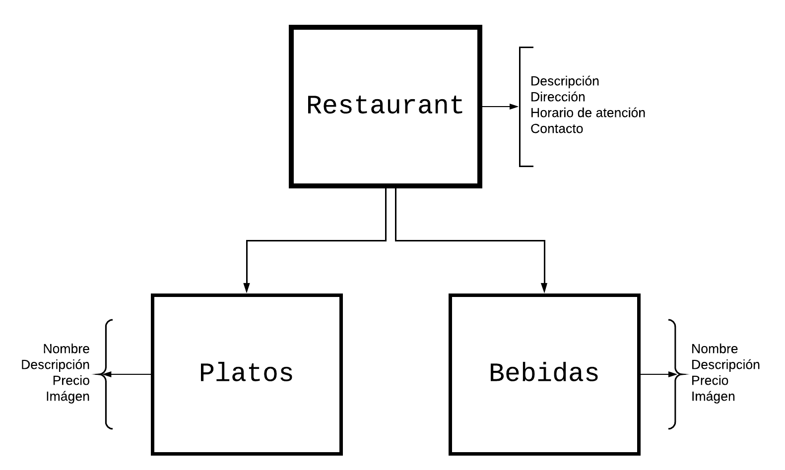

# Capítulo 2. Generalización de eventos

EEn este capítulo aprenderás todo lo que necesitas saber sobre la generalización de **events** (eventos) utilizando las **variables Mammut**. Para esto, configuraremos paso a paso una **variable** en el **corpus** de _Sylvia_ que nos permitirá ampliar la capacidad de uno de sus events para abarcar una mayor cantidad de posibles solicitudes de usuario. ¿Estás listo? Comencemos.

> Para esta fase de nuestro tutorial, trabajaremos en este archivo con el [corpus de Sylvia](https://docs.google.com/spreadsheets/d/1J4S7VAzvGqTQ9_PFzgb37VxDlWVHB-Egvpjz7okbPXo/edit?usp=sharing).

## ¿A qué nos referimos cuando hablamos de "generalizar" events?

Para comprender esto, tomemos como ejemplo del scenario 1 event 3 en el corpus de _Sylvia_: _¿Cuál es el precio de la lasaña?_ Aquí podemos observar que uno de los problemas en este event es que solo funciona cuando el usuario pregunta por el plato **lasaña**.

| id | sub_id | scenario_type | event_message | hidden | field | lambda_condition | ui_event | action | source | regional_settings |
| - | - | - | - | - | - | - | - | - | - | - |
| 1| 3 | Conversation | ¿Cuál es el precio de la _lasaña_? |  |  |  |  |  | Carmen | es |
| 1	| 4	| Conversation | El precio es de 15 USD | | | | | | Mammut | es |
**Tab. 1:** _Escenario 1, event 3_.

Sin embargo, sabemos que el menú del _Restaurante Mammut_ es mucho más amplio que eso, como podemos verlo en esta tabla que muestra el contenido del **vertex** (vértice) 'dish (plato)':

| name | type | description |
| - | - | - |
| Desayuno americano | Desayuno | Panqueques con mantequilla y jarabe de arce, tocino frito y huevos fritos. |
| Sándwich | Desayuno | Puedes elegir 3 de estos rellenos para sándwiches: queso, jamón y queso, ensalada de jamón, salchicha, queso y cebolla, mayonesa de huevo, mayonesa de atún o ensalada de pollo.|
| Lasaña | Almuerzo | Un perfecto equilibrio entre capas de queso, fideos y salsa boloñesa casera.|
| Pabellón | Almuerzo | Un plato tradicional venezolano que incluye una combinación de arroz y frijoles que se encuentra en todo el Caribe.|
| Pasta al pesto | Pasta | Pasta con salsa pesto.|
| Ensalada césar de pollo | Ensalada | Una ensalada verde de lechuga romana.|
| Cheesecake | Postre | Postre dulce con corteza hecha de galletas dulces y relleno de queso crema.|
| Brownie | Postre | Un brownie que tiene una textura similar a la del pastel.|
**Tab. 2:** _Contenido del vertex "dish" (plato)_.

> **Nota:** para entender mejor el diseño del **corpus** y **knowledge**, te invitamos a leer nuestras guías quick-start para [corpus](../quick_starts/quick_start_corpus.md) y [knowledge](../quick_starts/quick_start_knowledge_es.md).

Ahora, imagina tener que escribir un **event** diferente para preguntar por el precio de cada uno de los platos que _Sylvia_ va a vender. Terminarías con un corpus muy extenso sólo para conseguir que _Sylvia_ aprenda una pregunta acerca de los precios de los diferentes productos de nuestro restaurante. ¿Cómo podemos resolver esto de forma más práctica?

Las **variables** de Mammut nos permitirán generalizar este **event** sustituyendo la palabra _lasaña_ por cualquier otra instance (instancia) del **vertex** 'dish' dependiendo de la solicitud del usuario. Esto nos ayudará a abarcar la mayor cantidad de variantes de una misma pregunta referente a instances diversos de un mismo vertex utilizando un solo event en el **corpus**.

> **Nota:** la clase de información que podemos sustituir por **variables** en el corpus es siempre aquella que ya ha sido incluída en el knowledge del chatbot. Si en tu corpus aparecen recurrentemente palabras de determinado tipo, y estas se encuentran definidas como **instances** del knowledge en uno de los vertices de la **ontology**, entonces pueden ser sustituídas por una variable.

## Configuremos una variable Mammut para este event

Ahora que entiendes cómo funciona, vamos a crear una variable para el escenario 1 event 3 del corpus de _Sylvia_: _¿Cuál es el precio de la lasaña?_ para solucionar el problema que acabamos de explicar.

| id | sub_id | scenario_type | event_message | hidden | field | lambda_condition | ui_event | action | source | regional_settings |
| - | - | - | - | - | - | - | - | - | - | - |
| 1| 3 | Conversation | ¿Cuál es el precio de la _lasaña_? |  |  |  |  |  | Carmen | es |
**Tab. 3:** _Escenario 1, event 3_.

### Requisitos previos:

Antes de comenzar a crer variables, necesitas:

- Crear un [corpus M](../concepts/corpusM.md). 
- Crear [un knowledge y una ontology](../concepts/ontology.md)

> Para esto te recomendamos seguir nuestro [tutorial introductorio](../tutorial-intro/index.md) y familiarizarte con los conceptos de [variables](../concepts/variables.md), [path](../concepts/path.md) y [scope](../concepts/scope.md) en nuestra sección de conceptos.


### Paso a paso para generalizar events usando variables

1. Haz una copia del [corpus de Sylvia](https://docs.google.com/spreadsheets/d/1J4S7VAzvGqTQ9_PFzgb37VxDlWVHB-Egvpjz7okbPXo/edit?usp=sharing).

2. Determina cuál es la ubicación en la ontology de los datos que vamos a sustituir por la variable.

    * Identifica el nombre del **vertex** y la **property** (propiedad) donde almacenamos esa información:

        
        **Fig. 1:** _Representación gráfica de la ontology de Sylvia con sus respectivos vertices y properties_.

        En esta ocasión, podemos ver que el elemento pertenece al vertex 'dish' y la property que almacena los datos a reemplazar es **name**.

| *name* | type | description |
| - | - | - |
| Desayuno americano | Desayuno | Panqueques con mantequilla y jarabe de arce, tocino frito y huevos fritos. |
| Sándwich | Desayuno | Puedes elegir 3 de estos rellenos para sándwiches: queso, jamón y queso, ensalada de jamón, salchicha, queso y cebolla, mayonesa de huevo, mayonesa de atún o ensalada de pollo.|
| **Lasaña** | Almuerzo | Un perfecto equilibrio entre capas de queso, fideos y salsa boloñesa casera.|
_La instance **lasaña** forma parte del vertex **dish** y se encuentra en la property **name**_


3. ¡Excelente! Entonces escribamos nuestra variable con la ubicación identificada en el paso anterior.

    * Ubícate en la columna **event_message** de el sheet del corpus, en el scenario 1 event 3.

    * Borra del event_message la información que vas a sustituir (el nombre del plato). La parte de la pregunta que va a estar escrita en lenguaje natural (en cualquier idioma) se deja como está, en este caso: _"Cuál es el precio de"_.

    * En el lugar del nombre del plato que reemplazaremos con una variable:

        * Abre corchetes y escribe el nombre de la transformación y sepáralo con una barra vertical. Prueba copiando lo siguiente: ```[variable|```

        * Después de la barra vertical, escribe el lugar de la ontology donde está la información que vamos a sustituir. Para escribirla, describiremos el **path** (ruta) de la ontology que nos lleva al lugar del knowledge que ya determinamos en el **paso 2**. Prueba escribiendo: ```restaurant.sell_several.dish.name```.

            > **Nota:** para escribir el **path** (ruta), es necesario comenzar siempre desde el **entry point** (punto de entrada) seguido por los **edges** (aristas) y **vertices** necesarios, hasta que lleguemos a la **property** (propiedad) final donde se encuentra alojada la información.

            > **Nota:** los componentes de la función deben ser separados usando puntos, añadiendo los vertices y edges correspondientes de forma consecutiva. Se excluye el edge que une al vértice final con la propiedad de destino del path.

            La variable que acabas de programar debe verse así:

| id | sub_id | scenario_type | event_message | hidden | field | lambda_condition | ui_event | action | source | regional_settings |
| - | - | - | - | - | - | - | - | - | - | - |
| 1| 3 | Conversation | ¿Cuál es el precio de la ```[variable|restaurant.sell_several.dish.name]```? |  |  |  |  |  | Carmen | es |
**Tab. 4:** _Variable en el escenario 1, evento 3 del corpus de Sylvia_.

¡Excelente! Ya programaste tu primera variable. No olvides que también es necesario configurar las paráfrasis del event en la [extensión del corpus](../concepts/extension.md) usando la misma variable. Para esto, sigue el siguiente paso a paso.

### Uso de variables en las paráfrasis de un event

No olvides que también es necesario configurar las paráfrasis del **event** en la [extensión del corpus](../concepts/extension.md), usando la misma **variable**. Para esto, dirígete al sheet donde se encuentra el **corpus_extension**, ubícate en las paráfrasis del scenario 1 event 3 y reemplaza la palabra _lasaña_ por la variable que acabas de crear.

| id | sub_id | event_message | hidden | field | lambda_condition | ui_event | action | source | regional_settings |
| - | - | - | - | - | - | - | - | - | - |
| 1| 3 | ¿Cuál es el precio de una ```[variable|restaurant.sell_several.dish.name]```? |  |  |  |  |  | Carmen | es |
| 1| 3 | Quiero saber el costo de una ```[variable|restaurant.sell_several.dish.name]```? |  |  |  |  |  | Carmen | es |
**Tab. 5:** _Evento con variables en el extension_.

No fue tan difícil, ¿verdad?

## ¿Qué aprendiste en este capítulo?

En este capítulo aprendiste cómo las **variables Mammut** pueden ayudarnos a generalizar los events en un corpus para ampliar sus capacidades. También creaste tu primera variable para uno de los events de _Sylvia_.

## ¿Qué sigue?

En el siguiente capítulo de este tutorial vamos a crear una variable para la respuesta a esta solicitud. Así, el chatbot podrá responder utilizando la información alojada en su **knowledge**.

¿Estás listo? ¡Vamos!

[Paso a paso 2: configurando una variable para una respuesta](variables_and_knowledge.md)
