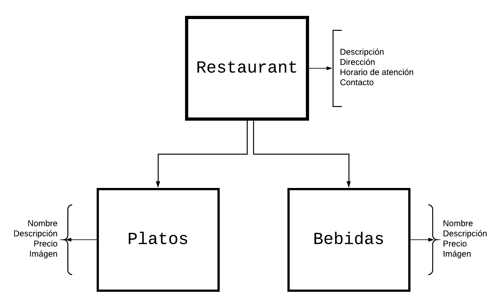

# Tutorial de variables: Aprende a usar un corpus M

> **License:** this work is registered under Creative Commons Attribution-ShareAlike 4.0. international licence. To see a copy of this license, visit the following link: https://creativecommons.org/licenses/by-sa/4.0/

## Introducción

¡Bienvenido de nuevo! En este tutorial, vamos a echar un vistazo más de cerca a los chatbots Mammut para aprender cómo usar [variables](../concepts/variables.md) en un **corpus**. Te recomendamos que antes de empezar este tutorial hayas completado anteriormente nuestro [tutorial introductorio](../tutorial-intro/index.md), donde ya habrás visto de manera global cómo poner en marcha un chatbot.  Este tutorial de **variables** mammut que estás a punto de comenzar, te va a permitir ampliar lo que aprendiste sobre las [variables](../tutorial-intro/corpusM(3).md) y te va a mostrar su función en la construcción de un chatbot.

Para lograr este objetivo, vamos a trabajar en el corpus de _Sylvia_, el chatbot de nuestra cadena de comida _Mammut_. Entre las cosas que _Sylvia_ debe tener en su **knowledge** (base de conocimiento) para cumplir con su trabajo está: 

* Información básica del **restaurant (restaurante)** para el que esta trabaja (_Restaurante Mammut_); su dirección, el horario de trabajo, etc. 

* Los diversos **dishes (platos)** ofrecidos (como _lasagna_, _brownie_, _ensalada césar_, etc.); su nombre, su descripción, su precio. 

* Las opciones de **drinks (bebidas)** con las que los comenzales pueden acompañar cada uno de esos platillos (_jugos_, _cafés_, _licores_, etc.).

## ¿Qué vamos a construir?

En este tutorial, vamos a echar un vistazo más de cerca a los chatbots Mammut para aprender a construir y utilizar variables en un corpus. Las [variables](../concepts/variables.md) son fragmentos de código que pueden cambiar sus valores en el tiempo. Juntos vamos a agregarlas al corpus de _Sylvia_ para permitirle manejar más conversaciones de las que conoce en los events (eventos) que forman su corpus actual. De igual modo, usaremos las variables para ayudar a _Sylvia_ a encontrar la información dentro de su knowledge. Además, configuraremos el **scope** de sus scenarios para que esta pueda estar al tanto de lo que ocurre en las conversaciones con sus usuarios.

## ¿Qué vamos a aprender en este tutorial?

Juntos vamos a aprender [qué es una variable Mammut y cuáles son sus usos](introduction.md), también aprenderemos a [configurar variables Mammut y cómo usarlas para ampliar la capacidad de los events](event_generalization.md) de un corpus. Además, en el veremos cómo estas nos ayudan a ofrecer respuestas más precisas permitiéndonos [acceder a la información alojada en la base de knowledge](variables_and_knowledge.md) de un chatbot. Finalmente veremos cómo [proporcionar contexto](variables_and_scope) a las conversaciones a través de las variables.

¿Estas listo? Comencemos con algunas ideas sobre las variables y lo que podrá hacer una vez que las incluyas en el corpus.

[El Corpus M de Sylvia](introduction.md)
