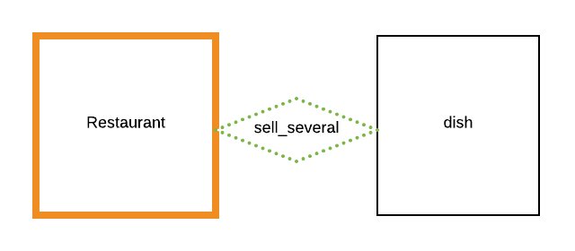
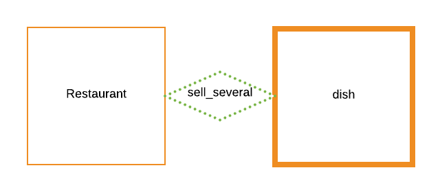
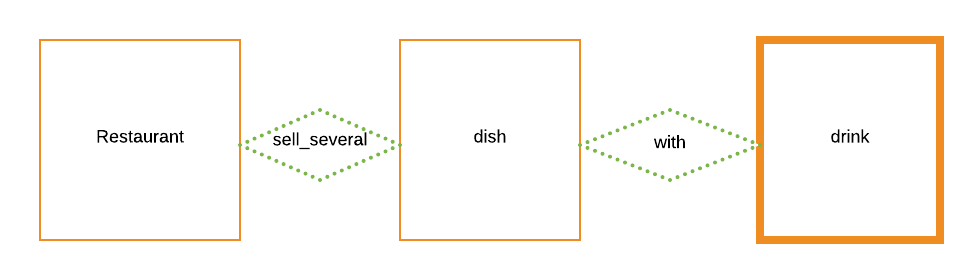

# Capítulo 4. Configuración del scope

En este capítulo, vamos a aprender el papel fundamental que tienen las variables en la configuración del **scope** del chatbot. Las **variables** proporcionan a tu chatbot la información que necesita para manejar una conversación de manera natural. Para esto, veremos un ejemplo de cómo al agregar las variables nuestro chatbot guarda en su memoria los datos que usamos en las interacciones con _Sylvia_.

## ¿Cómo las variables configuran el **scope**?

Denominamos [scope](../concepts/scope.md) a la información que los usuarios proporcionan al chatbot a lo largo de una conversación. Esta información permite al chatbot *contextualizarse*. El chatbot es capaz de identificar la información proporcionada por los usuarios a través de las variables. Estas le proveen al chatbot las rutas que necesita para ubicar la información pertinente en su **knowledge base**. De esta manera, el chatbot puede saber de qué le habla el usuario y puede acceder a su knowledge para buscar las respuestas adecuadas.


## El diseño de los scenarios del corpus y su relación con el scope

Es importante recordar que la eficacia de las variables en la programación del **scope** está relacionada con la forma en cómo se diseñan los scenarios. Al igual que has visto en el [corpus](../concepts/corpus.md), la forma más eficiente de construir tus scenarios es seguir las conversaciones tal como podrían ocurrir cuando interactúan dos personas. Para esto se puede pensar en las cosas que los usuarios pueden decir o preguntar primero, y luego continuar con el curso natural de la interacción, lo que ayudará también a lograr un buen diseño de la [ontology](../concepts/ontology.md).

La idea de diseñar los escenarios y el conocimiento de esta manera es que durante la conversación, el chatbot obtenga la información que necesita de los [paths (rutas)](../concepts/path.md) trazados en la ontología. Esta información es provista por el usuario en sus interacciones o también puede ser configurada previamente. 

> Recomendamos a nuestros principiantes que sigan este método para el diseño de escenarios, sin embargo, en Mammut también tenemos un par de herramientas para que el mismo chatbot busque la información que le falta, y así preveer casos en donde los usuarios no den la información necesaria. Estas herramientas son las  **condiciones lambda** en el corpus o la configuración de los [scenery_defaults](../concepts/default.md) para canales específicos.

Veamos ahora cómo está programado el **scope** en los primeros events del escenario 1:

## ¿Qué información proveen las variables en los events del corpus de Sylvia?

Como ya hemos mencionado antes, las variables proveen al chatbot informacion que le permite obtener el **contexto** de la conversación, es decir, esta información permite al chatbot saber de qué está hablando el usuario. Para ilustrar esto, veamos lo que tenemos en el primer escenario del corpus de _Sylvia_. 

| id 	| sub_id 	| scenery_type 	| event_message                                                                                                      	| source 	| regional_setting 	|
|----	|--------	|--------------	|--------------------------------------------------------------------------------------------------------------------	|--------	|------------------	|
| 1  	| 1      	| Conversation 	| Hola, Sylvia. Por favor, dame la dirección del ```[variable\|restaurant.name]```                                         	| Carmen 	| es               	|
| 1  	| 2      	| Conversation 	| Nuestra dirección es ```[variable\|restaurant.address]```                                                                	| Mammut 	| es               	|
| 1  	| 3      	| Conversation 	| ¿Cuál es el precio de la ```[variable\|restaurant.sell_several.dish.name]```?                                            	| Carmen 	| es               	|
| 1  	| 4      	| Conversation 	| El precio de la ```[variable\|restaurant.sell_several.dish.name]``` es de ```[variable\|restaurant.sell_several.dish.price]``` 	| Mammut 	| es               	|

**Tab. 1:** _Escenario 1 en el corpus de Sylvia_.

Allí podemos ver que la primera información dada por el usuario es la del **entry_point** en el event 1: _"Hola, Sylvia. Por favor, dame la dirección de [variable|restaurant.name]"_. Esta información le permite a _Sylvia_ responder preguntas sobre el **restaurant** para el que trabaja, como podemos ver en el event número 2 _"Nuestra dirección es [variable|restaurant.address]?"_.

| id 	| sub_id 	| scenery_type 	| event_message                                                                                                      	| source 	| regional_setting 	|
|----	|--------	|--------------	|--------------------------------------------------------------------------------------------------------------------	|--------	|------------------	|
| 1  	| 1      	| Conversation 	| Hola, Sylvia. Por favor, dame la dirección del ```[variable\|restaurant.name]```                                         	| Carmen 	| es               	|
| 1  	| 2      	| Conversation 	| Nuestra dirección es ```[variable\|restaurant.address]```                                                                	| Mammut 	| es               	|
**Tab. 2:** _Events 1 y 2_.

| id                    	| KR_1                                             	| KR_2                                             	|
|-----------------------	|--------------------------------------------------	|--------------------------------------------------	|
| hidden                	|                                                  	|                                                  	|
| name                  	| Restaurante Mammut                               	| Café Mammut                                      	|
| description           	| Restaurant-Bar-Pizzeria                          	| Restaurant-Cafe                                  	|
| address               	| slide\|2-text-Downtown                           	| slide\|2-text-Outside                            	|
| opening_hours         	| Mo-Su 7:00-22:00                                 	| Mo-Su 7:00-22:00                                 	|
| payment_methods       	| tarjeta de débito, tarjeta de crédito y efectivo 	| tarjeta de débito, tarjeta de crédito y efectivo 	|
| telephone             	|                                       2121234567 	|                                       2121234567 	|
| url                   	| www.mammut.io                                    	|                                                  	|
| recommend_to_drink    	| drink.KD_2                                       	| drink.KD_18                                      	|
| recommend             	| dish.KP_3                                        	| dish.KP_7                                        	|
| recommended_for_after 	| dish.KP_12                                       	| drink.KD_15                                      	|
| sell_several          	| dish                                             	| dish                                             	|
| offer_several         	| drink                                            	| drink                                            	|
**Tab. 3:** _Información en el vertex 'restaurant'_.

En el siguiente gráfico, podemos ver cómo el path de la ontology comienza en este vertex:


**Fig. 1:** _Representación gráfica del vertex 'restaurant'_.

Por otro lado, en el event número 3, podemos ver cómo la variable que hemos agregado permite darle al chatbot información sobre el vertex siguiente, **dish**, proporcionando una ruta que lleva a una property de una instance específica, **name**:

| id 	| sub_id 	| scenery_type 	| event_message                    	|
|----	|--------	|--------------	|----------------------------------	|
|  1 	|      3 	| Conversation 	| ¿Cuál es el precio de la ```[variable\|restaurant.sell_several.dish.name]```? 	|
**Tab. 4:** _Event 3_.

 Esto le permite a _Sylvia_ avanzar en la conversación a través de uno de los paths de la ontology y, de este modo, también podrá darle al usuario la respuesta que este requiere usando la información contenida en ese vertex del knowledge:

| id 	| sub_id 	| scenery_type 	| event_message                    	|
|----	|--------	|--------------	|----------------------------------	|
|  1 	|      4 	| Conversation 	| El precio de la ```[variable\|restaurant.sell_several.dish.name]``` es de ```[variable\|restaurant.sell_several.dish.price]```  	|
**Tab. 5:** _Event 4_.

| _name_ | type | description | _Price_ |
| - | - | - | - |
| Desayuno americano | Desayuno | Panqueques con mantequilla y jarabe de arce, tocino frito y huevos fritos. | 22,00 |
| Sándwich | Desayuno | Puedes elegir 3 de estos rellenos para sándwiches: queso, jamón y queso, ensalada de jamón, salchicha, queso y cebolla, mayonesa de huevo, mayonesa de atún o ensalada de pollo.| 12,00 |
| ***Lasaña*** | Almuerzo | Un perfecto equilibrio entre capas de queso, fideos y salsa boloñesa casera.| ***18,50*** |
**Tab. 6:** _Información en el vertex 'dish'_.

En el siguiente gráfico, podemos observar cómo la conversación ha avanzado al vertex  **plato (dish)**:



**Fig. 2:** _Representación gráfica de la ruta 'restaurant-dish'_.

Gracias a las variables, esta información que provee el usuario en las conversaciones no solo le servirá a _Sylvia_ para comprender los mensajes de los usuarios y poder responderles de forma adecuada, si no que además le proporcionará al chatbot el contexto de la conversación al quedar almacenada en su memoria de corto plazo. De esta manera, el usuario no tendrá que repetir la misma información varias veces durante una conversación.

Veamos un ejemplo de cómo _Sylvia_ podrá usar esta información programando paso a paso un par de events más para este scenario.

## Paso a paso 3: Configura events en el corpus teniendo en cuenta la información en el scope

Muy bien. Ahora supongamos que, en la conversación, el usuario quiere que _Sylvia_ le recomiende una bebida para acompañar su _lasaña_ y de esta forma completar su pedido. Configuremos esta conversación:

**Paso 1:** 

Ubícate en el sheet del corpus, en la columna **event_message**, escenario 1 event 5. Para iniciar necesitamos escribir una pregunta como _¿Qué bebida me recomiendas para acompañar la lasaña?_. 

Ahora bien, si la información sobre el platillo (lasaña) no se encontrara en el _scope_, sería necesario añadir la variable _[variable|restaurant.sell_several.dish.name]_ para sustituir esta información. Sin embargo, como ya la hemos específicado anteriormente, _Sylvia_ será capaz de identificar el platillo sin necesidad de usar ninguna variable. Es más, podemos perfectamente escribir la pregunta de la siguiente manera sin que haya ningún problema: _"Qué bebida me recomiendas para acompañarla?"_

| id 	| sub_id 	| scenery_type 	| event_message                               	|
|----	|--------	|--------------	|---------------------------------------------	|
|  1 	|      5 	| Conversation 	| Qué bebida me recomiendas para acompañarla? 	|
**Tab. 7:** _Event 5_.

Ahora, programemos la respuesta de _Sylvia_:

**Paso 2:** 

**2.1.** Sitúate en la columna **event_message** del escenario 1 event 6 para editar el mensaje de respuesta que _Sylvia_ dará a sus usuarios: _"Te recomiendo nuestra magnífica Malteada Mammut"_. 

| id 	| sub_id 	| scenery_type 	| event_message                                    	|
|----	|--------	|--------------	|--------------------------------------------------	|
|  1 	|      6 	| Conversation 	| Te recomiendo nuestra magnífica Malteada Mammut. 	|
**Tab. 8:** _Event 6_.

Como cada platillo del vértice **dish** tiene una **bebida** recomendada del vertex **drink**, en este caso, _Sylvia_ será capaz de dar la recomendación de la bebida correspondiente al platillo _lasaña_.

| name                    	| type     	| description                                                                                                                                                                      	| price 	| *with_one*                	|
|-------------------------	|----------	|----------------------------------------------------------------------------------------------------------------------------------------------------------------------------------	|-------	|-------------------------	|
| Desayuno americano      	| Desayuno 	| Panqueques con mantequilla y jarabe de arce, tocino frito y huevos fritos.                                                                                                       	| 22,00 	| drink.KD_13,drink.KD_17 	|
| Sándwich                	| Desayuno 	| Puedes elegir 3 de estos rellenos para sándwiches: queso, jamón y queso, ensalada de jamón, salchicha, queso y cebolla, mayonesa de huevo, mayonesa de atún o ensalada de pollo. 	| 12,00 	| drink.KD_23             	|
| Lasagna                 	| Almuerzo 	| Un perfecto equilibrio entre capas de queso, fideos y salsa boloñesa casera.                                                                                                     	| 18,50 	| drink.KD_3              	|
| Pabellón                	| Almuerzo 	| Un plato tradicional venezolano que incluye una combinación de arroz y frijoles que se encuentra en todo el Caribe.                                                              	| 32,00 	| drink.KD_14             	|
| Pasta al pesto          	| Pasta    	| Pasta con salsa pesto.                                                                                                                                                           	| 26,00 	| drink.KD_2              	|
| Ensalada césar de pollo 	| Ensalada 	| Una ensalada verde de lechuga romana.                                                                                                                                            	| 28,00 	| drink.KD_2              	|
| Cheesecake              	| Postre   	| Postre dulce con corteza hecha de galletas dulces y relleno de queso crema.                                                                                                      	| 15,00 	| drink.KD_15             	|
| Brownie                 	| Postre   	| Un brownie que tiene una textura similar a la del pastel.                                                                                                                        	| 18,00 	| drink.KD_22             	|
**Tab. 9:** _Edge "with" al vertex "drink" en el vertex "dish"_.

**2.2.** Elimina el nombre "Malteada Mammut" para poner en su lugar los corchetes **[]** donde escribiremos la variable siguiendo los mismos pasos explicados en los capítulos [paso a paso 1](event_generalization.md) y [paso a paso 2](variables_and_knowledge.md). Prueba con: [variable|restaurant.sell_several.dish.with_one.drink.name]

Aquí es importante aclarar que, aunque _Sylvia_ será capaz de dar el nombre de la bebida, la información de esta no será parte del _scope_ hasta que el usuario apruebe dicha recomendación en un evento que use una variable. 

Programemos entonces este evento:

**Paso 3:** 

**3.1.** Suponiendo ahora que el usuario aprueba la recomendación de _Sylvia_ con el mensaje _"La malteada Mammut suena perfecta, gracias"_, escríbelo en la columna **event_message** del scenario 1, event 7.

**3.2.** Elimina la expresión "Malteada Mammut" y sustituyela por la misma variable que usaste en el event anterior, siguiendo los mismos pasos explicados en los capítulos [paso a paso 1](event_generalization.md) y [paso a paso 2](variables_and_knowledge.md).

| id 	| sub_id 	| scenery_type 	| event_message                                                                          	|
|----	|--------	|--------------	|----------------------------------------------------------------------------------------	|
|  1 	|      7 	| Conversation 	| La ```[variable\|restaurant.sell_several.dish.with_one.drink.name]``` suena perecta, gracias 	|
**Tab. 10:** _Event 7_.


Esta variable programada en el event le permitirá a _Sylvia_ avanzar un vertex más en el path de la ontology, almacenando en su memoria de corto plazo esta información sobre la **bebida** para poder asistir al usuario. Así lo podemos observar en el siguiente gráfico:


**Fig. 3:** _Representación gráfica de la ruta 'restaurant-dish-drink'_.

Al tener esta información en el **scope** de la conversación, _Sylvia_ también será capaz de usar la información alojada en su knowledge para responder a las preguntas de sus usuarios sin necesidad de que estos deban repetirle la información a lo largo de la interacción. Por ejemplo, si en el event siguiente _Sylvia_ le preguntara al usuario _"¿Deseas ordenar algo más?"_ la respuesta de este último podría ser _"No, solo el plato y bebida, por favor. Agrega ambos a mi pedido."_. En esta ocasión, no habría necesidad de repetir las variables en este event, ya que la información sobre el **plato (dish)** y la **bebida (drink)** ya se encuentran almacenados en el _scope_ de _Sylvia_.

¡Lo lograste! Aprendiste cómo las variables Mammut ayudan a proveer la información del **scope** en los events del corpus y configuraste además un par de events teniendo en cuenta esta información dentro de un mismo escenario. Ahora _Sylvia_ tiene a su alcance la información escencial del contexto para poder responder correctamente a las solicitudes de su usuario (en este caso, la información del restaurant y del plato y la bebida en el pedido).

Siguiendo las explicaciones y los pasos que has aprendido en este tutorial, podrás configurar el scope en todos los escenarios de tu corpus. Así _Sylvia_ podrá atender los pedidos de los usuarios de forma más fluída y eficiente.

Antes de terminar, te invitamos a que le des un vistazo a este [package de _Sylvia_ terminado](https://docs.google.com/spreadsheets/d/1PipFFyOWTcou9yYm3Uyc_bcNmnzh7kmKHdqR2jKgkyc/edit#gid=1068576320) para que confirmes que has seguido todos los pasos adecuadamente. Ahora tu corpus debe lucir exactamente como ese.

## ¿Qué aprendiste en este paso a paso?

Aprendiste a usar las variables para configurar el **scope** de tu chatbot, lo que le permitirá manejar el contexto en las conversaciones.

¡Felicidades! Hemos llegado al final de nuestro tutorial sobre variables Mammut. Te esperamos en nuestros siguientes tutoriales para aprender más sobre las herramientas que tenemos para ti.
